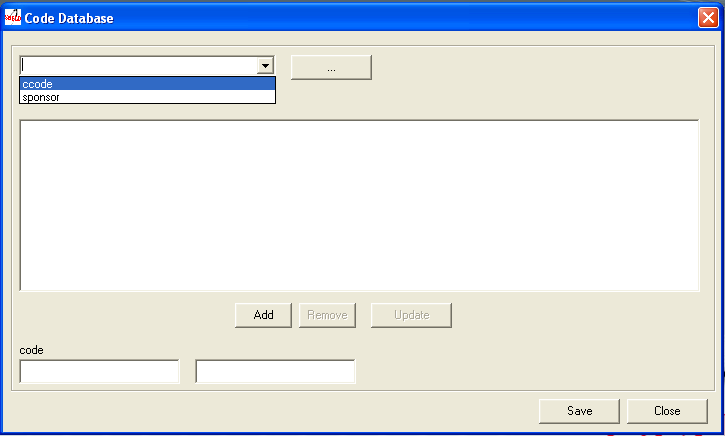

.. pcprograms documentation master file, created by
   You can adapt this file completely to your liking, but it should at least
   contain the root `toctree` directive.

============
Code Manager
============

Desktop application (Visual Basic, CDS/ISIS database) to manage the tables of codes/values used by SciELO Methodology.

Used in the `Local Server <concepts.html#local-server>`_ 

This program is only used if it is necessary to change data of the `customizable tables (newcode database) <newcode_database.html>`_

Opening the program
-------------------

Use the Windows menu to open the program.

.. image:: img/scielo_menu.png

Or use the Windows Explorer:

  c:\\scielo\\bin\\codes\\codes.exe

  (or corresponding to c:\\scielo)

Managing the tables 
-------------------

#. Select File > Open: 

.. image:: img/codemanager_file_open.png

- **Restricted Area** is used only by SciELO Methodology team. It is password protected. (`Code database <code_database.html>`_)
- **Customizing Tables** is to manage the customizable tables. (`Newcode database <newcode_database.html>`_)

Accessing a table
-----------------
 
Select the name of one of the tables, then click on the [...] button.

The program will display the selected table:

.. image:: img/codemanager_table.png

The data of the table will be presented as: code | label in Portuguese | Spanish | English.
But if there is no dependence on any language, only one column is displayed.
    

Removing a row of the table
---------------------------

1. Select a row to delete. Its data will be presented at code and labels fields of each language. 

.. image:: img/codemanager_select_row.png

2. Click on Remove button. 
3. Click on Save button.

Updating a row of the table
---------------------------

1. Select a row to update. Its data will be presented at code and labels fields of each language. 

.. image:: img/codemanager_select_row.png

2. Change the data.
3. Click on Update button. The updated row will be displayed in the list. 
4. Click on Save button

Creating a new row
------------------

1. Fill in the fields: code and label of each language or only one if it is not depending on a language.
 
.. image:: img/codemanager_adding_new_line.png

2. Click on Add button.

.. image:: img/codemanager_added_new_line.png

The new row will be displayed at the end of the list. 

3. Click on Save button.

