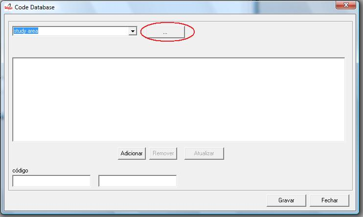
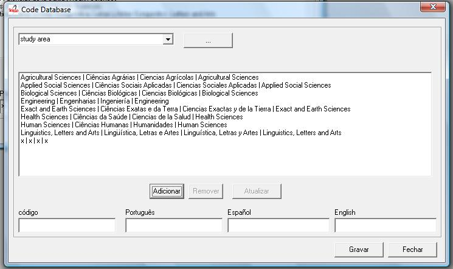

.. pcprograms documentation master file, created by
   You can adapt this file completely to your liking, but it should at least
   contain the root `toctree` directive.

Code Manager
============

- single-user program,
- Visual Basic 
- used on local server
- manage the tables of codes and values used by all the programs of SciELO Methodology.
   
There are tables which contents are rarely changed, for example, languages.
There are tables where the content is customizable for each collection. Currently: sponsor, markup center.

The table of subject areas was customizable. But now, it is required all the collections of the SciELO Network use the same table.

This program is only used if it is necessary to change data of the customizable tables.

Opening the program
-------------------

To open the program, use the Windows menu, select "SciELO", then "Code Manager"

.. image:: img/en/01_menu.jpg

Managing the tables 
-------------------

#. Select Files

- "Restricted Area" is used only by the developers of SciELO methodology. It is password protected.
- "Customizing Tables" is to manage the customizable tables.

Accessing a table
-----------------
 

Select one of the tables, clicking the button ...

The data of the tables will be presented in the format: code | label in Portuguese | Spanish | English.

Removing a row of the table
---------------------------

#. Select a row to delete. Its data will be presented at code and labels fields of each language. 
#. Click on Remove button. 
#. Click on Save button

Updating a row of the table
---------------------------

#. Select a row to update. Its data will be presented at code and labels fields of each language. 
#. Click on Update button. 
#. Click on Save button

Creating a new row
------------------

#. Fill in the fields: code and label of each language
 

Technical information
---------------------

Code database
.............

ISIS database. One record by table. 

Field 1
    Subfield *: table name
    Subfield l, optional: language 

Field 2
   Subfield c: code
   Subfield v: value

NewCode database
................

Same structure of code database, but the records corresponding to the editable tables are the only records that would be different.

Code database Content
.....................
    [doctopic]_

    [role]_

    [standard]_

    [ccode]_

    [literature_type]_

    [treatment_level]_

    [status]_

    [month]_

    [date]_

    [country]_

    [publication_level]_

    [alphabet_of_title]_

    [language]_

    [frequency]_

    [indexing_coverage]_

    [acquisition_priority]_

    [state]_

    [article_status]_

    [stitle]_

    [illustrative_material_type]_

    [version]_

    [from]_

    [to]_

    [keyword_priority_level]_

    [toccode]_

    [scheme]_

    [ftp]_

    [usersubscription]_

    [id]_

    [study_area]_

    [rid]_

    [dateiso]_

    [count]_

    [pii]_

    [pages]_

    [issue_status]_

    [idiom_interface]_

    [table_of_contents]_

    [sponsor]_

    [orgname]_

    [no]_

    [scielonet]_

    [issn_type]_

    [orgdiv1]_

    [orgdiv2]_

    [orgdiv3]_

    [orgdiv]_

    [ctdbid]_

    [doctype]_

    [deposid]_

    [ftype]_

    [lictype]_

    [pubtype]_

    [hcomment]_

    [license_text]_

    [ref-type]_

    [fntype]_

    [listtype]_

    [sec-type]_

.. [doctopic]

============================== ==================================================
code                           value
------------------------------ --------------------------------------------------
ab                             abstracts
ax                             annex
an                             announcements
sc                             brief communication
co                             comments
cr                             case report
ct                             clinical trial
ed                             editorial
in                             interview
le                             letter
mt                             methodology
oa                             original article
pv                             point-of-view
pr                             press release
rc                             recount
rn                             research note
ra                             review article
tr                             technical report
up                             update
============================== ==================================================

.. [role]

============================== ==================================================
code                           value
------------------------------ --------------------------------------------------
nd                             Not defined
coord                          coordinator
ed                             publisher
org                            organizer
tr                             translator
============================== ==================================================

.. [standard]

============================== ==================================================
code                           value
------------------------------ --------------------------------------------------
iso690                         iso 690/87 - international standard organization
nbr6023                        nbr 6023/89 - associação nacional de normas técnicas
other                          other standard
vancouv                        the vancouver group - uniform requirements for manuscripts submitted to biomedical journals
apa                            American Psychological Association
============================== ==================================================

.. [ccode]

============================== ==================================================
code                           value
------------------------------ --------------------------------------------------
bjce                           brazilian journal of chemical engineering
bjg                            brazilian journal of genetics
bjmbr                          brazilian journal of medical and biological research
bjp                            brazilian journal of physics
conicyt                        Comisión Nacional de Investigación Científica y Tecnológica
dados                          dados - revista de ciências sociais
br1.1                          scielo/bireme
infomed                        InfoMed
jbchs                          journal of the brazilian chemical society
jbcos                          journal of the brazilian computer society
mioc                           memórias do instituto oswaldo cruz
rbcs                           revista brasileira de ciência do solo
rbgeo                          revista brasileira de geociências
rimtsp                         revista do instituto de medicina tropical de são paulo
rsp                            revista de saúde pública
============================== ==================================================

.. [literature_type]

============================== ==================================================
code                           value
------------------------------ --------------------------------------------------
C                              Conference
M                              Monograph
MC                             Conference papers as Monograph
MP                             Project papers as Monograph
MPC                            Project and Conference papers as monograph
MS                             Monograph Series
MSC                            Conference papers as Monograph Series
MSP                            Project papers as Monograph Series
N                              Document in a non conventional form
NC                             Conference papers in a non conventional form
NP                             Project papers in a non conventional form
P                              Project
S                              Serial
SC                             Conference papers as Periodical Series
SCP                            Conference and Project papers as periodical series
SP                             Project papers as Periodical Series
T                              Thesis and Dissertation
TS                             Thesis Series
============================== ==================================================

.. [treatment_level]

============================== ==================================================
code                           value
------------------------------ --------------------------------------------------
am                             analytical of a monograph
amc                            analytical of a monograph in a collection
ams                            analytical of a monograph in a serial
as                             analytical of a serial
c                              collective level
m                              monographic level
mc                             monographic in a collection
ms                             monographic series level
============================== ==================================================

.. [status]

============================== ==================================================
code                           value
------------------------------ --------------------------------------------------
?                              Unknown
C                              Current
D                              Ceased
R                              Reports only
S                              Suspended
============================== ==================================================

.. [month]

============================== ==================================================
code                           value
------------------------------ --------------------------------------------------
1                              Jan.
2                              Feb.
3                              Mar.
4                              Apr.
5                              May
6                              June
7                              July
8                              Aug.
9                              Sept.
10                             Oct.
11                             Nov.
12                             Dec.
============================== ==================================================

.. [date]

============================== ==================================================
code                           value
------------------------------ --------------------------------------------------
Jan.                           January
Feb.                           February
Mar.                           March
Apr.                           April
May                            May
Jun.                           June
July                           July
Aug.                           August
Sept.                          September
Oct.                           October
Nov.                           November
Dec.                           December
============================== ==================================================

.. [country]

============================== ==================================================
code                           value
------------------------------ --------------------------------------------------
AF                             Afghanistan
AL                             Albania
DZ                             Algeria
AS                             American Samoa
AD                             Andorra
AO                             Angola
AQ                             Antarctica
AG                             Antigua
AR                             Argentina
AU                             Australia
AT                             Austria
BS                             Bahamas
BH                             Bahrain
BD                             Bangladesh
BB                             Barbados
BE                             Belgium
BZ                             Belize
BM                             Bermuda
BT                             Bhutan
BO                             Bolivia
BW                             Botswana
BV                             Bouvet Island
BR                             Brazil
VG                             British Virgin Islands
BN                             Brunei
BG                             Bulgaria
BU                             Burma
BI                             Burundi
BY                             Byelorussian RSS
CM                             Cameroon
CA                             Canada
CV                             Cape Verde
CF                             Central African Rep.
TD                             Chad
CL                             Chile
CN                             China
CO                             Colombia
CG                             Congo
CR                             Costa Rica
CU                             Cuba
CY                             Cyprus
CS                             Czechoslovakia
DK                             Denmark
DM                             Dominica
DO                             Dominican Republic
NQ                             Dronning Maud Land
EC                             Ecuador
EG                             Egypt
SV                             El Salvador
ET                             Ethiopia
FK                             Falkland Islands(Malvinas)
FJ                             Fiji
FI                             Filand
FR                             France
GF                             French Guiana
PF                             French Polynesia
GA                             Gabon
DD                             German Democratic Republic
DE                             Germany, Federal Republic
GH                             Ghana
GI                             Gibraltar
GR                             Greece
GL                             Greenland
GD                             Grenada
GP                             Guadeloupe
GU                             Guam
GT                             Guatemala
GC                             Guinea Ecuatorial
GN                             Guinea
GW                             Guinea-Bissau
GY                             Guyana
HT                             Haiti
HN                             Honduras
HK                             Hong Kong
HU                             Hungary
IS                             Iceland
IN                             India
ID                             Indonesia
IR                             Iran
IQ                             Iraq
IE                             Ireland
CX                             Isla de Navidad
JT                             Isla Johnston
NU                             Isla Niue
WK                             Isla Wake
PU                             Islands Miscellaneous
CT                             Islas Canton y Enderbury
CC                             Islas Cocos (Keeling)
CK                             Islas Cook
FO                             Islas Feroe
HM                             Islas Heard y Mc Donald
MI                             Islas Midway
PN                             Islas Pitcairn
SB                             Islas Salomón Británico
SJ                             Islas Svalbard y Jan Mayen
TK                             Islas Tokelau
WF                             Islas Wallis y Futuna
IL                             Israel
IT                             Italy
YU                             Iugoslavia
CI                             Ivory Coast
JM                             Jamaica
JP                             Japan
JO                             Jordan
KM                             Kamoras Islands
KH                             Kampuchea Democrática
KY                             Kayman Islands
KE                             Kenya
KD                             Korea, Democratic People's 
KP                             Korea, Democratic People's
KR                             Korea, Republic of
KW                             Kuwait
LD                             Lao People's Democratic 
LB                             Lebanon
LS                             Lesotho
LR                             Liberia
LY                             Libyan
LI                             Liechtenstein
LU                             Luxembourg
MO                             Macau
MG                             Madagascar
MW                             Malawi
MY                             Malaysia
MV                             Maldivas
ML                             Mali
MT                             Malta
MQ                             Martinique
MR                             Mauritania
MU                             Mauritius
MX                             Mexico
MC                             Monaco
MN                             Mongolia
MS                             Montserrat
MA                             Morocco
MZ                             Mozambique
NA                             Namibia
NR                             Nauru
NP                             Nepal
NL                             Netherlands
AN                             Netherlands Antilles
NC                             New Caledonia
NZ                             New Zealand
NI                             Nicaragua
NE                             Niger
NG                             Nigeria
NF                             Norfolk Island
NO                             Norway
NH                             Nuevas Hébridas
OM                             Oman
PC                             Pacific Islands
PK                             Pakistan
PA                             Panama
PG                             Papua New Guinea
PY                             Paraguay
PE                             Peru
PH                             Philippines
PL                             Poland
PT                             Portugal
PR                             Puerto Rico
QA                             Qatar
LA                             Republic
RE                             Réunion
RO                             Romania
RW                             Rwanda
PM                             S. Pedro y Miguelón
LC                             Saint Lucia
VC                             Saint Vincent
WS                             Samoa
KN                             San Cristóbal-Nieves-Anguila
SM                             San Marino
ST                             Sao Tome and Principe
SA                             Saudi Arabia
SC                             Seichelles
SN                             Senegal
SL                             Sierra Leone
SK                             Sikkim
SG                             Singapur
SO                             Somalia
ZA                             South Africa
ES                             Spain
LK                             Sri Lanka
SH                             St. Helena
SD                             Sudan
SR                             Suriname
SZ                             Swaziland
SE                             Sweden
CH                             Switzerland
SY                             Syrian Arab Republic
TW                             Taiwan
TZ                             Tanzania
TH                             Thailand
TG                             Togo
TO                             Tonga
TT                             Trinidad and Tobago
TN                             Tunisia
TR                             Turkey
TC                             Turks and Caicos Islands
UG                             Uganda
UA                             Ukrainian RSS
AE                             United Arab Emirates
GB                             United Kingdom
US                             United States
UP                             United States Pacific
HV                             Upper Volta
SU                             URSS
UY                             Uruguay
VU                             Vanuatu
VA                             Vatican City State
VE                             Venezuela
VN                             Viet Nam
EH                             Western Sahara
YE                             Yemen
YD                             Yemen, Democratic
ZR                             Zaire
ZM                             Zambia
nd                             Not defined
============================== ==================================================

.. [publication_level]

============================== ==================================================
code                           value
------------------------------ --------------------------------------------------
CT                             Scientific/technical
DI                             Divulgation
============================== ==================================================

.. [alphabet_of_title]

============================== ==================================================
code                           value
------------------------------ --------------------------------------------------
A                              Basic Roman
B                              Extensive Roman
C                              Cirillic
D                              Japanese
E                              Chinese
K                              Korean
O                              Another alphabet
============================== ==================================================

.. [language]

============================== ==================================================
code                           value
------------------------------ --------------------------------------------------
en                             English
pt                             Portuguese
es                             Spanish
af                             Afrikaans
ar                             Arabic
bg                             Bulgarian
ch                             Chinese
cs                             Czech
da                             Danish
nl                             Dutch
eo                             Esperanto
fr                             French
de                             German
gr                             Greek
he                             Hebrew
hi                             Hindi
hu                             Hungarian
in                             Indonesian
ia                             Interlingua
ie                             Interlingue
it                             Italian
ja                             Japanese
ko                             Korean
la                             Latin
no                             Norwergian
pl                             Polish
ro                             Romanian
ru                             Russian
sa                             Sanskrit
sh                             Serbo-Croat
sk                             Slovak
sn                             Slovenian
sv                             Swedish
tr                             Turkish
uk                             Ukrainian
ur                             Urdu
zz                             Other
gl                             Galician
eu                             Basque
ca                             Catalan
============================== ==================================================

.. [frequency]

============================== ==================================================
code                           value
------------------------------ --------------------------------------------------
?                              Unknown
A                              Annual
B                              Bimonthly (every two months)
C                              Semiweekly (twice a week)
D                              Daily
E                              Biweekly (every two weeks)
F                              Semiannual (twice a year)
G                              Biennial (every two years)
H                              Triennial (every three years)
I                              Three times a week
J                              Three times a month
K                              Irregular (known to be so)
M                              Monthly
Q                              Quarterly
S                              Semimonthly (twice a month)
T                              Three times a year
W                              Weekly
Z                              Other frequencies
============================== ==================================================

.. [indexing_coverage]

============================== ==================================================
code                           value
------------------------------ --------------------------------------------------
BA                             Biological Abstracts
EM                             Excerpta Medica
IM                             Index Medicus
LL                             LILACS
SP                             Salud Publica
============================== ==================================================

.. [acquisition_priority]

============================== ==================================================
code                           value
------------------------------ --------------------------------------------------
1                              Indispensable
2                              Dispensable because exists in the Country
3                              Dispensable because exists in the Region
============================== ==================================================

.. [state]

============================== ==================================================
code                           value
------------------------------ --------------------------------------------------
AC                             Acre
AL                             Alagoas
AM                             Amazonas
AP                             Amapá
BA                             Bahia
CE                             Ceará
DF                             Distrito Federal
ES                             Espírito Santo
FN                             Fernando de Noronha
GO                             Goiás
MA                             Maranhão
MG                             Minas Gerais
MS                             Mato Grosso do Sul
MT                             Mato Grosso
PA                             Pará
PB                             Paraíba
PE                             Pernambuco
PI                             Piauí
PR                             Paraná
RJ                             Rio de Janeiro
RN                             Rio Grande do Norte
RO                             Rondônia
RR                             Roraima
RS                             Rio Grande do Sul
SC                             Santa Catarina
SE                             Sergipe
SP                             São Paulo
============================== ==================================================

.. [article_status]

============================== ==================================================
code                           value
------------------------------ --------------------------------------------------
1                              Available
============================== ==================================================

.. [stitle]

============================== ==================================================
code                           value
------------------------------ --------------------------------------------------
Acta Cir. Bras.                Acta Cirurgica Brasileira
Bragantia                      Bragantia
Braz. J. Chem. Eng.            Brazilian Journal of Chemical Engineering
Braz. J. Genet.                Brazilian Journal of Genetics
Braz J Med Biol Res            Brazilian Journal of Medical and Biological Research
Braz. J. Phys.                 Brazilian Journal of Physics
Cad. CEDES                     Cadernos CEDES
Cad. Saúde Púbica              Cadernos de Saúde Pública
Ci. Inf.                       Ciência da Informação
Ciênc. Tecnol. Aliment.        Ciência e Tecnologia de Alimentos
DELTA                          DELTA: Documentação de Estudos em Lingüística Teórica e Aplicada
Dados                          Dados
Educ. Soc.                     Educação & Sociedade
Genet. Mol. Biol.              Genetics and Molecular Biology
J. Venom. Anim. Toxins         Journal of Venomous Animals and Toxins
J. Braz. Chem. Soc.            Journal of the Brazilian Chemical Society
J. Braz. Comp. Soc.            Journal of the Brazilian Computer Society
Mem. Inst. Oswaldo Cruz        Memórias do Instituto Oswaldo Cruz
Pesq. Vet. Bras.               Pesquisa Veterinária Brasileira
Psicol. USP                    Psicologia USP
Rev. bras. Bot.                Revista Brasileira de Botânica
Rev Bras Cir Cardiovasc        Revista Brasileira de Cirurgia Cardiovascular
Rev. bras. Ci. Solo            Revista Brasileira de Ciência do Solo
Rev. bras. Ci. Soc.            Revista Brasileira de Ciências Sociais
Rev. bras. Geocienc.           Revista Brasileira de Geosciences
Rev. bras. Hist.               Revista Brasileira de História
Rev Panam Salud Publica        Revista Panamericana de Salud Pública
Rev. Fac. Educ.                Revista da Faculdade de Educação
Rev. Microbiol.                Revista de Microbiologia
Rev Odontol Univ São Paulo     Revista de Odontologia da Universidade de São Paulo
Rev. Saúde Pública             Revista de Saúde Pública
Rev. Inst. Med. trop. S. Paulo Revista do Instituto de Medicina Tropical de São Paulo
Sci. agric.                    Scientia Agricola
Salud pública Méx              Salud Pública de México
============================== ==================================================

.. [illustrative_material_type]

============================== ==================================================
code                           value
------------------------------ --------------------------------------------------
nd                             no illustrative material
ilus                           figure
gra                            graphic
map                            map
tab                            table
============================== ==================================================

.. [version]

============================== ==================================================
code                           value
------------------------------ --------------------------------------------------
3.1                            3.1
4.0                            4.0
============================== ==================================================

.. [from]

============================== ==================================================
code                           value
------------------------------ --------------------------------------------------
00000000                       00000000
============================== ==================================================

.. [to]

============================== ==================================================
code                           value
------------------------------ --------------------------------------------------
00000000                       00000000
============================== ==================================================

.. [keyword_priority_level]

============================== ==================================================
code                           value
------------------------------ --------------------------------------------------
m                              main
s                              secondary
============================== ==================================================

.. [toccode]

============================== ==================================================
code                           value
------------------------------ --------------------------------------------------
1                              title
2                              sectitle
============================== ==================================================

.. [scheme]

============================== ==================================================
code                           value
------------------------------ --------------------------------------------------
nd                             No Descriptor
decs                           Health Science Descriptors
============================== ==================================================

.. [ftp]

============================== ==================================================
code                           value
------------------------------ --------------------------------------------------
art                            article based - a PDF file for each article
iss                            issue based - a PDF file for each issue
na                             Not Available
============================== ==================================================

.. [usersubscription]

============================== ==================================================
code                           value
------------------------------ --------------------------------------------------
na                             Not Available
reg                            Electronic Registration
sub                            Regular Subscription
============================== ==================================================

.. [id]

============================== ==================================================
code                           value
------------------------------ --------------------------------------------------
nd                             Not defined
============================== ==================================================

.. [study_area]

============================== ==================================================
code                           value
------------------------------ --------------------------------------------------
Agricultural Sciences          Agricultural Sciences
Applied Social Sciences        Applied Social Sciences
Biological Sciences            Biological Sciences
Engineering                    Engineering
Exact and Earth Sciences       Exact and Earth Sciences
Health Sciences                Health Sciences
Human Sciences                 Human Sciences
Linguistics, Letters and Arts  Linguistic, Literature and Arts
============================== ==================================================

.. [rid]

============================== ==================================================
code                           value
------------------------------ --------------------------------------------------
nd                             Not defined
============================== ==================================================

.. [dateiso]

============================== ==================================================
code                           value
------------------------------ --------------------------------------------------
00000000                       00000000
============================== ==================================================

.. [count]

============================== ==================================================
code                           value
------------------------------ --------------------------------------------------
0                              0
============================== ==================================================

.. [pii]

============================== ==================================================
code                           value
------------------------------ --------------------------------------------------
nd                             Not defined
============================== ==================================================

.. [pages]

============================== ==================================================
code                           value
------------------------------ --------------------------------------------------
0-0                            0-0
============================== ==================================================

.. [issue_status]

============================== ==================================================
code                           value
------------------------------ --------------------------------------------------
1                              Available
0                              Not available
2                              Partial available
============================== ==================================================

.. [idiom_interface]

============================== ==================================================
code                           value
------------------------------ --------------------------------------------------
es                             Spanish
pt                             Portuguese
en                             English
============================== ==================================================

.. [table_of_contents]

============================== ==================================================
code                           value
------------------------------ --------------------------------------------------
en                             Table of Contents
pt                             Sumário
es                             Sumario
============================== ==================================================

.. [sponsor]

============================== ==================================================
code                           value
------------------------------ --------------------------------------------------
nd                             Not definido
============================== ==================================================

.. [orgname]

============================== ==================================================
code                           value
------------------------------ --------------------------------------------------
nd                             nd
============================== ==================================================

.. [no]

============================== ==================================================
code                           value
------------------------------ --------------------------------------------------
0                              0
============================== ==================================================

.. [scielonet]

============================== ==================================================
code                           value
------------------------------ --------------------------------------------------
1                              SciELO Brasil
2                              SciELO Chile
3                              SciELO Salud Pública
4                              SciELO BEEP
5                              SciELO Ecler
6                              SciELO Cuba
7                              SciELO Colombia
8                              SciELO Costa Rica
9                              SciELO Uruguay
10                             SciELO Argentina
11                             SciELO Biodiversidade
12                             SciELO Bolivia
13                             SciELO España
14                             SciELO Jamaica
15                             SciELO México
16                             SciELO Perú
17                             SciELO Portugal
18                             SciELO Venezuela
19                             SciELO Adolec
20                             SciELO Social Sciences
21                             SciELO Paraguay
22                             SciELO Ecuador
23                             SciELO Caribbean
24                             SciELO South Africa
============================== ==================================================

.. [issn_type]

============================== ==================================================
code                           value
------------------------------ --------------------------------------------------
CDROM                          CD-ROM ISSN
DISKT                          Diskette ISSN
ONLIN                          On line ISSN
PRINT                          PRINT ISSN
============================== ==================================================

.. [orgdiv1]

============================== ==================================================
code                           value
------------------------------ --------------------------------------------------
nd                             nd
============================== ==================================================

.. [orgdiv2]

============================== ==================================================
code                           value
------------------------------ --------------------------------------------------
nd                             nd
============================== ==================================================

.. [orgdiv3]

============================== ==================================================
code                           value
------------------------------ --------------------------------------------------
nd                             nd
============================== ==================================================

.. [orgdiv]

============================== ==================================================
code                           value
------------------------------ --------------------------------------------------
nd                             nd
============================== ==================================================

.. [ctdbid]

============================== ==================================================
code                           value
------------------------------ --------------------------------------------------
CT                             CT - Clinicaltrials.gov
ACTR                           ACTR - Australian Clinical Trials Registry
ISRCTN                         ISRCTN - International Standard Randomised Controlled Trial Number Register
NTR                            NTR - Nederlands Trial Register
UMIN                           UMIN - University Hospital Medical Information Network
ChiCTR                         ChiCTR - Chinese Clinical Trial Register
============================== ==================================================

.. [doctype]

============================== ==================================================
code                           value
------------------------------ --------------------------------------------------
au                             audio
pr                             press release
vi                             video
============================== ==================================================

.. [deposid]

============================== ==================================================
code                           value
------------------------------ --------------------------------------------------
1                              Unicamp
2                              Unifesp
3                              Unesp
4                              USP
5                              ITA
6                              UFSCar
============================== ==================================================

.. [ftype]

============================== ==================================================
code                           value
------------------------------ --------------------------------------------------
audiogram                      audiogram
cardiogram                     cardiogram
cartoon                        cartoon
chart                          chart
chemical structure             chemical structure
dendrogram                     dendrogram
diagram                        diagram
drawing                        drawing
exihibit                       exihibit
graphic                        graphic
illustration                   illustration
map                            map
medical image                  medical image
other                          other
photo                          photo
photomicrograph                photomicrograph
plate                          plate
polysomnogram                  polysomnogram
schema                         schema
workflow                       workflow
============================== ==================================================

.. [lictype]

============================== ==================================================
code                           value
------------------------------ --------------------------------------------------
open-access                    open access
nd                             not defined
============================== ==================================================

.. [pubtype]

============================== ==================================================
code                           value
------------------------------ --------------------------------------------------
epub                           electronic publication
ppub                           print publication
============================== ==================================================

.. [hcomment]

============================== ==================================================
code                           value
------------------------------ --------------------------------------------------
0                              people can not comment
1                              people can comment
============================== ==================================================

.. [license_text]

============================== ==================================================
code                           value
------------------------------ --------------------------------------------------
BY                              All the contents of this journal, except where otherwise noted, is licensed under a  <a rel="license" href="http://creativecommons.org/licenses/by/3.0/">Creative Commons Attribution License</a>
BY-NC                           All the contents of this journal, except where otherwise noted, is licensed under a <a rel="license" href="http://creativecommons.org/licenses/by-nc/3.0/">Creative Commons Attribution License</a>
nd                             
 

============================== ==================================================

.. [ref-type]

============================== ==================================================
code                           value
------------------------------ --------------------------------------------------
aff                            Affiliation
app                            Appendix
author-notes                   Author notes
bibr                           Bibliographic reference
boxed-text                     Textbox or sidebar
chem                           Chemical structure
contrib                        Contributor
corresp                        Corresponding author
disp-formula                   Display formula
fig                            Figure or group of figures
fn                             Footnote
kwd                            Keyword
list                           List or list item
other                          None of the items listed
plate                          Plate
scheme                         Scheme
sec                            Section
statement                      Statement
supplementary-material         Supplementary information
table                          Table or group of tables
============================== ==================================================

.. [fntype]

============================== ==================================================
code                           value
------------------------------ --------------------------------------------------
abbr                           Abbreviations
com                            Communicated-by information
con                            Contributed-by information
conflict                       Conflict of interest statements
corresp                        Corresponding author information not identified separately, but merely footnoted
current-aff                    Contributor's current affiliation
deceased                       Person has died since article was written
edited-by                      Contributor has the role of an editor
equal                          Contributed equally to the creation of the document
financial-disclosure           Statement of funding or denial of funds received in support of the research on which an article is based
on-leave                       Contributor is on sabbatical or other leave of absence
other                          Some footnote type, other than those enumerated.
participating-researchers      Contributor was a researcher for an article
present-address                Contributor's current address
presented-at                   Conference, colloquium, or other occasion at which this paper was presented
presented-by                   Contributor who presented the material
previously-at                  Contributor's previous location or affiliation
study-group-members            Contributor was a member of the study group for the research
supplementary-material         Points to or describes supplementary material for the article
supported-by                   Research upon which an article is based was supported by some entity
============================== ==================================================

.. [listtype]

============================== ==================================================
code                           value
------------------------------ --------------------------------------------------
order                          Ordered list. Prefix character is a number or a letter, depending on style
bullet                         Unordered or bulleted list. Prefix character is a bullet, dash, or other symbol
alpha-lower                    Ordered list. Prefix character is a lowercase alphabetical character
alpha-upper                    Ordered list. Prefix character is an uppercase alphabetical character
roman-lower                    Ordered list. Prefix character is a lowercase roman numeral
roman-upper                    Ordered list. Prefix character is an uppercase roman numeral
simple                         Simple or plain list (No prefix character before each item) 
============================== ==================================================

.. [sec-type]

============================== ==================================================
code                           value
------------------------------ --------------------------------------------------
cases                          Cases/Case Reports
conclusions                    Conclusions/Comment
discussion                     Discussion/Interpretation
intro                          Introduction/Synopsis
materials                      Materials
methods                        Methods/Methodology/Procedures
results                        Results/Statement of Findings
subjects                       Subjects/Participants/Patients
supplementary-material         Supplementary materials
============================== ==================================================

