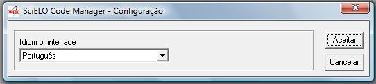
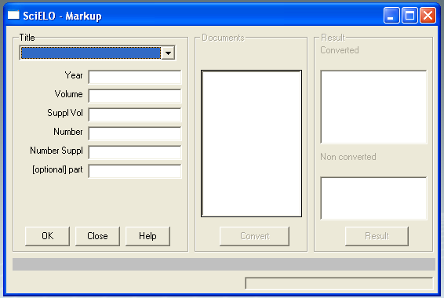
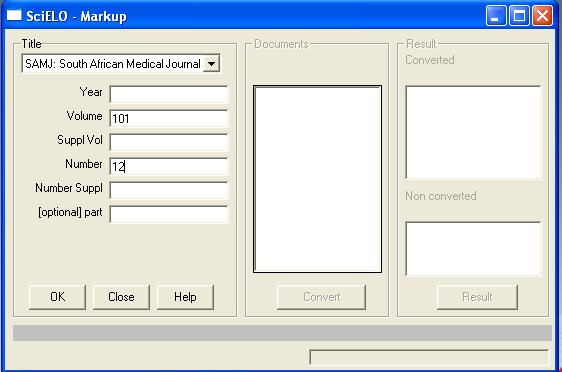
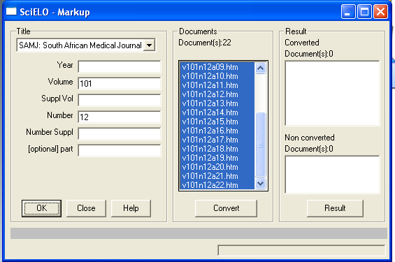
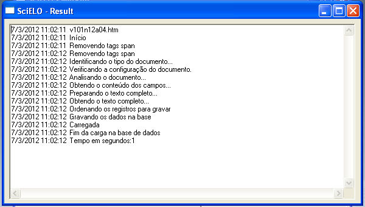
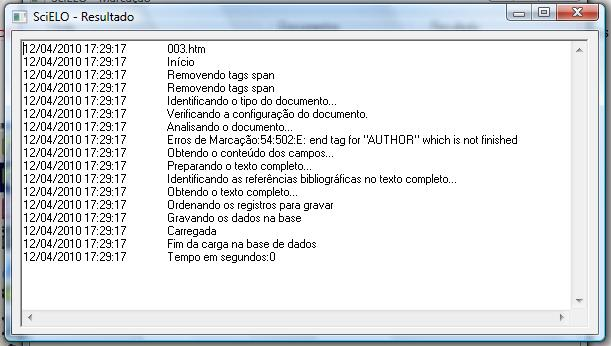

.. pcprograms documentation master file, created by
   You can adapt this file completely to your liking, but it should at least
   contain the root `toctree` directive.

Converter
=========

Desktop Application (Visual Basic), installed in the `local server <concepts.html#local-server>`_, to generate the database of the documents, by reading the files from `markup and body folders <concepts.html#folders-structure>`_ and the databases in `title and issue folders <concepts.html#folders-structure>`_.

How to open the program
-----------------------

Use the Windows menu to open the program.

.. image:: img/scielo_menu.png

Or by the path of the program:

  c:\\scielo\\bin\\convert\\convert.exe

How to change the language of the program
-----------------------------------------

The programs are available in Portuguese, Spanish and English.

Use the program menu: Options > Configurations.

How to use the program
----------------------

1. Select Files > Open.

.. image:: img/converter_open_files.png

2. Fill the fields:

- journal's title: 
    select the title of the journal.
- year: 
    FILL ONLY if it is **ahead** number
- volume: 
    fill it in with the volume
- supplement of volume:
    fill it in with the supplement of volume, if it is applicable
- number:
    fill it in with the number. If it is an ahead of print, use **ahead**, respectively
- supplement of number: 
    fill it in with the supplement of number, if it is applicable
- complement: 
    fill it in, if it exists. Recently it is used to **press release**, fill it in with **pr**.

3. Click on **OK** button.

4. Converter uses these data to identify the issue, `markup and body folders <concepts.html#folders-structure>`_. If the data are correct, the program will list the markup files. 

5. Click on **Convert** button.

6. Converter will convert the selected files. 

    For each file, the program:

        - extracts the identified data
        - compares the data in the document and the data in the issue database

        .. attention:: If there are any unmatched data related to the issue, the program will not create the database. It will be necessary to correct the data in Markup or in `Title Manager <titlemanager.html>`_

    If the database is generated, the result will be shown on the screen.

    .. image:: img/converter_resultado.jpg

    Results:

    - successfully converted: [ ] (in red)
    - converted, with errors: [X] (in blue) 
        There are some not fatal markup errors, which could have been corrected at SGML Parser stage.
    - not converted: (in green)
        It is related to unmatched data of the issue database and the data in the markup file. For instance:
        - The issue's volume is 30, and the volume in the document is 3. The program will indicates an error. In this case, the correction is in the markup file.
        

7. Click on each file in the result area, then on **Result** button, to view the result of the convertion.

**Successfully converted**

**Converted, but no fatal errors: markup error**

**Converted, but no fatal error: some bibliography references not identified**

    Converter also marks, in the body file, the end of the paragraph of each  bibliography reference found in markup file. It is used by the website to create [ Links ] at the end of the paragraph of each reference.

    .. image:: img/converter_resultado6.jpg

    .. image:: img/converter_resultado6b.jpg

    If Converter was not able to find the markup references in body references:

    .. image:: img/converter_resultado5.jpg

    It is necessary to evaluate the references in markup and in body. There must be some different character that causes the error.

**Not converted, because of fatal errors**

    .. image:: img/converter_resultado3.jpg

