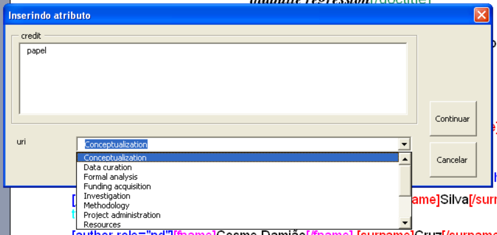
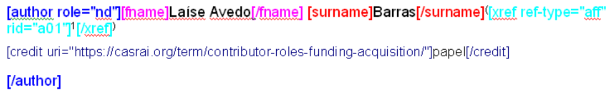

# CRediT: Markup e Geração de XML

É uma taxonomia para explicitar o tipo de contribuição das autorias do documento.

Para SPS 1.10 (JATS 1.1), em cada elemento `contrib` deve conter o papel correspondente do autor.
Usando esta taxonomia, o XML ficaria assim:


## Identificação do papel "Conceitualização"

```xml
<role content-type="https://casrai.org/term/contributor-roles-conceptualization/">Contributor Roles/Conceptualization</role>
```

No lugar de **Contributor Roles/Conceptualization**, pode-se usar um termo correspondente.


Para gerar o XML correspondente, no arquivo marcado, identifica-se o dado da seguinte forma:

```
[credit uri="https://casrai.org/term/contributor-roles-conceptualization/"]Contributor Roles/Conceptualization[/credit]
```

Veja no final da página como fazer a marcação.


## Identificação do papel "Curadoria de Dados"

```xml
<role content-type="https://casrai.org/term/contributor-roles-data-curation/">Contributor Roles/Data curation</role>
```

No lugar de **Contributor Roles/Data curation**, pode-se usar um termo correspondente.


Para gerar o XML correspondente, no arquivo marcado, identifica-se o dado da seguinte forma:

```
[credit uri="https://casrai.org/term/contributor-roles-data-curation/"]Contributor Roles/Data curation[/credit]
```

Veja no final da página como fazer a marcação.


## Identificação do papel "Análise Formal"

```xml
<role content-type="https://casrai.org/term/contributor-roles-formal-analysis/">Contributor Roles/Formal analysis</role>
```

No lugar de **Contributor Roles/Formal analysis**, pode-se usar um termo correspondente.


Para gerar o XML correspondente, no arquivo marcado, identifica-se o dado da seguinte forma:

```
[credit uri="https://casrai.org/term/contributor-roles-formal-analysis/"]Contributor Roles/Formal analysis[/credit]
```

Veja no final da página como fazer a marcação.


## Identificação do papel "Aquisição de Financiamento"

```xml
<role content-type="https://casrai.org/term/contributor-roles-funding-acquisition/">Contributor Roles/Funding acquisition</role>
```

No lugar de **Contributor Roles/Funding acquisition**, pode-se usar um termo correspondente.


Para gerar o XML correspondente, no arquivo marcado, identifica-se o dado da seguinte forma:

```
[credit uri="https://casrai.org/term/contributor-roles-funding-acquisition/"]Contributor Roles/Funding acquisition[/credit]
```

Veja no final da página como fazer a marcação.

## Identificação do papel "Pesquisa"

```xml
<role content-type="https://casrai.org/term/contributor-roles-investigation/">Contributor Roles/Investigation</role>
```

No lugar de **Contributor Roles/Investigation**, pode-se usar um termo correspondente.


Para gerar o XML correspondente, no arquivo marcado, identifica-se o dado da seguinte forma:

```
[credit uri="https://casrai.org/term/contributor-roles-investigation/"]Contributor Roles/Investigation[/credit]
```

Veja no final da página como fazer a marcação.

## Identificação do papel "Metodologia"

```xml
<role content-type="https://casrai.org/term/contributor-roles-methodology/">Contributor Roles/Methodology</role>
```

No lugar de **Contributor Roles/Methodology**, pode-se usar um termo correspondente.


Para gerar o XML correspondente, no arquivo marcado, identifica-se o dado da seguinte forma:

```
[credit uri="https://casrai.org/term/contributor-roles-methodology/"]Contributor Roles/Methodology[/credit]
```

Veja no final da página como fazer a marcação.

## Identificação do papel "Administração do Projeto"

```xml
<role content-type="https://casrai.org/term/contributor-roles-project-administration/">Contributor Roles/Project administration</role>
```

No lugar de **Contributor Roles/Project administration**, pode-se usar um termo correspondente.


Para gerar o XML correspondente, no arquivo marcado, identifica-se o dado da seguinte forma:

```
[credit uri="https://casrai.org/term/contributor-roles-project-administration/"]Contributor Roles/Project[/credit]
```

Veja no final da página como fazer a marcação.

## Identificação do papel "Recursos"

```xml
<role content-type="https://casrai.org/term/contributor-roles-resources/">Contributor Roles/Resources</role>
```

No lugar de **Contributor Roles/Resources**, pode-se usar um termo correspondente.


Para gerar o XML correspondente, no arquivo marcado, identifica-se o dado da seguinte forma:

```
[credit uri="https://casrai.org/term/contributor-roles-resources/"]Contributor Roles/Resources[/credit]
```

Veja no final da página como fazer a marcação.

## Identificação do papel "Software"

```xml
<role content-type="https://casrai.org/term/contributor-roles-software/">Contributor Roles/Software</role>
```

No lugar de **Contributor Roles/Software**, pode-se usar um termo correspondente.


Para gerar o XML correspondente, no arquivo marcado, identifica-se o dado da seguinte forma:

```
[credit uri="https://casrai.org/term/contributor-roles-software/"]Contributor Roles/Software[/credit]
```

Veja no final da página como fazer a marcação.

## Identificação do papel "Supervisão"

```xml
<role content-type="https://casrai.org/term/contributor-roles-supervision/">Contributor Roles/Supervision</role>
```

No lugar de **Contributor Roles/Supervision**, pode-se usar um termo correspondente.


Para gerar o XML correspondente, no arquivo marcado, identifica-se o dado da seguinte forma:

```
[credit uri="https://casrai.org/term/contributor-roles-supervision/"]Contributor Roles/Supervision[/credit]
```

Veja no final da página como fazer a marcação.

## Identificação do papel "Validação"

```xml
<role content-type="https://casrai.org/term/contributor-roles-validation/">Contributor Roles/Validation</role>
```

No lugar de **Contributor Roles/Validation**, pode-se usar um termo correspondente.


Para gerar o XML correspondente, no arquivo marcado, identifica-se o dado da seguinte forma:

```
[credit uri="https://casrai.org/term/contributor-roles-validation/"]Contributor Roles/Validation[/credit]
```

Veja no final da página como fazer a marcação.

## Identificação do papel "Visualização"

```xml
<role content-type="https://web.archive.org/web/20180314065118/http://dictionary.casrai.org/Contributor_Roles/Visualization">Contributor Roles/Visualization</role>
```

No lugar de **Contributor Roles/Visualization**, pode-se usar um termo correspondente.


Para gerar o XML correspondente, no arquivo marcado, identifica-se o dado da seguinte forma:

```
[credit uri="https://web.archive.org/web/20180314065118/http://dictionary.casrai.org/Contributor_Roles/Visualization"]Contributor Roles/Visualization[/credit]
```

Veja no final da página como fazer a marcação.

## Identificação do papel "Escrita do manuscrito original"

```xml
<role content-type="https://casrai.org/term/contributor-roles-writing-original-draft/">Contributor Roles/Writing – original draft</role>
```

No lugar de **Contributor Roles/Writing – original draft**, pode-se usar um termo correspondente.


Para gerar o XML correspondente, no arquivo marcado, identifica-se o dado da seguinte forma:

```
[credit uri="https://casrai.org/term/contributor-roles-writing-original-draft/"]Contributor Roles/Writing – original draft[/credit]
```

Veja no final da página como fazer a marcação.

## Identificação do papel "Escrita - Revisão e Edição"

```xml
<role content-type="https://casrai.org/term/contributor-roles-writing-review-editing/">Contributor Roles/Writing – review &amp; editing</role>
```

No lugar de **Contributor Roles/Writing – review & editing**, pode-se usar um termo correspondente.


Para gerar o XML correspondente, no arquivo marcado, identifica-se o dado da seguinte forma:

```
[credit uri="https://casrai.org/term/contributor-roles-writing-review-editing/"]Contributor Roles/Writing – review & editing[/credit]
```

Veja no final da página como fazer a marcação.


## Como marcar o elemento _credit_

O botão da etiqueta `credit` fica disponível em `author`.

O dado a ser marcado deve ficar junto ao nome do autor, de forma que todos os dados referentes ao mesmo autor, fiquem agrupados pelo elemento `author`.

Selecionar no texto do documento o trecho que corresponde ao termo do papel.

Selecione o botão `credit`. Será mostrada uma janela para preencher um valor para `uri`. Escolha uma das opções que corresponde ao papel relacionado.

Pode-se marcar mais de um `credit` por `author`.


	

	
	


