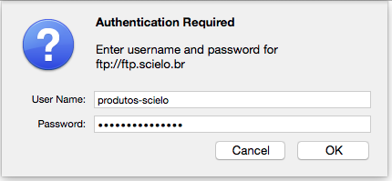
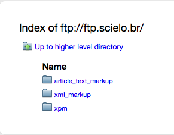

Última atualização Jun, 2020


# Download Markup SGML/HTML

Abra o navegador Web e escreva o endereço: <ftp://ftp.scielo.br>

Informe o usuário e a senha

```
usuário: produtos-scielo
senha: produtos@scielo
```


  


Veja as pastas disponíveis:


  


Selecione a pasta:

- article_text_markup: Programas Markup SGML/HTML (article and text DTD)

