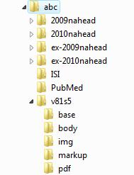

How to generate SGML files (article and text DTD)
=================================================

.. toctree::
   :maxdepth: 3

Files specifications
--------------------

- one document (article or text) by file
- .html
- all the files related to the document must have the same name. For instance, a01.pdf. 
- all the *translations* files must have the same name preceeded by <lang two letters>_. For instance, en_a01.pdf, en_a01.html.

Files location
--------------

Organize the files according to this files/folders structure.

files for Markup
    /scielo/serial/<acron>/<issue_identification>/markup

body
    /scielo/serial/<acron>/<issue_identification>/body

images
    /scielo/serial/<acron>/<issue_identification>/img

pdf
    /scielo/serial/<acron>/<issue_identification>/pdf

For instance:

Input files for Markup
----------------------

You must not have /scielo/bin/markup/markup_journals_list.csv. If you do, delete it.

Instead, you must have:

- ??_issue.mds: updated/created as any issue number’s data is updated/created
- issue.mds: updated/created as any issue number’s data is updated/created
- journal-standard.txt: updated/created as any journal’s data is updated/created

These files are generated by `Title Manager <titlemanager.html>`_ or SciELO Manager.

Markup
------

Use `Markup Program <markup.html>`_.

----------------

Last update of this page: August 2015
