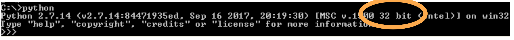
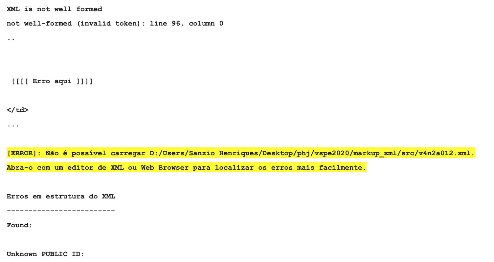
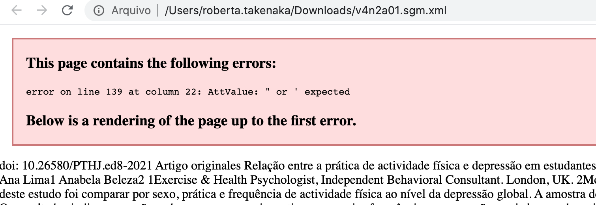
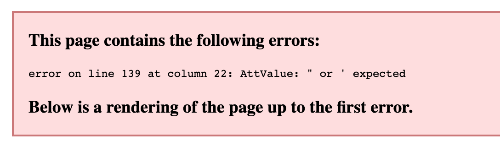
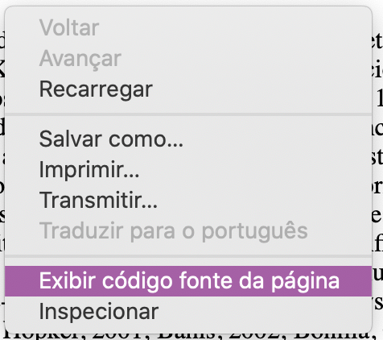
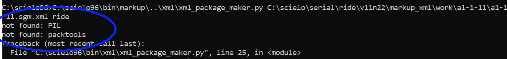

.. _how_to_generate_xml-problem:

Como resolver problemas na geração de XML
=========================================

Introdução
==========

Este documento apresenta os principais problemas e soluções ao gerar o XML.


.. image:: img/GeneratingReport.png
   :height: 400px
   :align: center


Problema 1: Pré-requisitos não instalados adequadamente
=======================================================

Para descartar se este é o problema
-----------------------------------

No terminal do DOS, digite:

```
python
```

Se obtiver uma mensagem:

```
'python' não é reconhecido como um comando interno
ou externo, um programa operável ou um arquivo em lotes.
```

Ou Python não está instalado ou não está no PATH. 
Estar no PATH, significa que está registrado no computador a localização do Python, de forma que de dentro de qualquer diretório (pasta) o comando python pode ser executado.

**Solução:** 

Reinstale o Python com atenção a:

* Python 2.7.x, 32 bits (não 64 bits)
* Pip - selecionar esta opção ao instalar Python
* Inserir o Python no PATH (Add to PATH) - selecionar esta opção ao instalar Python
* SEMPRE que reinstalar Python, revisite esta página para verificar se os pré-requisitos estão funcionando


Senão, entrará no terminal do Python.




Observe se está escrito 32 bit e não 64. No passado, alguns usuários que tinham instalado python 64 bits tiveram que reinstalar python 32 bit para que os programas funcionassem. Você pode tentar usar 64 bit no lugar de 32, mas se não obtiver sucesso, tente com o 32.

**Solução:** 

Reinstale o Python com atenção a:

* Python 2.7.x, 32 bits (não 64 bits)
* Pip - selecionar esta opção ao instalar Python
* Inserir o Python no PATH (Add to PATH) - selecionar esta opção ao instalar Python
* SEMPRE que reinstalar Python, revisite esta página para verificar se os pré-requisitos estão funcionando


Ainda no terminal do Python, execute os comandos:


```
import PIL

```


```
import packtools

```


```
exit()
```

Execute o comando `exit()` para sair do terminal do python.


Se não obtiver nenhuma mensagem é porque estão instalados.

Se para algum deles obtiver a mensagem:


```
ImportError: No module named 'PIL'
```

```
ImportError: No module named 'packtools'
```

é porque não estão instalados. 

**Solução:** 

No terminal do DOS, execute:

```
pip install pillow==6.2.2
```

```
pip install packtools==2.5.1
```

Se apresentar qualquer mensagem de **WARNING**, pode **ignorar**. E **teste a geração de XML**.


Mas se obtiver a mensagem:

```
'pip' não é reconhecido como um comando interno
ou externo, um programa operável ou um arquivo em lotes.
```


Reinstale o Python com atenção a:

* Python 2.7.x, 32 bits (não 64 bits)
* Pip - selecionar esta opção ao instalar Python
* Inserir o Python no PATH (Add to PATH) - selecionar esta opção ao instalar Python
* SEMPRE que reinstalar Python, revisite esta página para verificar se os pré-requisitos estão funcionando


Problema 2: Problema em um documento marcado
============================================

Se obtiver um erro similar a este significa que a marcação contém erro nas etiquetas ou nos atributos e, por isso, o XML não será gerado.





No arquivo XML é esperado que contenha etiquetas ou *tags* de abertura e fechamento, respectivamente, [etiqueta] e [/etiqueta].

Por exemplo, as etiquetas de parágrafo indicam que determinado conteúdo é parágrafo:

```
[p]Isto é um parágrafo no artigo[/p]
```


Etiquetas podem agrupar um conjunto de conteúdos etiquetados (*tagueados*):


```
[section]
[p]Isto é um parágrafo no artigo[/p]
[p]Isto é um parágrafo no artigo[/p]
[p]Isto é um parágrafo no artigo[/p]
[p]Isto é um parágrafo no artigo[/p]
[p]Isto é um parágrafo no artigo[/p]
[/section]
```

O erro é provocado quando há falta de pareamento: abertura e fechamento.

Atributos são dados identificados dentro da etiqueta de abertura, por exemplo na `doc` há vários:


.. image:: img/doc-mkp-language-doctitle.jpg
   :height: 400px
   :align: center


A sintaxe dos atributos é:

```
nome="dado"
```

observe que as aspas são "retas".


Siga as instruções da mensagem:

.. image:: img/GeneratingXML_erro_apresentado_no_navegador0.jpg
   :height: 400px
   :align: center


Abra o arquivo em um navegador Web ou num editor de XML, melhor ainda.

O exemplo ilustra no navegador Web Chrome.





Observe o erro e a linha onde ocorre. O erro que obtiver não necessariamente é o mesmo, mas terá a ver com aquilo que foi explicado sobre as aspas e/ou as etiquetas.







Clique com o botão direito do *mouse* sobre a página no navegador Web e selecione a opção "visualizar código fonte" ou similar.


.. image:: img/GeneratingXML_erro_apresentado_no_navegador4.png
   :height: 400px
   :align: center


Vá até a linha em que ocorreu o erro e observe como está a marcação, considerando o que foi dito sobre as etiquetas e as aspas dos atributos.


Volte à marcação e faça as devidas correções.


Problema 3: Bug no programa
===========================

Logo após tentar gerar o XML, antes de fechar o programa, acesse pelo Windows Explorer a pasta do programa Markup, por exemplo:

```
c:\scielo\bin\markup\tmp
```

Dentro você localizará um arquivo chamado cmd.log

Abra o arquivo (é um arquivo texto), seleciona última linha, a partir do comando do python.

Cole este comando no terminal do DOS.

Observe a mensagem obtida.


Um possível problema está ilustrado nesta figura.




**Solução**:
Revise, nesta página, a seção: 
"Problema 1: Pré-requisitos não instalados adequadamente"


Caso contrário, veja a seção "PEDINDO AJUDA"

PEDINDO AJUDA
=============

Antes de pedir ajuda, revise esta página e tente usar os programas novamente.
Persistindo o problema, refaça todos os passos capturando cada tela até ocorrer o erro. Apenas a última captura pode não ser o suficiente.

Ao pedir ajuda:
1. descreva as tentativas de solucionar os problemas
2. envie todas as capturas de tela até apresentar o erro
3. envie o arquivo .doc
4. envie o arquivo .xml indicado nas mensagens de erro

Isso agilizará a identificação do problema e a solução.
Vale lembrar que os membros da lista também podem dar apoio.
Vale lembrar que soluções podem ser encontradas fazendo pesquisa na própria lista de discussão.
