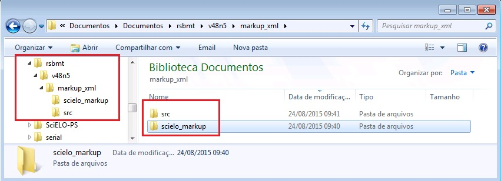
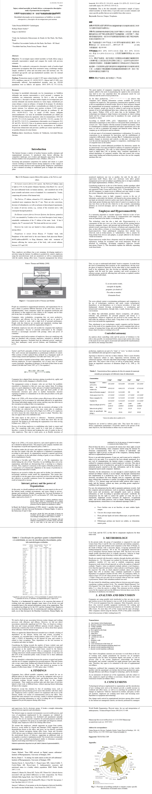

.. _pt_how_to_generate_xml-prepara:

How to prepare the files for Markup Program
===========================================
 
Antes de iniciar o processo de marcação, é necessário seguir alguns passos para preparação do arquivo que será marcado.
Veja abaixo os requisitos para a marcação do documento.
 
 * Os arquivos devem estar em formato Word (.doc) ou (.docx).
 * A estrutura de pastas deve seguir o padrão SciELO
 * Os arquivos devem ser formatados de acordo com a Formatação SciELO.
 

.. note:: A nomeação dos arquivos que serão trabalhados não deve conter espaços, acentos ou
         caracteres especiais. Caso seja necessário separar uma informação de outra use underline. 
         Apenas dessa forma as imagens marcadas no corpo do texto serão renomeadas e geradas corretamente. 
         Exemplo: ACB_2345.doc

Arquivos de entrada para o Markup
---------------------------------

Periódicos do www.scielo.org
............................

Somente se é um periódico do www.scielo.org, use o menú para atualizar a lista de periódicos.

   .. image:: img/scielo_menu_download_journals.png

Selecione a coleção:

   .. image:: img/download_journals_data.png

Outros periódicos
.................

Não deve existir o arquivo /scielo/bin/markup/markup_journals_list.csv. Se existe, apague-o.

No lugar, deve existir:

- ??_issue.mds: atualizado/criado assim que qualquer dado de fascículo é criado ou atualizado
- journal-standard.txt: atualizado/criado assim que qualquer dado de periódico é criado ou atualizado

Estes arquivos são gerados pelo programa `Title Manager <titlemanager.html>`_ ou `SciELO Manager <http://docs.scielo.org/projects/scielo-manager/en/latest/>`_.

.. note::
   Title Manager gera estes arquivos em /scielo/bin/markup no computador onde Title Manager é executado.
   Então, se o Markup é usado em outro computador, é necessário copiar estes arquivos para o computador onde o Markup será executado.

.. raw:: html

   <iframe width="854" height="480" src="https://www.youtube.com/embed/SNAXZ1BaMM0?list=PLQZT93bz3H79NTc-aUFMU_UZgo4Vl2iUH" frameborder="0" allowfullscreen></iframe>

.. _estrutura-de-pastas:

Estrutura de pastas
-------------------

Antes de iniciar a marcação, é necessário garantir que a estrutura de pastas
esteja como segue:

Veja que dentro da pasta "markup_xml" foram inseridas duas pastas, no mesmo nível:

 * src: utilizada para inserir os arquivos PDF, mídia e suplementos.
 * scielo_markup: utilizada para inserir os arquivos .doc ou .docx.

..  note:: Se a recomendação de estrutura apresentada acima não for seguida, o processo de marcação não será iniciado.

.. raw:: html

   <iframe width="854" height="480" src="https://www.youtube.com/embed/RLizVtt5Ca8?list=PLQZT93bz3H79NTc-aUFMU_UZgo4Vl2iUH" frameborder="0" allowfullscreen></iframe>

.. _formato-scielo:

Formatação do Arquivo
---------------------

Para otimizar o processo de marcação dos elementos básicos do arquivo, é necessário seguir o padrão de formatação SciELO disponível abaixo:

**Instruções para formatação de dados básicos do artigo:**

 * Linha 1: inserir número de DOI (somente se presente), caso não exista deixar linha em branco;
 * Linha 2: inserir a seção do sumário (Se ausente, deixar linha em branco);
 * Linha 3: Título do artigo;
 * Linhas seguintes: Títulos traduzidos do arquivo;
 * Para separar autores de título, pular 1 linha;
 * Cada autor deve estar em uma linha e usar "sup" para label;
 * Pular 1 linha para separar autores de afiliações;
 * Cada afiliação deve estar em uma linha;
 * Pular 1 linha para separar afiliação de resumos;
 * Resumos estruturados: negrito no nome da seção;
 * Palavras-chave: os separadores devem ser ou ponto-e-vírgula ou vírgula;
 * Seções: negrito, 16, centralizadas;
 * Subseções: negrito, 14, centralizadas;
 * Subseção de subseção: negrito, 13, centralizadas;
 * Texto: formatação livre;
 * Para tabelas, label e caption na linha antes da imagem, mas os demais, após a imagem;
 * Separador de label e caption: dois-pontos e espaço ou espaço + hífen + espaço ou ponto + espaço;
 * Para tabelas codificadas, o cabeçalho deve estar em negrito;
 * A citação de autor/data no corpo do texto deve ser: sobrenome do autor, ano;
 * Para citação no sistema numérico no corpo do texto: "sup" e entre parênteses;
 * Notas de rodapé no corpo do texto podem estar em "sup", mas não estarão entre parênteses;
 * Citações (quote), recuo de 4 cm da margem esquerda;

Exemplo:

.. raw:: html

   <iframe width="854" height="480" src="https://www.youtube.com/embed/kaYRu-bkhBE?list=PLQZT93bz3H79NTc-aUFMU_UZgo4Vl2iUH" frameborder="0" allowfullscreen></iframe>

.. note:: As imagens dos artigos devem estar disponíveis no arquivo .doc, preferencialmente em formato .jpeg e .png.
