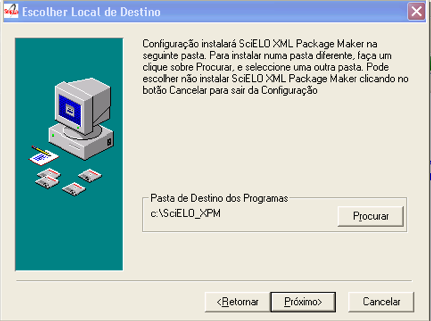
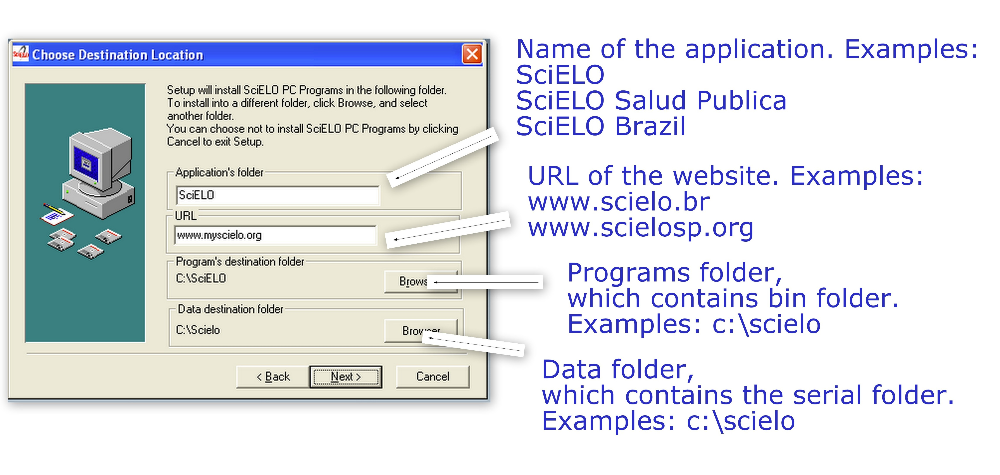
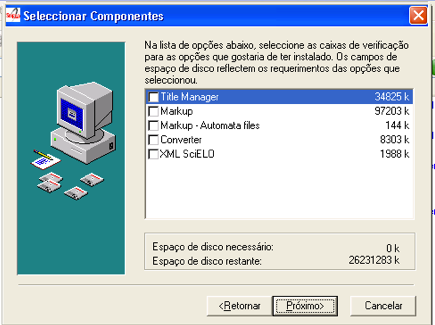

.. pcprograms documentation master file, created by
 sphinx-quickstart on Tue Mar 27 17:41:25 2012.
 You can adapt this file completely to your liking, but it should at least
 contain the root `toctree` directive.

.. how_to_update:

=============
How to update
=============

Before updating
---------------
1. Be sure **where** the programs (**bin folder**) are installed. E.g.: c:\\scielo.
2. Be sure **where** the data (**serial folder**) are stored. E.g.: c:\\scielo.

.. code_and_title_error:

Before updating Title Manager and Code Manager 
----------------------------------------------

Only some files in **code folder** will be updated. Be sure you have  **your code folder** in **serial** before updating. DO NOT copy **serial** contents after updating. But in case you have done it, reinstall the programs again.

.. how_to_install:

==============
How to install
==============

XML Package Maker
-----------------
1. Check if you have installed the :ref:`Requirements`. 
2. `Test the requirements are correctly installed <howtoinstall_path.html#test_requirements>`_
3. Download the `installer <download.html>`_
4. Run the installer.
5. Configure the location of the application

SciELO PC Programs
------------------

1. Check if you have installed the :ref:`Requirements`. 
2. `Test the requirements are correctly installed <howtoinstall_path.html#test_requirements>`_
3. Download the `installer <download.html>`_
4. Run the installer.

5. Configure:

 * Application name
 * Website **url**
 * **bin** folder location (DO NOT use diacritics)
 * **serial** folder location (DO NOT use diacritics)

6. Select the programs you want to install in your computer, according to the purpose:

- Local server (only one computer)

  - Title Manager: program to manage journals and issues databases
  - Converter: program to load the marked documents into the database
  - XML SciELO: (optional) program to create XML format for PubMed

- Desktop Computer (one or more computer)

  - Markup: program to identify the bibliographic elements in the articles/texts
  - Markup - Automata files (optional): examples of files for automatic markup

================
How to configure
================

Converter, Title Manager, Code Manager
--------------------------------------

Set OS23470a to the environment variable BAP, by accessing the Windows menu: Control Panel -> Performance and Maintenance -> System -> Advanced Settings -> Environment variables.

  Check if the variable already exists. 
  If it does not, click New and enter the value.

  .. image:: img/installation_setup_bap.jpg

XML Converter
-------------

Edit the file corresponding to **c:\\scielo\\bin\\scielo_paths.ini**, the line:

.. code::

  SCI_LISTA_SITE=c:\\home\\scielo\www\\proc\\scilista.lst

Change **c:\\home\\scielo\\www** to the location of local SciELO Website. E.g.: **c:\\var\\www\\scielo**

Application menu
----------------

Sometimes the menu of the application will be created only for the Administrator user. 

.. code::

  C:\\Documents and Settings\\Administrador\\Menu Iniciar\\Programas

In this case, copy the SciELO folder to All Users folder, to all users have the menu.

.. code::

  C:\\Documents and Settings\\All Users\\Menu Iniciar\\Programas

