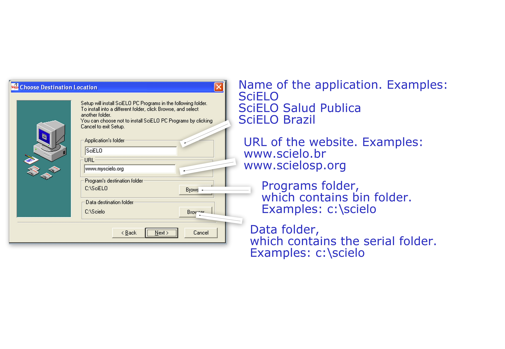

.. pcprograms documentation master file, created by
 sphinx-quickstart on Tue Mar 27 17:41:25 2012.
 You can adapt this file completely to your liking, but it should at least
 contain the root `toctree` directive.

SciELO PC Programs' documentation

Requirements
============

- JAVA
- PYTHON 2.7.x

.. note:: Add the Java and Python paths to PATH (environment variable)

How to install
==============

1. Download the `installer <download.html>`_
2. Install the requirements
3. Run the installer
4. Follow the instructions given in each screen

.. attention:: Use a drive in which the user can have full access 

5. Complete the data of the installation

6. Select the programs you want to install in your computer, according to the purpose of the computer:

- Local server (only one computer)

  - Title Manager: program to manage journal and issues data
  - Markup: program to identify the bibliographic elements in the articles/texts
  - Markup - Automata files (optional): examples of files for automatic markup
  - Converter: program to load the marked documents in the database
  - XML SciELO: (optional) program to create XML format for PubMed and ISI

- Markup Computer (one or more computers)

  - Markup: program to identify the bibliographic elements in the articles/texts
  - Markup - Automata files (optional): examples of files for automatic markup

7. For local server installation, set OS23470a to the environment variable BAP, by accessing the Windows menu: Control Panel -> Performance and Maintenance -> System -> Advanced Settings -> Environment variables.
  Check if the variable already exists. 
  If it does not, click New and enter the value.

  .. image:: img/00_bap.jpg

8. If you install as administrator, the menu of the application will be created only for the Administrator user. 

  C:\\Documents and Settings\\Administrador\\Menu Iniciar\\Programas

So, copy the SciELO folder to All Users folder

  C:\\Documents and Settings\\All Users\\Menu Iniciar\\Programas

----------------

Last update of this page: Feb 6, 2014

