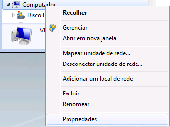
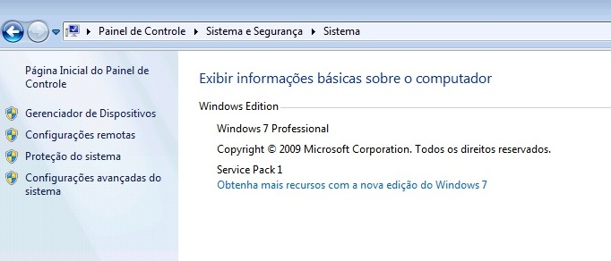
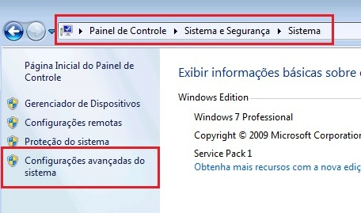
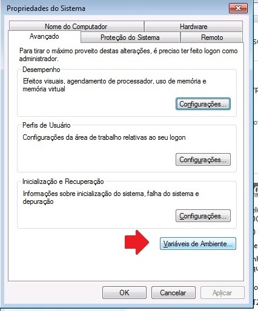
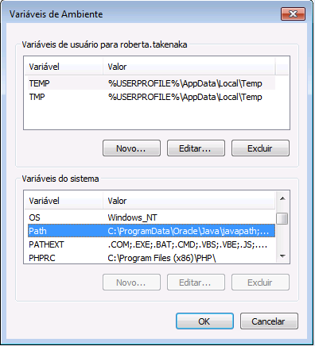
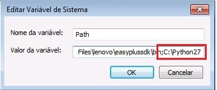
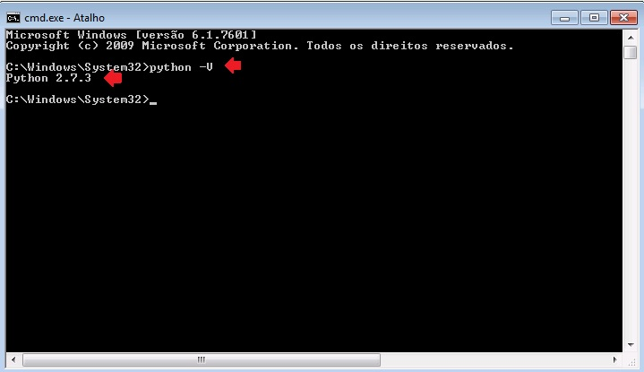
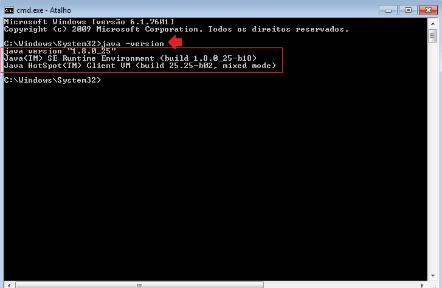

.. _add-paths:

How to add Java and Python paths to Path
========================================

After downloading the file PYTHON 2.7.x and JAVA you have to open the System Configuration.

Use a shortcut to open that window is: Windows + Pause Break key.

Or click on **Computer** with right button of the mouse.

.. image:: img/howtoinstall_path_computer.png

Then click on **Properties**.

Computer System Configuration
-----------------------------

 
Click on Advanced Settings.

Then click on Environment Variables. 

Find Path variable in the list.

.. image:: img/howtoinstall_path_search-path.jpg

Select Path, then click on **Edit** button.

Put the cursor at the end of the line, insert the character ";" and complete with the Python path. Do the same to JAVA.

It means, insert the character ";" and complete with the JAVA path.

Make sure that this procedure was done correctly using a **NEW** window of DOS terminal. Do not use any which is already open. 
Open a **NEW** window of DOS terminal and type:

.. code-block:: code
 
 	python -V

Expected:

Then check Java:

.. code-block:: code

	java -version

Expected:

With Java and Python installed and added to Path, the Markup program is almost ready for use.
