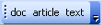

.. pcprograms documentation master file, created by
   You can adapt this file completely to your liking, but it should at least
   contain the root `toctree` directive.

Markup Program
==============

Markup program is a desktop Application (macro in Microsoft Office Word), to identify bibliographic elements in the articles and texts, according to SciELO DTD for `article <dtd.html#article>`_ and for `text <dtd.html#text>`_, based on standard ISO 8879-1986 (SGML - Standard Generalized Markup Language) and ISO 12083-1994 (Electronic Manuscript Preparation and Markup).

Nowadays there is a new SciELO DTD: doc. It is simpler than article and text because there are less levels, but by the other hand, there are more elements to identify. It must be used to identify the elements to generate XML according to `SPS <http://docs.scielo.org/projects/scielo-publishing-schema/>`_. 

Functionalities
---------------

- identify the elements of articles and texts, in a .doc or .html format file
- identify semiautomatically the elements of the references.
- validate the identification according to `article <https://raw.githubusercontent.com/scieloorg/PC-Programs/master/src/scielo/bin/SGMLPars/art4_0.dtd>`_, `text <https://raw.githubusercontent.com/scieloorg/PC-Programs/master/src/scielo/bin/SGMLPars/text4_0.dtd>`_, and `doc <https://raw.githubusercontent.com/scieloorg/PC-Programs/master/src/scielo/bin/SGMLPars/doc4_0.dtd>`_.
- generate XML files according to `SPS <http://docs.scielo.org/projects/scielo-publishing-schema/>`_ and `JATS DTD <http://jats.nlm.nih.gov/publishing/1.0/>`_.
- validate XML files according to `SPS <http://docs.scielo.org/projects/scielo-publishing-schema/>`_ and `JATS DTD <http://jats.nlm.nih.gov/publishing/1.0/>`_.

Before starting
---------------

File specification
..................

For both methodologies:
- one document (article or text) by file
- .doc or .html

For SGML:

- all the files related to the document must have the same name. For instance, a01.pdf, a01.html (body file)

For XML:

- all the files related to the document must have the same name or start with same name and hyphen. For instance, a01.pdf, a01.html (body file), a01-f01.jpg (image of the figure 1), a01-en.pdf (PDF of the English version)

Files location
..............

For SGML:

- .doc or .html file: 
    /scielo/serial/<acron>/<issue_identification>/markup
- body: 
    /scielo/serial/<acron>/<issue_identification>/body
- images: 
    /scielo/serial/<acron>/<issue_identification>/img
- pdf: 
    /scielo/serial/<acron>/<issue_identification>/pdf

.. image:: img/concepts_serial_abc.jpg

For XML:

- .doc or .html file: /scielo/serial/<acron>/<issue_identification>/markup_xml/scielo_markup
- other files: /scielo/serial/<acron>/<issue_identification>/markup_xml/src (images, PDF, etc)

.. image:: img/markup_file_system.png

Input files
...........

Title Manager and Code Manager programs generate, in /scielo/bin/markup/ of the `local server <concepts.html#local-server>`, the following files:

- ??_attb.mds - updated when code database is updated
- ??_issue.mds - updated when any issue number's data is updated/created
- issue.mds - updated when any issue number's data is updated/created
- journal-standard.txt - updated when any journal's data is updated/created

How to open
-----------

Use the Windows menu to open the program.

.. image:: img/scielo_menu.png

Or use Windows Explorer and click on markup.exe: 

  c:\\scielo\\bin\\markup\\markup.exe

Word Program location
.....................

Markup Program will try to open the Microsoft Office Word Program. If it is unable to open it, inform the correct path of Microsoft Office Word Program.

.. image:: img/markup_word_path.jpg

Or edit, c:\\scielo\\bin\\markup\\start.mds, inserting the Microsoft Office Word path. E.g.:

  "c:\\arquivos de programas\\microsoft office\\office11\\winword.exe"

Enabling macro execution
........................

Markup Program requires permission to run macros

.. image:: img/markup_2007_habilitar_macros.jpg

Markup button
.............

If Word program opens properly, Markup bar will appear at the bottom of the screen.

.. image:: img/markup_botao_markup.jpg

From Word 2007, it is different. The Markup bar will appear inside the Supplement group.

.. image:: img/markup_2007_botao_suplementos.jpg

Loading macro manually
......................

If there is no Markup button. You can try to load the macro manually.

Select the  Tools->Supplements and Models option of the menu.

.. image:: img/markup_habilitarmacro.jpg

Remove the incorrect item and inform the right path corresponding to c:\\scielo\\bin\\markup\\markup.prg.

.. image:: img/markup_habilitarmacro2.jpg

Overview
--------

#. Open only one file of article or a text file (.doc or .html).

#. Click on Markup button.

#. Click on Markup DTD-SciELO.

- white: operations over the document: edit or eraser a tag and automatic markup
- orange: floating tags, which can be used in any part of the document
- green: tags which requires an hierarchical structure

.. image:: img/markup_barras.jpg

From Word 2007, all these tags bars are grouped in Supplements.

.. image:: img/markup_2007_posicao_das_barras.jpg

Operations bar
--------------

.. image:: img/markup_operations_bar.png

Exit button
...........

.. image:: img/markup_operations_bar_exit.jpg

To exit the program, click on Exit button.

Choose one of the options bellow.

.. image:: img/markup_exit_message.png

Edition tag's attribute button
..............................

.. image:: img/markup_operations_bar_edit.jpg

To edit attributes of an element, click on the element name, then click on the edit button (pencil). Edit the values of the attributes, then confirm this action.

Delete tag button
.................

.. image:: img/markup_operations_bar_del.jpg

To delete one element and its attributes, click on the element name, then click on the delete button. The program will ask to confirm this action.

Save file button
................

.. image:: img/markup_operations_bar_save.jpg

To save the file, click on the save button.

Automata 1 button
.................

.. image:: img/automata1.jpg

To identify automatically the elements of the bibliographic references:

It requires that the journal has an automata file (read `how to program an automata <automata.html>`_), which configures the rules to identify the references elements.

1. Click on a paragraph of one bibliographic reference
2. Click on the Automata 1 button.

This action will activate a tool which will try to identify automatically the bibliographic reference elements. The tool will present the several possibilities of identification. Choose the correct one. 

.. image:: img/automata1b.jpg

Automata 2 Button
.................

.. image:: img/automata2.jpg

To identify automatically a set of bibliographic references (available only for Vancouver standard).

1. Select one or more bibliographic references

.. image:: img/markup_automata2_select.jpg

2. Click on the Automata 2 button. 

The program will try to identify all the references, keeping the original reference identified as [text-ref]. Thus the user can compare the original to the detailed identification in order to check if the reference was properly identified, and correct it, if necessary.

.. image:: img/markup_automata2_marcado.jpg

Automata 3 button
.................

.. image:: img/automata3.jpg

To identify automatically the elements of the bibliographic references:

It requires that the journal has to adopt a standard (APA, Vancouver, ABNT, ISO)

1. Click on a paragraph of one bibliographic reference
2. Click on the Automata 3 button.

This action will activate a tool which will try to identify automatically the bibliographic reference elements. The tool will present the several possibilities of identification. Choose the correct one. 

.. image:: img/automata1b.jpg

Save button
...........

.. image:: img/markup_operations_bar_save.jpg

Click on this button to save the document.

SGML Parser button
..................

.. image:: img/markup_operations_bar_parser.jpg

Click on this button to validate the SGML Markup.
It will convert the file to .txt and will open it in the `SGML Parser program <parser.html>`_.

Generate XML button
...................

.. image:: img/markup_operations_bar_xml.jpg

After identifying all the elements of the document, click on this button to generate the XML file.

Files and DTD errors report button
.........................................

.. image:: img/markup_operations_bar_err_report.jpg

Click on this button to view the `report of files and DTD errors  <xml_package_maker.html#report-of-files-and-dtd-errors>`_.

SciELO Style Checker report button
..................................

.. image:: img/markup_operations_bar_xml_style_report.jpg

Click on this button to view the `report of SciELO Style Checker <xml_package_maker.html#report-of-scielo-style-checker>`_.

Contents Validations report button
..................................

.. image:: img/markup_operations_bar_data_val_report.jpg

Click on this button to view the `report of Contents Validations <xml_package_maker.html#report-of-contents-validations>`_.

PMC Style Checker report button
...............................

.. image:: img/markup_operations_bar_pmc_style_report.jpg

Click on this button to view the `report of PMC Style Checker <xml_package_maker.html#report-of-pmc-style-checker>`_.

View Markup button
...................

The operations bar would be presented with some buttons unavailable when any report is displayed.

.. image:: img/markup_operations_bar_reports.png

Click on this button to view the SGML file.

.. image:: img/markup_operations_bar_view_markup.jpg

Floating tags bar
-----------------

The floating tags are for the elements which appear in any part of the document.

.. image:: img/markup_bar_floating.png

Hierarchical tags bar
---------------------

This bar groups the elements which follow an hierarchical structure. 

The highest level are doc, article, text.

Tag
...

#. Select the text you want to identify.
#. Click on the tag button which identifies the text. For example: to identify the first name of an author, select the text corresponding to the first name, then click on fname.
#. Some elements have attributes. Complete the form with the values of their attributes.
#. Some elements have children (agroup other elements). As it is identified, the bar of the lower level is displayed.

Read the `Tags of Article, Text, and Doc DTD <markup_tags.html>`_

Navigation
...........

The down and up arrows button are used to navigate between the levels. 

.. image:: img/markup_barra_hierarquica2.jpg

For example: 

Down
++++

Bar of **front** element

.. image:: img/markup_barra_front.jpg

Bar of **front** element's children

.. image:: img/markup_barra_titlegrp.jpg

Bar of **titlegrp** element's chidren

.. image:: img/markup_barra_title.jpg

Up
++

.. image:: img/markup_barra_title_sobe.jpg

.. image:: img/markup_barra_titlegrp_paracima.jpg

.. image:: img/markup_barra_front_0.jpg

How to use
----------

`How to use Markup Program <markup_how_to_use.html>`_.

Error messages
--------------

1. The user has not filled the attribute field with a valid value

.. image:: img/markup_msg_invalid_value_for_attribute.jpg

2. The user clicked on a tag which is not allowed in a incorrect place (it is not according to the DTD). 

.. image:: img/markup_msg_inserting_tag.png

The selected text is inside title and the user clicks on authgrp, which is not allowed inside title.

.. image:: img/markup_msg_inserting_tag.jpg

This message is also displayed if the selected text contains tags or part of tags.

.. image:: img/markup_msg_inserting_tag_03.png

----------------

Last update of this page: July 2015

