.. pcprograms documentation master file, created by
   You can adapt this file completely to your liking, but it should at least
   contain the root `toctree` directive.

Markup Program
==============

Markup program is a desktop Application (macro in Microsoft Office Word), to identify bibliographic elements in the articles and texts, according to SciELO DTD for `article <dtd.html#article>`_ and for `text <dtd.html#text>`_, based on standard ISO 8879-1986 (SGML - Standard Generalized Markup Language) and ISO 12083-1994 (Electronic Manuscript Preparation and Markup).

Functionalities
---------------

- identify the elements of articles and texts, in a .doc or .html format file
- identify semiautomatically the elements of references.
- validate the identification according to `article <dtd.html#article>`_ and for `text <dtd.html#text>`_
- generate XML files according to `SciELO DTD <http://scieloorg.github.io/scielo_publishing_schema/>`_ and `PMC DTD <http://dtd.nlm.nih.gov/publishing/3.0/>`_.
- validate XML files according to `SciELO DTD <http://scieloorg.github.io/scielo_publishing_schema/>`_ and `PMC DTD <http://dtd.nlm.nih.gov/publishing/3.0/>`_.

Before starting
---------------

File specification
..................

- one article/text by file
- .doc or .html
- all the files related to the article must have the same name or start with. For instance, a01.pdf, a01.html (body file), a01f01.jpg (image of the figure 1)

Files location for SGML Markup
.............................

- .doc or .html file: 
    /scielo/serial/<acron>/<issue_identification>/markup
- body: 
    /scielo/serial/<acron>/<issue_identification>/body
- images: 
    /scielo/serial/<acron>/<issue_identification>/img
- pdf: 
    /scielo/serial/<acron>/<issue_identification>/pdf

.. image:: img/concepts_serial_abc.jpg

Files location for XML Markup
..............................

- .doc or .html file: /scielo/serial/<acron>/<issue_identification>/markup_xml/scielo_markup
- other files: /scielo/serial/<acron>/<issue_identification>/markup_xml/src (images, PDF, etc)

.. image:: img/markup_file_system.png

Input files
...........

Title Manager and Code Manager programs generate, in the `local server <concepts.html#local-server>`_, at /scielo/bin/markup/, the following files:

- ??_attb.mds - updated when code database is updated
- ??_issue.mds - updated when any issue number's data is updated/created
- issue.mds - updated when any issue number's data is updated/created
- journal-standard.txt - updated when any journal's data is updated/created

Opening the program
-------------------

Use the Windows menu to open the program.

.. image:: img/scielo_menu.png

By the path of the program, clicking on markup.exe: 

  c:\\scielo\\bin\\markup\\markup.exe

Informing the Word Program location
...................................

Markup will try to open the Microsoft Office Word Program. If it is not in the correct path, Markup program will ask for the right path of Microsoft Office Word Program.

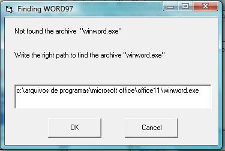

Or edit, c:\\scielo\\bin\\markup\\start.mds, inserting the Microsoft Office Word path:

  "c:\\arquivos de programas\\microsoft office\\office11\\winword.exe"

Enabling macro execution
........................

Possibly a warning about enable macro will be displayed.

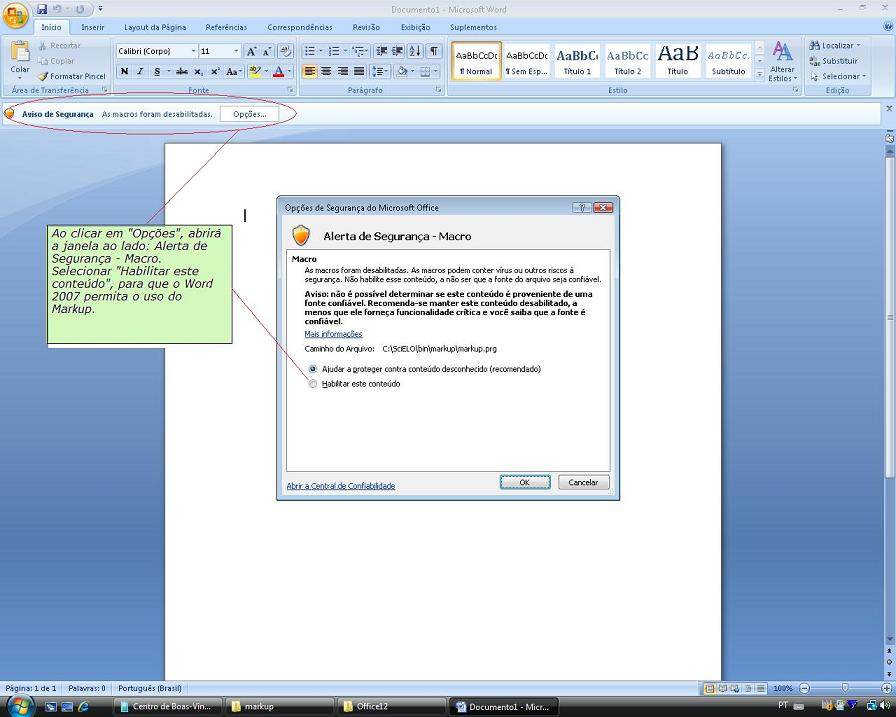

Markup button
.............

If Word program opens properly, Markup bar will appear at the bottom of the screen.

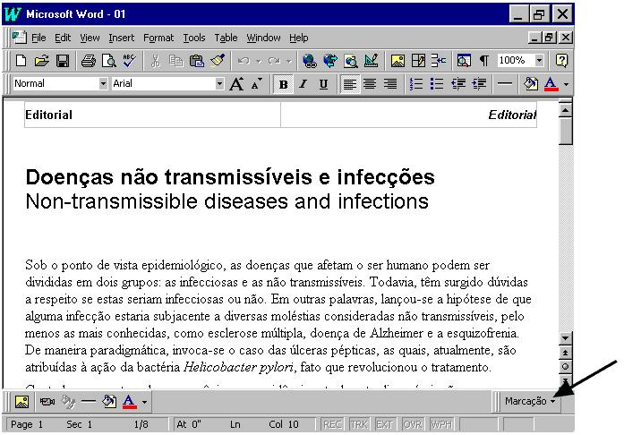

In Word 2007, it is different. The Markup bar will appear inside the Supplement group.

.. image:: img/markup_2007_botao_suplementos.jpg

Loading macro manually
......................

If there is no Markup button. You can try to load the macro manually.

Select the  Tools->Supplements and Models option of the menu.

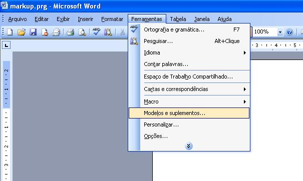

Remove the incorrect item and inform the right path corresponding to c:\\scielo\\bin\\markup\\markup.prg.

.. image:: img/markup_habilitarmacro2.jpg

Opening a file
--------------

#. Open only one file of article or a text file (.doc or .html).

#. Click on Markup button.

#. Click on Markup DTD-SciELO.

The Microsof Office Word bars will disappear, remaining only the Markup bars:

- white: files operations: edit or eraser a tag and automatic markup
- orange: floating tags, which can be used in any part of the document
- green: tags which requires an hierarchical structure

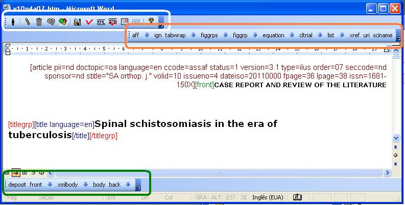

In Word 2007, all these tags bars are grouped in Supplements.

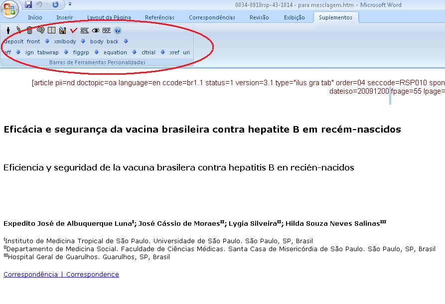

Operations bar
--------------

.. image:: img/markup_operations_bar.png

Exit button
...........

To exit the program, click on Exit button.

Choose one of the options bellow.

.. image:: img/markup_exit_message.png

Edition tag's attribute button
..............................

.. image:: img/markup_operations_bar_edit.jpg

To edit attributes of an element, click on the element name, then click on the edit button (pencil). The program will ask for changing the values of the attributes.

Delete tag button
.................

.. image:: img/markup_operations_bar_del.jpg

To delete one element and its attributes, click on the element name, then click on the delete button. The program will ask to confirm this action.

Save file button
................

.. image:: img/markup_operations_bar_save.jpg

To save the file, click on the save button.

Automata 1 button
.................

To identify automatically the elements of the bibliographic references:

It requires that the journal has to have an automata file (read `how to programming an automata <automata.html>`_), which configures the rules to identify the references elements.

1. Click on a paragraph of one bibliographic reference
2. Click on the Automata 1 button.

This action will activate a tool which will try to identify automatically the bibliographic reference elements. The tool will present the several possibilities of identification. So the user have to choose the correct one. 

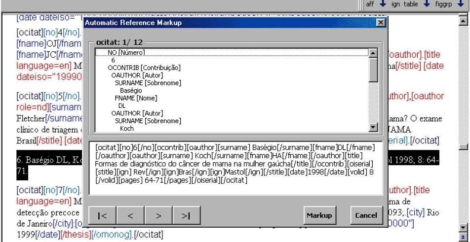

Automata 2 Button
.................

To identify automatically a set of bibliographic references (available only for Vancouver standard).

1. Select one or more bibliographic references

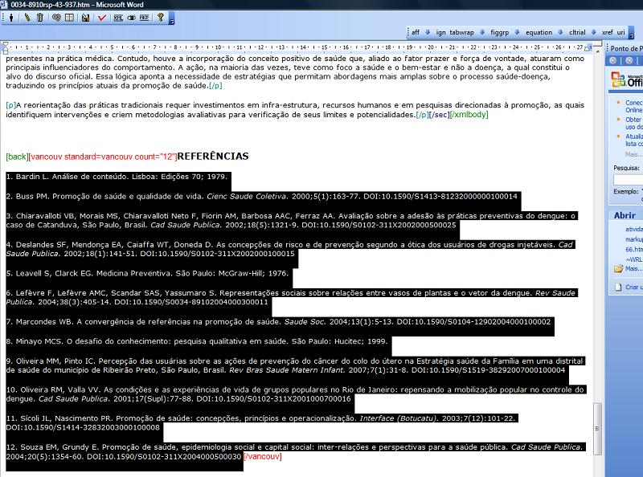

2. Click on the Automata 2 button. 

The program will try to identify all the references, keeping the original reference identified as [text-ref]. Thus the user can compare the original to the detailed identification in order to check if the reference was properly identified, and correct it, if necessary.

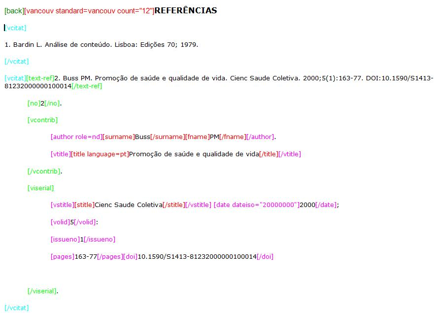

Automata 3 button
.................

To identify automatically the elements of the bibliographic references:

It requires that the journal has to adopt a standard (APA, Vancouver, ABNT, ISO)

1. Click on a paragraph of one bibliographic reference
2. Click on the Automata 3 button.

This action will activate a tool which will try to identify automatically the bibliographic reference elements. The tool will present the several possibilities of identification. So the user have to choose the correct one. 

Save button
...........

.. image:: img/markup_operations_bar_save.jpg

Click on this button to save the document.

SGML Parser button
..................

.. image:: img/markup_operations_bar_parser.jpg

Click on this button to validate the SGML Markup.
It will convert the file to .txt and will run the `SGML Parser program <parser.html>`_.

Generate XML button
...................

After identifying all the elements of the text, click on this button to generate the XML file.

Files/DTD errors report button
..............................

Click on this button to view the `report of files and DTD errors  <xml_package_maker.html#report-of-files-and-dtd-errors>`_.

SciELO Style Checker report button
..................................

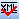

Click on this button to view the `report of SciELO Style Checker <xml_package_maker.html#report-of-scielo-style-checker>`_.

Contents Validations report button
..................................

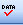

Click on this button to view the `report of Contents Validations <xml_package_maker.html#report-of-contents-validations>`_.

PMC Style Checker report button
...............................

Click on this button to view the `report of PMC Style Checker <xml_package_maker.html#report-of-pmc-style-checker>`_.

View Markup button
...................

The operations bar would be presented with some buttons unavailable when any report is displayed.

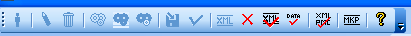

Click on this button to view the SGML file.

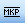

Floating tags bar
-----------------

The floating tags are for the elements which appear in any part of the text.

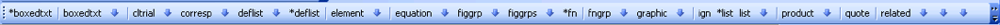

Hierarchical tags bar
---------------------

This bar groups the elements which must be in an hierarchical level. 

The highest level is article or text (other text than articles). But use article to generate XML files.

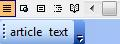

Navigation
...........

As the user identify an element which has elements in a lower level, the bars show the tags of the lower level. 

The down and up arrows button are used to navigate between the levels. 

As the user clicks on the tags button of new level will be displayed.

.. image:: img/markup_barra_hierarquica2.jpg

For example: 

Down
++++

Bar of **front** element

.. image:: img/markup_barra_front.jpg

Bar of **front** element's children

.. image:: img/markup_barra_titlegrp.jpg

Bar of **titlegrp** element's chidren

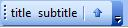

Up
++

.. image:: img/markup_barra_title_sobe.jpg

.. image:: img/markup_barra_titlegrp_paracima.jpg

.. image:: img/markup_barra_front_0.jpg

Identifying the elements
------------------------

#. Select the text to identify
#. Click on the tag button which identify the text. For example: to identify the whole document, select the whole document, then click on article or text.
#. article and text tags have attributes. Fill in the form with the data which are the attributes values of article/text tags.
#. The new level, lower than article or text, will be displayed.
#. Again select the next part, which is front, that groups metadata of the article or text (authors, title, it means, part before the text body)
#. Click on front tag.

Read the `Markup Tags <markup_tags.html>`_

Error messages
--------------

1. The user has not filled the attribute field with a valid value

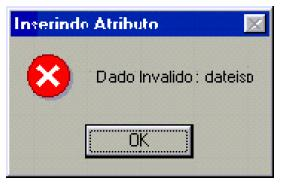

2. The user clicked on a tag which is not allowed in a incorrect place (it is not according to the DTD). 

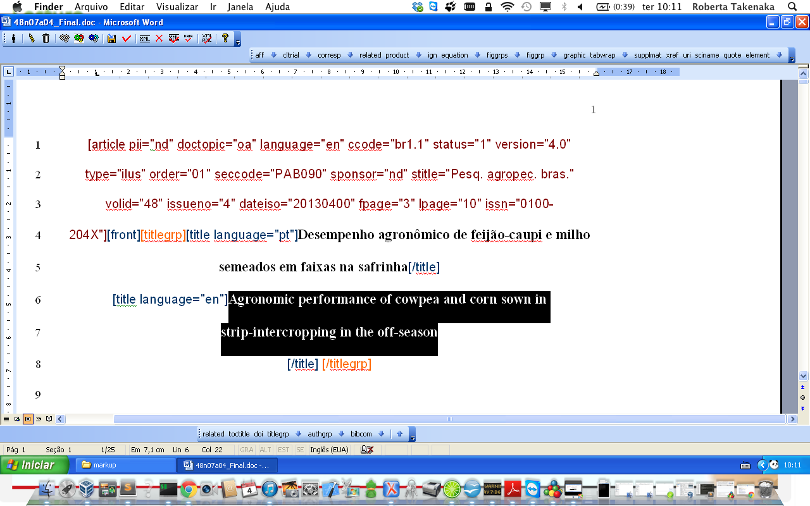

The selected text is inside title and the user clicks on authgrp, which is not allowed inside title.

.. image:: img/markup_msg_inserting_tag.jpg

This message is also displayed if the selected text contains tags or part of tags.

.. image:: img/markup_msg_inserting_tag_03.png

----------------

Last update of this page: Abril 2, 2014

