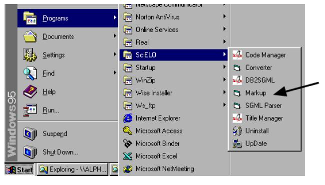
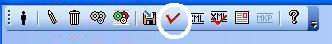

.. pcprograms documentation master file, created by
   You can adapt this file completely to your liking, but it should at least
   contain the root `toctree` directive.

Markup
======

Markup program is a desktop Application (macro in Microsoft Office Word), to identify bibliographic elements in the articles and texts, according to SciELO DTD for `article <dtd.html#article>`_ and for `text <dtd.html#text>`_, based on standard ISO 8879-1986 (SGML - Standard Generalized Markup Language) and ISO 12083-1994 (Electronic Manuscript Preparation and Markup).

Functionalities
---------------

- identify the bibliographic elements in a .doc or .html file
- identify the elements of references semiautomatically
- validate the identification according to `article <dtd.html#article>`_ and for `text <dtd.html#text>`_
- generate XML files according to `http://dtd.nlm.nih.gov/publishing/3.0/`.
- validate XML files according to `http://dtd.nlm.nih.gov/publishing/3.0/`.

Before starting
---------------

File specification
..................

- one article/text by file
- .doc or .html
- same name of the corresponding PDF file
- location of .doc or .html file: /scielo/serial/<acron>/<issue_identification>/pmc/pmc_markup
- location of the other files: /scielo/serial/<acron>/<issue_identification>/pmc/src (images, PDF, etc)

.. image:: img/markup_file_system.png

Input files
...........

Title Manager  and Code Manager programs generate, in the `local server <concepts.html#local-server>`_, at /scielo/bin/markup/, the following files:

- ??_attb.mds - updated when code database is updated
- ??_issue.mds - updated when any issue number's data is updated/created
- issue.mds - updated when any issue number's data is updated/created
- journal-standard.txt - updated when any journal's data is updated/created

Opening the program
-------------------

By the menu, selecting **SciELO** > **Markup**:

By the path of the program, clicking on markup.exe: 

  c:\\scielo\\bin\\markup\\markup.exe

Setting the Word path
.....................

Markup will try to open the Microsoft Office Word Program. If it is not in the correct path, Markup program will ask for the right path of Microsoft Office Word Program.

.. image:: img/markup_word_path.jpg

Or edit, c:\\scielo\\bin\\markup\\start.mds, inserting the Microsoft Office Word path:

  "c:\\arquivos de programas\\microsoft office\\office11\\winword.exe"

Enabling macro execution
........................

Possibly a warning about enable macro will be displayed.

.. image:: img/markup_2007_habilitar_macros.jpg

Markup button
.............

If Word program opens properly, Markup bar will appear at the bottom of the screen.

.. image:: img/markup_botao_markup.jpg

In Word 2007, it is different. The Markup bar will appear inside the Supplement group.

.. image:: img/markup_2007_botao_suplementos.jpg

Loading macro manually
......................

If there is no Markup button. You can try to load the macro manually.

Select the  Tools->Supplements and Models option of the menu.

.. image:: img/markup_habilitarmacro.jpg

Remove the incorrect item and inform the right path corresponding to c:\\scielo\\bin\\markup\\markup.prg.

.. image:: img/markup_habilitarmacro2.jpg

Starting the markup of a file
-----------------------------

#. Open only one file of article or a text file (.doc or .html).

#. Click on Markup button.

#. Click on Markup DTD-SciELO.

The Microsof Office Word bars will disappear, remaining only the Markup bars:

- white: files operations: edit or eraser a tag and automatic markup
- orange: floating tags, which can be used in any part of the document
- green: tags which requires an hierarchical structure

.. image:: img/markup_barras.jpg

In Word 2007, all these tags bars are grouped in Supplements.

.. image:: img/markup_2007_posicao_das_barras.jpg

Operations bar
--------------

.. image:: img/markup_operations_bar.png

Exit button
...........

To exit the program, click on Exit button.

.. image:: img/markup_operations_bar.png

Choose one of the options bellow.

.. image:: img/markup_exit_message.png

Edition tag's attribute button
..............................

To edit attributes of an element, click on the element name, then click on the edit button (pencil). The program will ask for changing the values of the attributes.

.. image:: img/markup_operations_bar_edit.png

Delete tag button
.................

To delete one element and its attributes, click on the element name, then click on the delete button. The program will ask to confirm this action.

.. image:: img/markup_operations_bar_del.png

Save file button
................

To save the file, click on the save button.

.. image:: img/markup_operations_bar_save.png

Automata 1 button
.................

To identify automatically the elements of the bibliographic references:

- the journal has to have an automata file (read `how to programming an automata <automata.html>`_), which configures the rules to identify the references elements.
- click on the paragraph of one bibliographic reference, then click on the Automata 1 button.

.. image:: img/automata1.png

This action will activate a tool which will try to identify automatically the bibliographic reference elements. The tool will present the several possibilities of identification. So the user have to choose the correct one. 

.. image:: img/automata1b.jpg

Automata 2 Button
.................

.. image:: img/automata2.png

To identify automatically a set of bibliographic references (available only for Vancouver standard).
Select one or more bibliographic references, then click on the Automata 2 button. 

.. image:: img/markup_automata2_select.jpg

.. image:: img/markup_main_bar_auto2.JPG

The program will try to identify all the references, keeping the original reference identified as [text-ref]. Thus the user can compare the original to the detailed identification in order to check if the reference was properly identified, and correct it, if necessary.

.. image:: img/markup_automata2_marcado.jpg

Automata 3 button
.................

.. image:: img/automata3.png

To identify automatically the elements of the bibliographic references:

- the journal has to adopt a standard (APA, Vancouver, ABNT, ISO)
- click on the paragraph of one bibliographic reference, then click on the Automata 3 button.

.. image:: img/automata3.png

This action will activate a tool which will try to identify automatically the bibliographic reference elements. The tool will present the several possibilities of identification. So the user have to choose the correct one. 

.. image:: img/automata1b.jpg

Save button
...........

.. image:: img/markup_operations_bar.png

SGML Parser button
..................

Click on this button to validate the SGML Markup.
It will convert the file to .txt and will run the `SGML Parser program<parser.html>`_.

.. image:: img/markup_operations_parser.png

Generate XML button
....................

Click on this button to generate the XML file.

.. image:: img/markup_operations_xml.png

Report of files and DTD errors button
.....................................

Click on this button to view the report of files and DTD errors.
This report will show errors, such as missing mandatory elements, bad location of elements, missing files, etc.

Report of SciELO style button
.............................

Click on this button to generate or display the report of SciELO style.
This report shows the errors related to unmatched id and rid and problems of identification of  mandatory elements to SciELO database, etc.

.. image:: img/markup_operations_xml_style_report.png

Report of contents validations button
.....................................

Click on this button to generate or display the report of contents validations. 
This report indicates the metadata and problems in their identification.

.. image:: img/markup_operations_data_val_report.png

Report of PMC style button
..........................

Click on this button to generate or display the report of PMC style.
This report shows the errors related to unmatched id and rid and problems of identification of  mandatory elements to PMC database.

.. image:: img/markup_operations_pmc_style_report.png

View Markup file button
.......................

Click on this button to view the SGML Markup. 
It is visible only when the program displays the reports.

Floating tags bar
-----------------

The floating tags are for the elements which appear in any part of the text.

.. image:: img/markup_bar_floating.png

Hierarchical tags bar
---------------------

This bar groups the elements which must be in an hierarchical level. 

The highest level is article or text (other text than articles). But use article to generate XML files.

.. image:: img/markup_inicial.jpg

Navigation
----------

As the user identify an element which has elements in a lower level, the bars show the tags of the lower level. 

The down and up arrows button are used to navigate between the levels. 

As the user clicks on the tags button of new level will be displayed.

.. image:: img/markup_barra_hierarquica2.jpg

For example: 

Down
....
Bar of **front** element

.. image:: img/markup_barra_front.jpg

Bar of **front** element's children

.. image:: img/markup_barra_titlegrp.jpg

Bar of **titlegrp** element's chidren

.. image:: img/markup_barra_title.jpg

Up
..
.. image:: img/markup_barra_title_sobe.jpg

.. image:: img/markup_barra_titlegrp_paracima.jpg

.. image:: img/markup_barra_front_0.jpg

Identifying the elements
------------------------

#. Select the text to identify
#. Click on the tag button which identify the text. For example: to identify the whole document, select the whole document, then click on article or text.
#. article and text tags have attributes. Fill in the form with the data which are the attributes values of article/text tags.
#. The new level, lower than article or text, will be displayed.
#. Again select the next part, which is front, that groups metadata of the article or text (authors, title, it means, part before the text body)
#. Click on front tag.

Error messages
--------------

1. The user has not filled the attribute field with a valid value

.. image:: img/markup_msg_invalid_value_for_attribute.jpg

2. The user clicked on a tag which is not allowed in a incorrect place (it is not according to the DTD). 
.. image:: img/markup_msg_inserting_tag.png

The selected text is inside title and the user clicks on authgrp, which is not allowed inside title.

.. image:: img/markup_msg_inserting_tag.jpg

This message is also displayed if the selected text contains tags or part of tags.

.. image:: img/markup_msg_inserting_tag_03.png

3. If the user does not select any text and clicks on a tag, the program inform that the user must select a text.

.. image:: img/markup_msg_select_text.jpg

