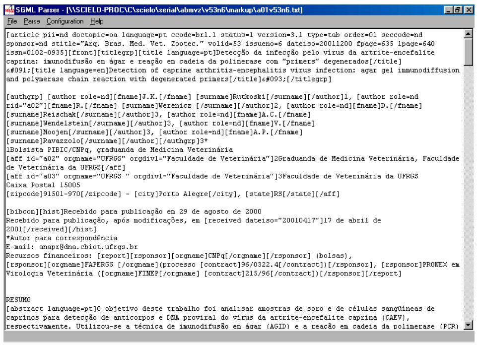
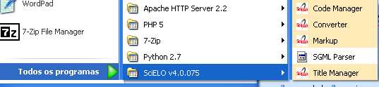
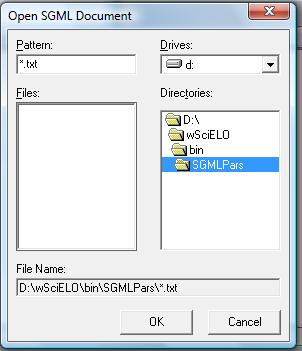
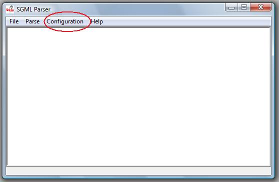
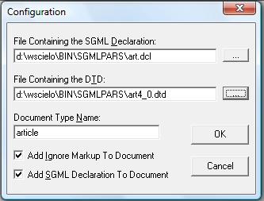
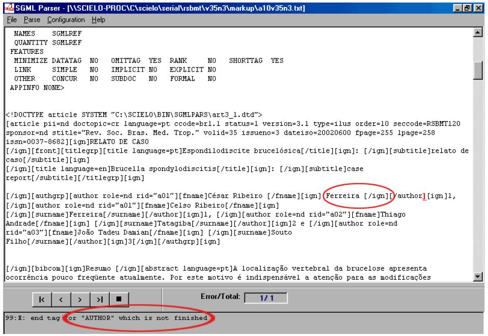

.. pcprograms documentation master file, created by
   You can adapt this file completely to your liking, but it should at least
   contain the root `toctree` directive.

SGML Parser
===========

SGML Parser is a desktop application (Visual Basic, C and sp120.dll library), to validate if the document was identified according to `DTD SciELO <dtd_scielo.html>`_. 

This program can be executed:

1. from `Markup <markup.html>`_ 
2. Embedded in Converter, for internal use, to analyze and get the value of the elements and their attributes. 
3. as stand-alone application 

Executed from Markup Program
----------------------------

To execute the SGML Parser from Markup, click on the button:

.. image:: img/markup_operations_bar_parser.jpg

The file, which is open in the Markup program, is saved as .txt and is open in SGML Parser program.

Executed embedded in Converter
------------------------------

Converter uses SGML Parser to validate the files but also to get the identified contents, in order to load them in the database.

During this process, some markup errors can be found.
To view the errors:

1. open the SGML Parser program as stand-alone application
2. open the \*.sci file
3. execute the program

Executed as stand-alone application
-----------------------------------

Open the SGML Parser program using the Windows menu.

.. image:: img/parser_openFile.jpg

.. image:: img/parser_openFile3.jpg

.. image:: img/parser_openFile4.jpg

Configuration
-------------

Access the Menu and select Configuration option.

The options below must be checked:

- Add ignore markup to document
- Add SGML declaration to document

The other fields, for:
    
- article:

  - **File Containing the DTD** = C:\\SCIELO\\BIN\\SGMLPARS\\article4_0.dtd 
  - **Document Type Name** = article

- text:

  - **File Containing the DTD** = C:\\SCIELO\\BIN\\SGMLPARS\\text4_0.dtd 
  - **Document Type Name** = text

Document analysis
-----------------

After the configuration, the user have to click on **Parse** menu option in order to analyze the document.

If everything is correct, the message bellow is presented:

.. image:: img/parser_noerror.jpg

Then, the user can exit the program.

If there are errors, the SGML Parser will indicate the line and the error type occured.
In this case, the user must go back to Markup program, make corrections, then repeat the procedure of using SGML Parser until there is no error.

