.. pt_how_to_generate_xml-markup:

==================
Como usar o Markup
==================

Introdução
==========

Este manual tem como objetivo apresentar o uso do programa de marcação `Markup <markup.html>`_ 

.. _sugestao-id:

Sugestão de Atribuição de “ID”
==============================

O atributo "ID" é usado para identificar alguns elementos, tornando possível estabelecer referências cruzadas entre sua chamada no decorrer do texto e o elemento em si, como figuras, tabelas, afiliações etc.
Para composição do “ID” combine o prefixo do tipo do elemento e um número inteiro, como segue:

+------------------------+---------------------------+---------+---------------------+
| Elemento XML           | Descrição                 | Prefixo | Exemplo             |
+========================+===========================+=========+=====================+
| aff                    | Afiliação                 | aff     | aff1, aff2, ...     |
+------------------------+---------------------------+---------+---------------------+
| app                    | Apêndice                  | app     | app1, app2, ...     |
+------------------------+---------------------------+---------+---------------------+
| author-notes/fn |      | Notas de rodapé do artigo | fn      | fn1, fn2, ...       | 
| fn-group/fn            |                           |         |                     |
+------------------------+---------------------------+---------+---------------------+
| boxed-text             | Caixa de texto            | bx      | bx1, bx2, ...       |
+------------------------+---------------------------+---------+---------------------+
| corresp                | Correspondência           | c       | c1, c2, ...         |
+------------------------+---------------------------+---------+---------------------+
| def-list               | Lista de Definições       | d       | d1, d2, ...         |
+------------------------+---------------------------+---------+---------------------+
| disp-formula           | Equações                  | e       | e1, e2, ...         |
+------------------------+---------------------------+---------+---------------------+
| fig                    | Figuras                   | f       | f1, f2, ...         |
+------------------------+---------------------------+---------+---------------------+
| glossary               | Glossário                 | gl      | gl1, gl2, ...       |
+------------------------+---------------------------+---------+---------------------+
| media                  | Media                     | m       | m1, m2, ...         |
+------------------------+---------------------------+---------+---------------------+
| ref                    | Referência bibliográfica  | B       | B1, B2, ...         |
+------------------------+---------------------------+---------+---------------------+
| sec                    | Seções                    | sec     | sec1, sec2, ...     |
+------------------------+---------------------------+---------+---------------------+
| sub-article            | sub-artigo                | S       | S1, S2, ...         |
+------------------------+---------------------------+---------+---------------------+
| supplementary-material | Suplemento                | suppl   | suppl1, suppl2, ... |
+------------------------+---------------------------+---------+---------------------+
| table-wrap-foot/fn     | Notas de rodapé de tabela | TFN     | TFN1, TFN2, ...     |
+------------------------+---------------------------+---------+---------------------+
| table-wrap             | Tabela                    | t       | t1, t2, ...         |
+------------------------+---------------------------+---------+---------------------+

.. _markup:

Dados Básicos
=============

Estando o arquivo formatado de acordo com o manual `Preparação de Arquivos para o Programa Markup <pt_how_to_generate_xml-prepara.html>`_ e aberto no programa `Markup <markup.html>`_, selecione a tag [doc]:

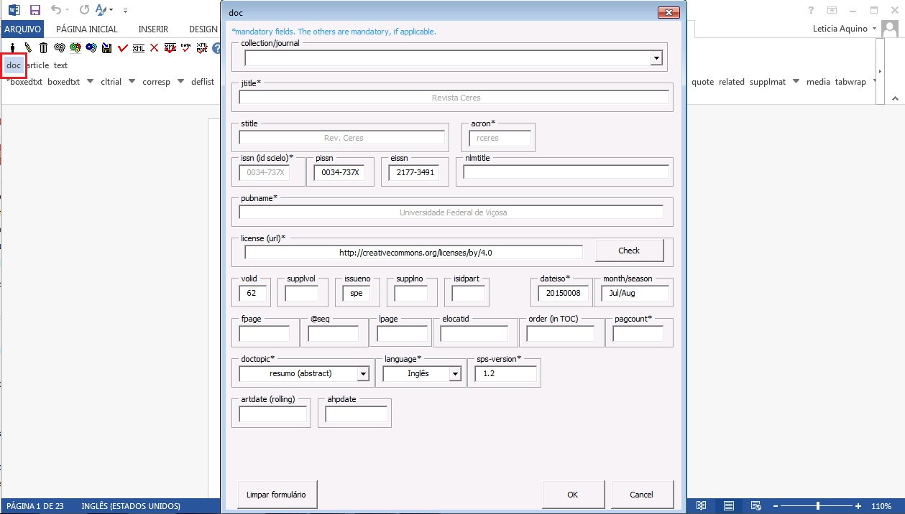

Ao clicar em [doc] o programa abrirá um formulário para ser completado com os dados básicos do artigo:

Ao selecionar o periódico no campo “collection/journal” o programa preencherá alguns dados automaticamente, tais como: ISSNs, título abreviado, acrônimo, entre outros. Os demais dados serão preenchidos manualmente, de acordo com as orientações abaixo:

+-------------------+-----------------------------------------------------------------------------------------------+
| Campo             | Descrição                                                                                     |
+===================+===============================================================================================+
| license           | se não for inserido automaticamente, preencher com a URL da licença creative commons          |
|                   | adotada pelo periódico. Consultar licenças em:                                                |
|                   | http://docs.scielo.org/projects/scielo-publishing-schema/pt_BR/1.3-branch/tagset.html#license |
+-------------------+-----------------------------------------------------------------------------------------------+
| volid             | Inserir volume, se existir. Para Ahead of Print, não incluir volume                           |
+-------------------+-----------------------------------------------------------------------------------------------+
| supplvol          | Caso seja um suplemento de volume incluir sua parte ou número correspondente.                 |
|                   | **Exemplo: vol.12 supl.A**, então preencha com **A**, neste campo                             |
+-------------------+-----------------------------------------------------------------------------------------------+
| issueno           | Entre com o número do fascículo. Caso seja um artigo publicado em ahead of                    |
|                   | print, insira ahead neste campo                                                               |
+-------------------+-----------------------------------------------------------------------------------------------+
| supplno           | Caso seja um suplemento de fascículo incluir sua parte ou número                              |
|                   | correspondente. **Exemplo: n.37, supl.A**, então preencha com **A** neste campo               |
+-------------------+-----------------------------------------------------------------------------------------------+
| isidpart          | Usar em casos de press release, incluindo a sigla pr                                          |
+-------------------+-----------------------------------------------------------------------------------------------+
| dateiso           | Data de publicação formada por ano, mês e dia **(YYYYMMDD)**. Preencher sempre                |
|                   | com o último mês da periodicidade. Por exemplo, se o periódico é bimestral                    |
|                   | preencher **20140600**. Use **00** para mês e dia nos casos em não haja sua                   |
|                   | identificação. **Exemplo: 20140000**.                                                         |
+-------------------+-----------------------------------------------------------------------------------------------+
| month/season      | Entre o mês ou mês inicial barra final, em inglês (três letras) e ponto,                      |
|                   | exceto para May, June e July. **Ex.: May/June, July/Aug.**                                    |
+-------------------+-----------------------------------------------------------------------------------------------+
| fpage             | Primeira página do documento. Para artigo em Ahead of Print, incluir 00                       |
+-------------------+-----------------------------------------------------------------------------------------------+
| @seq              | Para artigos que iniciam na mesma página de um artigo anterior, incluir a                     |
|                   | sequência com letra                                                                           |
+-------------------+-----------------------------------------------------------------------------------------------+
| lpage             | Inserir a última página do documento.                                                         |
+-------------------+-----------------------------------------------------------------------------------------------+
| elocatid          | Incluir paginação eletrônica. Neste caso não preencher fpage e lpage                          |
+-------------------+-----------------------------------------------------------------------------------------------+
| order (in TOC)    | Incluir a ordem do artigo no sumário do fascículo. Deve ter, no mínimo, dois                  |
|                   | dígitos. Por exemplo, se o artigo for o primeiro do sumário, preencha este                    |
|                   | campo com **01** e assim por diante.                                                          |
+-------------------+-----------------------------------------------------------------------------------------------+
| pagcount*         | Inserir o total de paginação. Para Ahead of Print, incluir o valor 1                          |
+-------------------+-----------------------------------------------------------------------------------------------+
| doctopic*         | Informar o tipo de documento a ser marcado. Por exemplo: artigo original, resenha,            | 
|                   | carta, comentário, etc. No caso de Ahead Of Print, incluir sempre o tipo artigo original,     |
|                   | exceto para errata                                                                            |
+-------------------+-----------------------------------------------------------------------------------------------+
| language*         | Informe o idioma principal do texto a ser marcado                                             |
+-------------------+-----------------------------------------------------------------------------------------------+
| version*          | Identifica a versão da DTD usada no processo de marcação (A versão atual é 4.0)               |
+-------------------+-----------------------------------------------------------------------------------------------+
| artdate (rolling) | Obrigatório completar com a data **YYYYMMDD** quando for um artigo rolling pass.              |
|                   | Rolling pass é um modelo publicação onde o periódico publica seus artigos num volume          |
|                   | único a medida em que estes ficam prontos                                                     |
+-------------------+-----------------------------------------------------------------------------------------------+
| ahpdate           | Indicar a data de publicação de um artigo publicado em ahead of print                         |
+-------------------+-----------------------------------------------------------------------------------------------+

.. note:: Os campos que apresentam um asterisco ao lado, são campos obrigatórios.

.. _front:

Front
=====

Tendo preenchido todos os campos, ao clicar em [Ok] será aberta uma janela perguntando se o documento está na formatação adequada para efetuar a marcação automática:

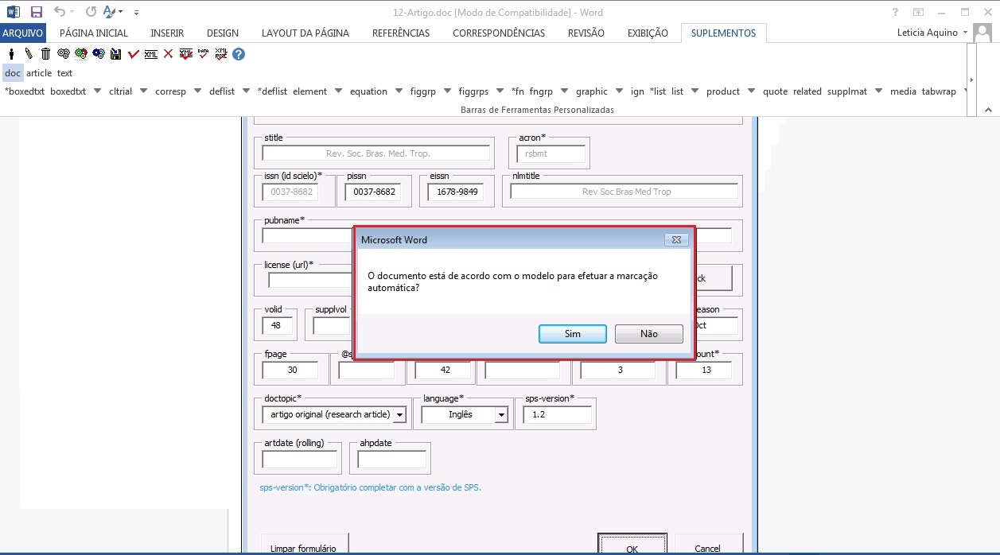

Ao clicar em [Sim], o programa efetuará a marcação automática dos elementos básicos do documento.

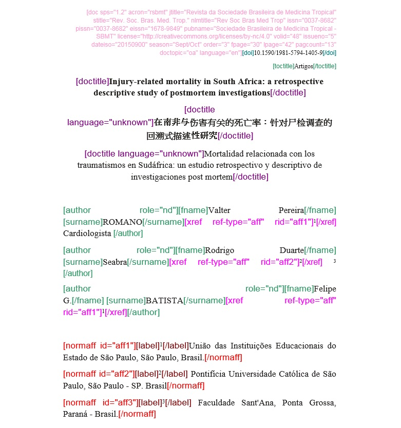

.. note:: Caso o arquivo não esteja na formatação recomendada em “Preparação de Arquivos para o Programa Markup”, o programa 
          não identificará corretamente os elementos.

Após a marcação automática é necessário completar a marcação dos elementos básicos. 

.. _titulo:

Doctitle
--------

Confira o idioma inserido em [doctitle] para títulos traduzidos e se necessário, corrija.
Para corrigir, selecione a tag "incorreta" e clique no botão "lápis" para editar os atributos:

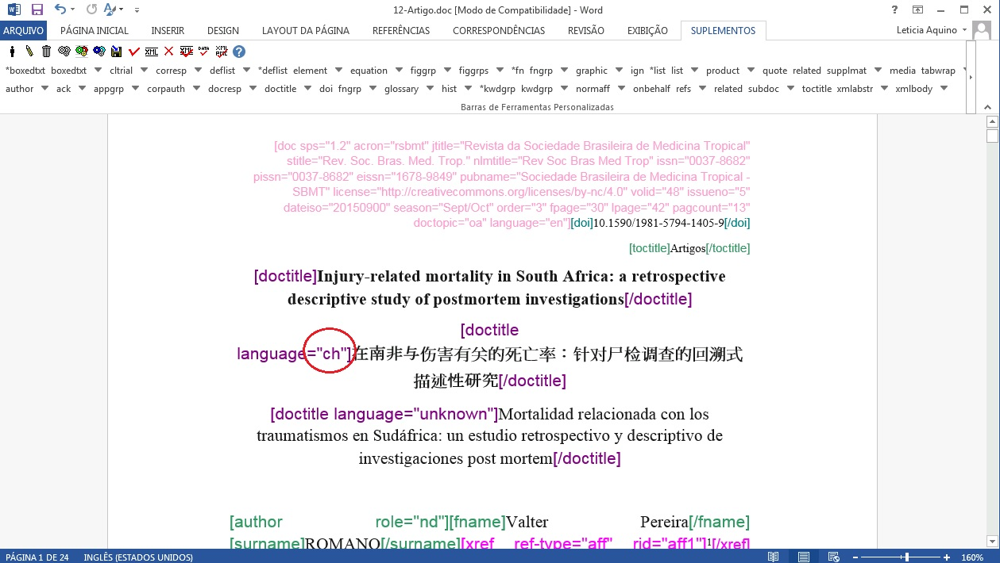

Faça o mesmo para os demais títulos traduzidos.

.. _autores:

Autores
-------

Alguns autores apresentam mais que 1 label ao lado do nome, porém o programa não faz a marcação automática de mais que 1 label. Para isso, selecione o label do autor e identifique com o elemento [xref].

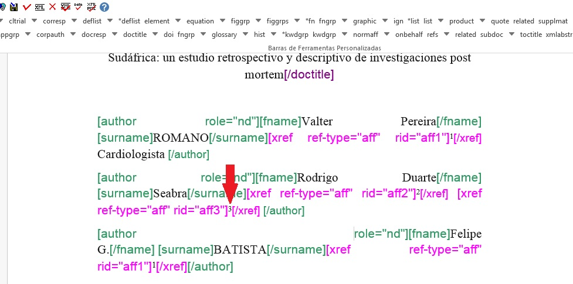

Por se tratar de referência cruzada (xref) de afiliação, o tipo de xref (ref-type) selecionado foi o "affiliation" e o rid (relacionado ao ID) "aff3" para relacionar o label 3 à afiliação correspondente.

O programa Markup não faz marcação automática de função de autor como, por exemplo, o cargo exercido. Para isso é necessário selecionar a informação que consta ao lado do nome do autor, ir para o nível inferior do elemento [author] e identificar esse dado com a tag [role]. Veja:

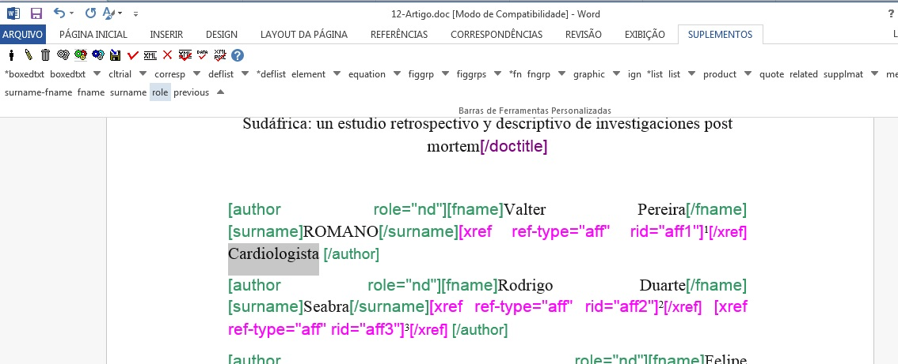

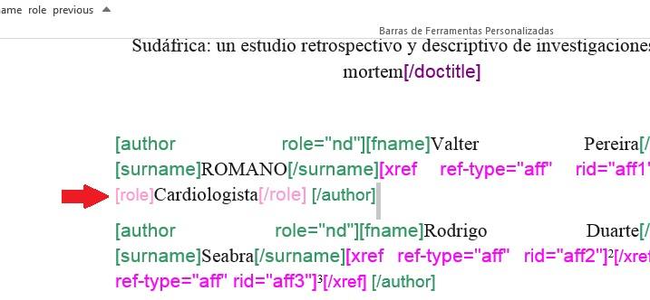

.. note:: O programa não identifica automaticamente símbolos ou letras como label, a qual deve ser marcada manualmente, observando-se 
          o tipo de referência cruzada a ser incluída.

.. raw:: html

   <iframe width="560" height="315" src="https://www.youtube.com/embed/R8YYjXZSk1c?list=PLQZT93bz3H79NTc-aUFMU_UZgo4Vl2iUH" frameborder="0" allowfullscreen></iframe>

.. _sigblock:

Sig-block
=========
Geralmente arquivos Editoriais, Apresentações etc possuem ao final do texto a assinatura do autor ou editor.
Para identificar a assinatura do autor, seja em imagem, seja em texto, é necessário selecionar a assinatura e identificar com a tag [sigblock]:

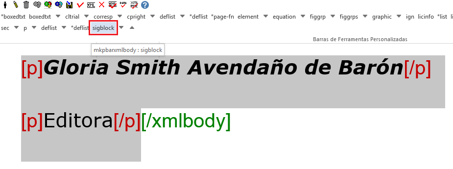

Após isso, selecione apenas a assinatura e identifique com a tag [sig]:

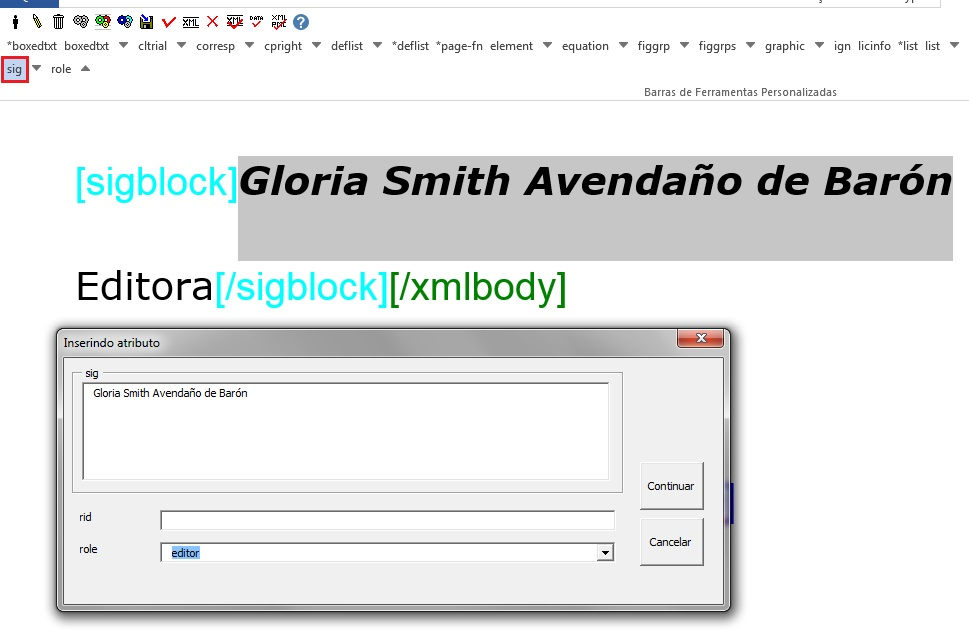

Abaixo o resultado da identificação de assinatura do autor/editor:

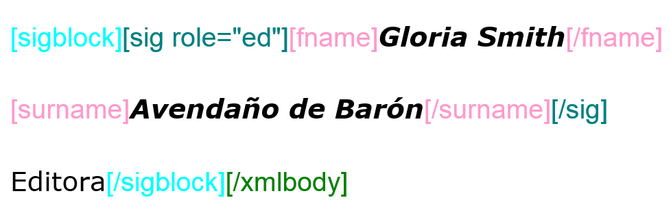

.. note:: Algumas assinaturas apresentam ao lado o cargo ou função do autor. Para a identificação de [sig], não considerar a função.

.. _onbehalf:

On Behalf
=========

O elemento [on-behalf] é utilizado quando um autor exerce papel de representante de um grupo ou organização. 
Para identificar esse dado, verifique se a informação do representante do grupo está na mesma linha do autor anterior. Exemplo:

    Fernando Augusto Proietti :sup:`2`  Interdisciplinary HTLV Research Group

O programa identificará o autor "Fernando Augusto Proietti" da seguinte forma:

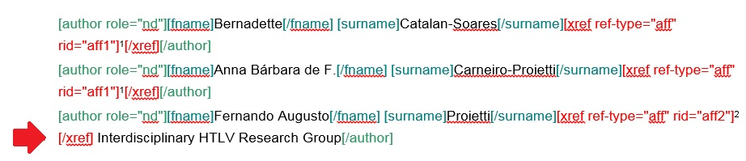

Agora selecione o nome do grupo ou organização e identifique com a tag: [onbehalf]:

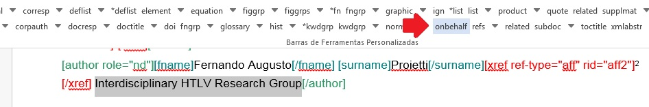

Contrib-ID
==========

Autores que apresentam registro no ORCID ou no Lattes devem inserir o link de registro ao lado do nome, após o label do autor:

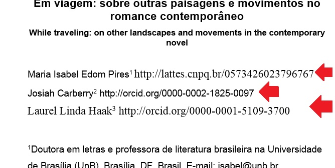

Ao fazer a marcação de [doc] o programa identificará automaticamente todos os dados iniciais do documento, inclusive marcará em [author] o link de registro do autor.
Ainda que o programa inclua o link na tag [author], será necessário completar a marcação desse dado.

Para isso, entre no nível de author, selecione o link do autor e clique em [author-id].
Na janela aberta pelo programa, selecione o tipo de registro do autor: se lattes ou ORCID e clique em [Continuar]

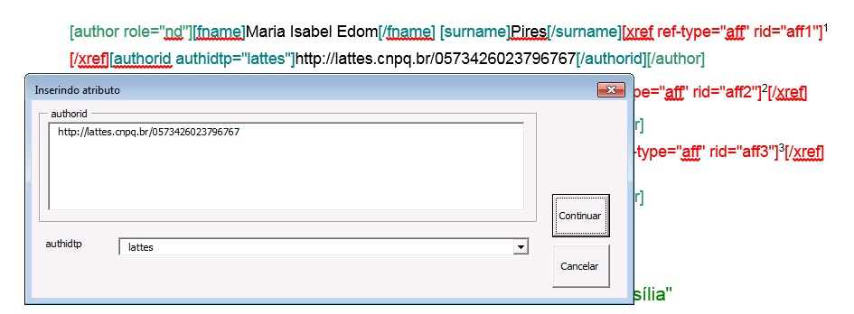

.. _afiliacao:

Afiliações
----------

O Programa Markup faz a identificação apenas de grupo de dados de cada afiliação com o elemento [normaff], ou seja, o detalhamento das afiliações não é feito automaticamente.
Complete a marcação de afiliações identificando: instituição maior [orgname], divisão 1 [orgdiv1], divisão 2 [orgdiv2], cidade [city], estado [state] (esses 4 últimos, se presentes) e o país [country].

Para fazer a identificação dos elementos acima vá para o nível inferior do elemento [normaff] e faça o detalhamento de cada afiliação.

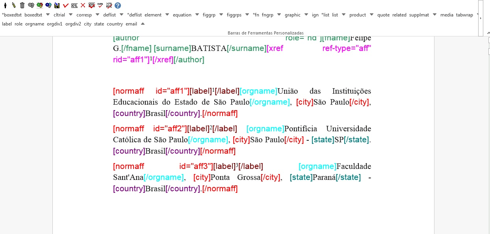

Após o detalhamento de afiliações, será necessário verificar se a instituição marcada e país correspondente, possui forma normalizada por SciELO. Para isso, selecione o elemento [normaff] e clique no "lapis" para editar os atributos. O programa abrirá uma janela para normalização dos elementos indicados nos campos em branco.

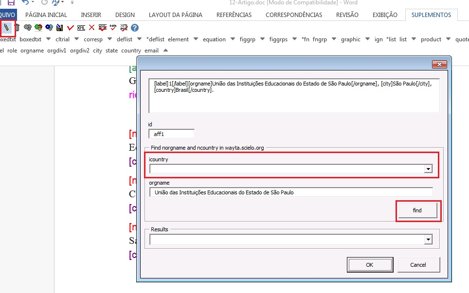

No campo "icountry" selecione o país da instituição maior (orgname), em seguida clique em "find" para encontrar a instituição normalizada. Ao fazer esse procedimento, o programa Markup consultará nossa base de dados de instituições normalizadas e verificará se a instituição selecionada consta na lista.

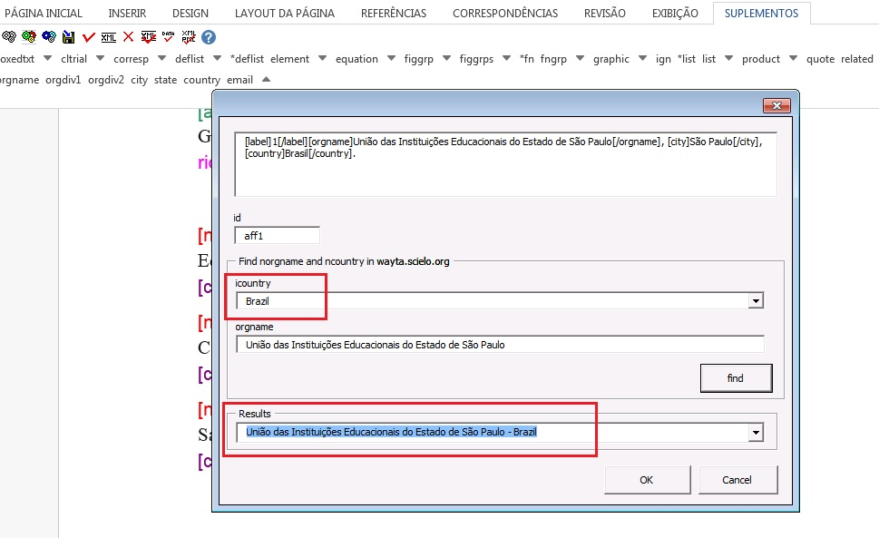

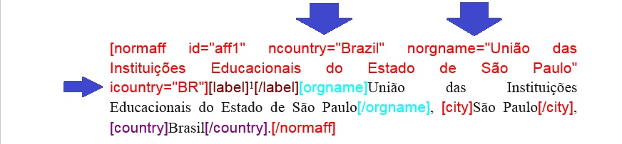

.. note:: Faça a busca pelo idioma de origem da instituição, exceto para línguas não latinas, quando a consulta deverá 
         ser feita em inglês. Caso a instituição não exista na lista do Markup, selecione o elemento "No match found" e clique em [OK].

.. _resumo:

Resumos
=======

Os resumos devem ser identificados manualmente. Para marcação de resumos simples (sem seções) e para os resumos estruturados (com seções) utilizar o elemento [xmlabstr]. Na marcação, selecione o título do resumo e o texto e em seguida marque com o botão [xmlabstr].

Resumo sem Seção:
-----------------

**selecionando:** 

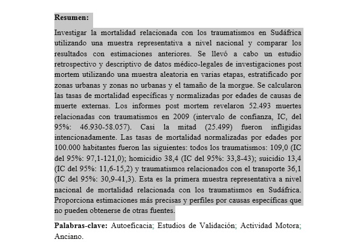

Quando clicar em [xmlabstr] o programa abrirá uma janela onde deve-se selecionar o idioma do resumo marcado:

**marcação:** 

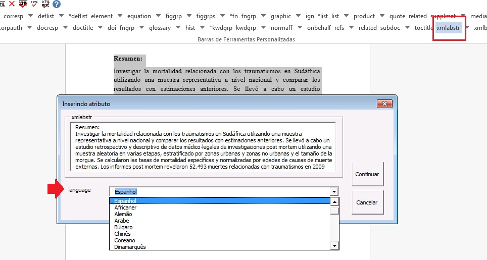

**Resultado**

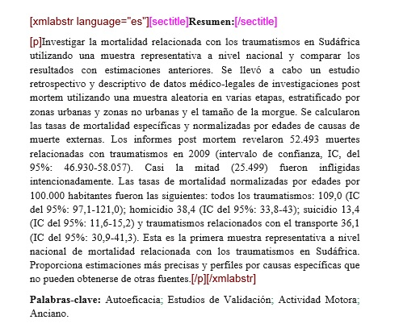

Já em resumos estruturados, o programa também marcará cada seção do resumo e seus respectivos parágrafos.

Resumo com Seção:
-----------------

Siga os mesmos passos descritos para resumo sem seção:

**selecionando:** 

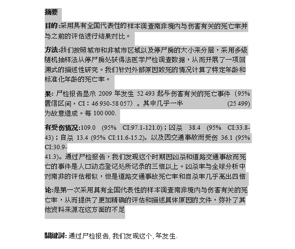

**marcação:**
		  
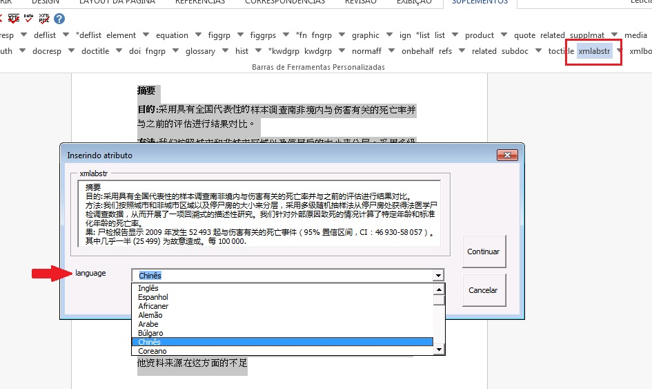

**Resultado**

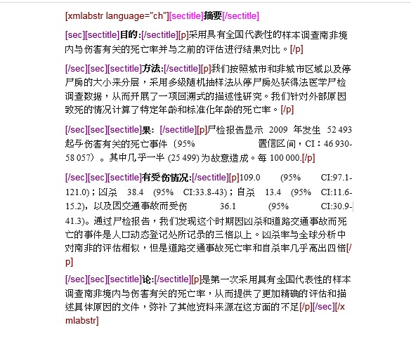

.. raw:: html

   <iframe width="560" height="315" src="https://www.youtube.com/v/FVTjDOIGV0Y" autostart="0" frameborder="0" allowfullscreen controls></iframe>

.. _palavra-chave:

Keywords
========

O programa Markup apresenta dois botões para identificação de palavras-chave, [*kwdgrp] e [kwdgrp].
O botão [*kwdgrp], com asterisco, é utilizada para identificação automática de cada palavra-chave e também do título. Para isso, selecione toda a informação inclusive o título e identifique os dados com o elemento [*kwdgrp].

Marcação Automática:
--------------------

**selecionando:**
 
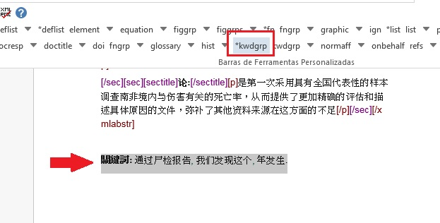

Ao clicar em [*kwdgrp] o programa abrirá uma janela para seleção do idioma das palavras-chave marcadas:

**marcação:** 

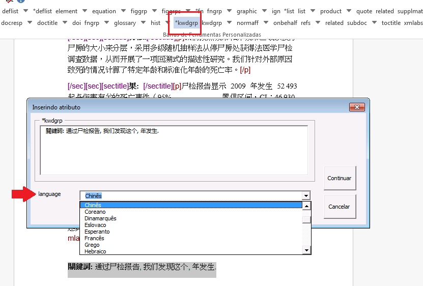

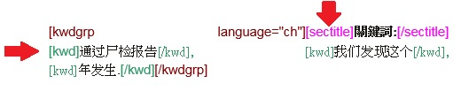

Marcação Manual:
----------------

Caso a marcação automática não ocorra conforme o esperado, pode-se marcar o grupo de palavras-chave manualmente. Selecione o grupo de palavras-chave e marque com o elemento [kwdgrp].

**marcação:**

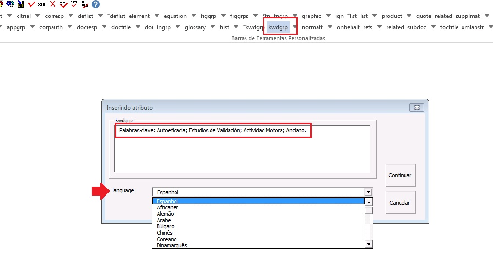

Em seguida, faça a identificação de item por item. Para tanto, selecione o título das palavras-chave e identifique com o elemento [sectitle]:

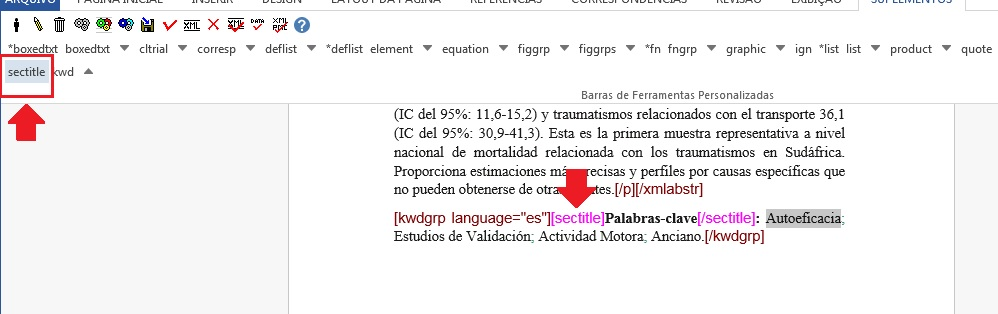

Na sequência, selecione palavra por palavra e marque com o elemento [kwd]:

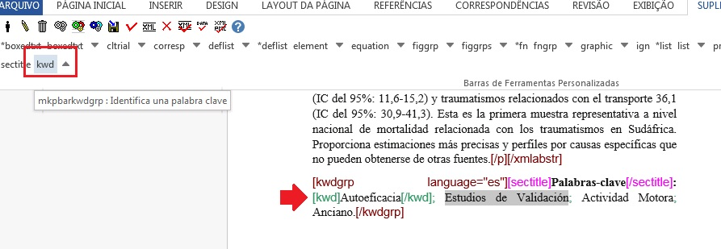

.. raw:: html

   <iframe width="560" height="315" src="https://www.youtube.com/v/6sNTlHF8WdU" autostart="0" frameborder="0" allowfullscreen controls></iframe>

.. _historico:

History
=======

O elemento [hist] é utilizado para marcar o histórico do documento. Selecione todo o dado de histórico e marque com o elemento [hist]:

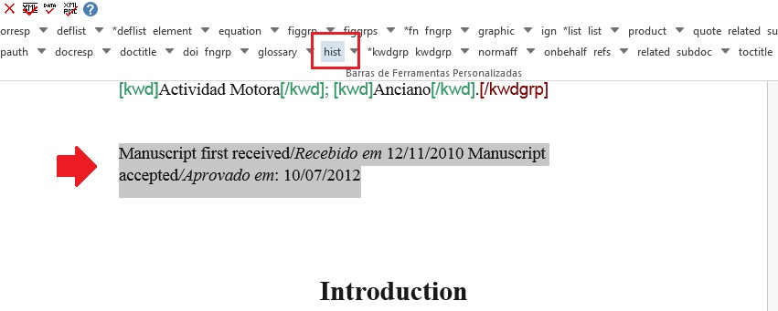

Selecione então a data de recebido e marque com o elemento [received]. Confira a data ISO indicada no campo dateiso e corrija, se necessário. A estrutura da data ISO esperada nesse campo é:
ANO MÊS DIA. Veja:

.. image:: img/doc-mkp-received.jpg
   :height: 350px
   :align: center

Caso haja a data de revisado, selecione-a e marque com o elemento [revised]. Faça o mesmo para a data de aceito; selecionando o elemento [accepted]. Confira a data ISO indicada no campo dateisso e corrija, se necessário.

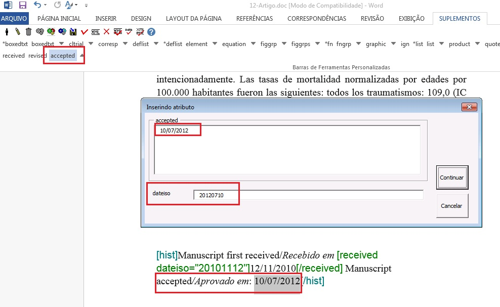

.. raw:: html

   <iframe width="560" height="315" src="https://www.youtube.com/embed/w4Bw7dXpS0E?list=PLQZT93bz3H79NTc-aUFMU_UZgo4Vl2iUH" frameborder="0" allowfullscreen></iframe>
   

.. _correspondencia:

Correspondência
===============

Com o elemento [corresp] é possível marcar os dados de correspondência do autor. Esse elemento possui um subnível para identificação do e-mail do autor. Selecione toda a informação de correspondência e marque com o elemento [corresp]. Será apresentada uma janela para marcação do ID de correspondência que, nesse caso, deve ser “c” + o número de ordem da correspondência.

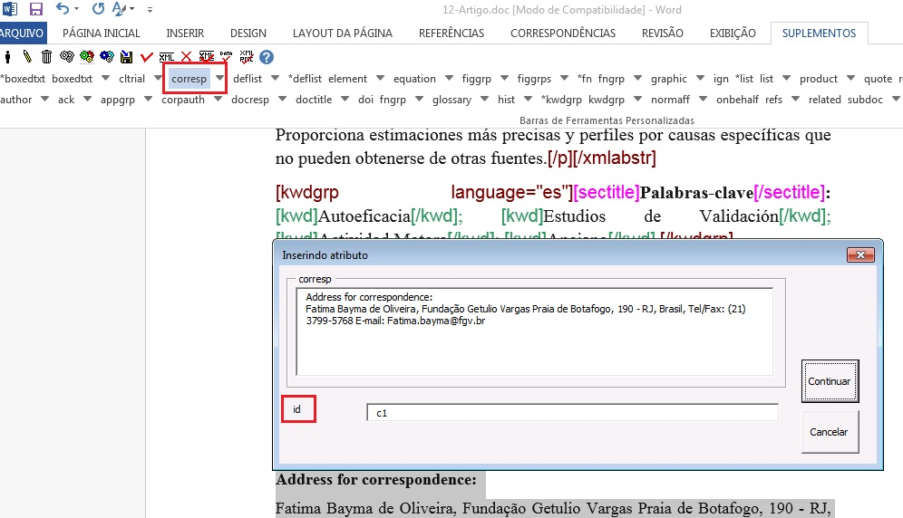

Selecione o e-mail do autor correspondente e marque com o elemento [email]. Suba um nível para marcar o próximo elemento.

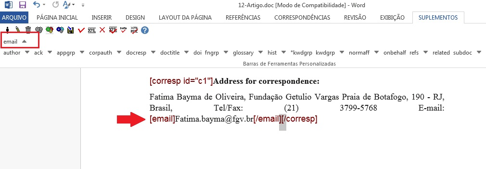

.. raw:: html

   <iframe width="560" height="315" src="https://www.youtube.com/embed/fuzSrOMlSvo?list=PLQZT93bz3H79NTc-aUFMU_UZgo4Vl2iUH" frameborder="0" allowfullscreen></iframe>

.. _ensaio-clinico:

Ensaio Clínico
==============
Arquivos que apresentam informação de ensaio clínico com número de registro, devem ser marcados com o elemento [cltrial]:

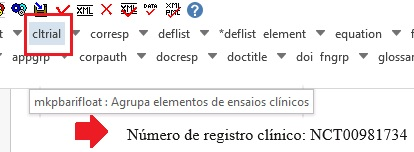

Na janela aberta pelo programa, preencha o campo de URL da base de dados onde o Ensaio foi indexado e o campo "ctdbid" selecionando a base correspondente:

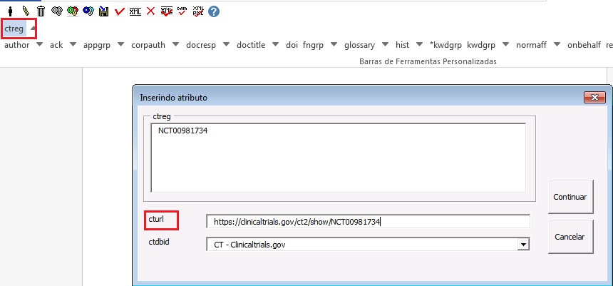

Para encontrar a URL do ensaio clínico faça uma busca na internet pelo número de registro para preenchimento do atributo conforme exemplo abaixo.

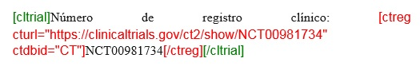

.. note:: Comumente a informação de Ensaio clínico está posicionada abaixo de resumos ou palavras-chave.

.. raw:: html

   <iframe width="560" height="315" src="https://www.youtube.com/embed/0bln_fugnAA?list=PLQZT93bz3H79NTc-aUFMU_UZgo4Vl2iUH" frameborder="0" allowfullscreen></iframe>

.. _referencias:

Referências
===========

As referências bibliográficas são marcadas elemento a elemento e seu formato original é mantido para apresentação no site do SciELO.

O programa marcará todas as referências selecionadas com o elemento [ref] do tipo [book]. A alteração do tipo de referência será manual ou automática, dependendo do tipo de elemento marcado, conforme será observado mais adiante.

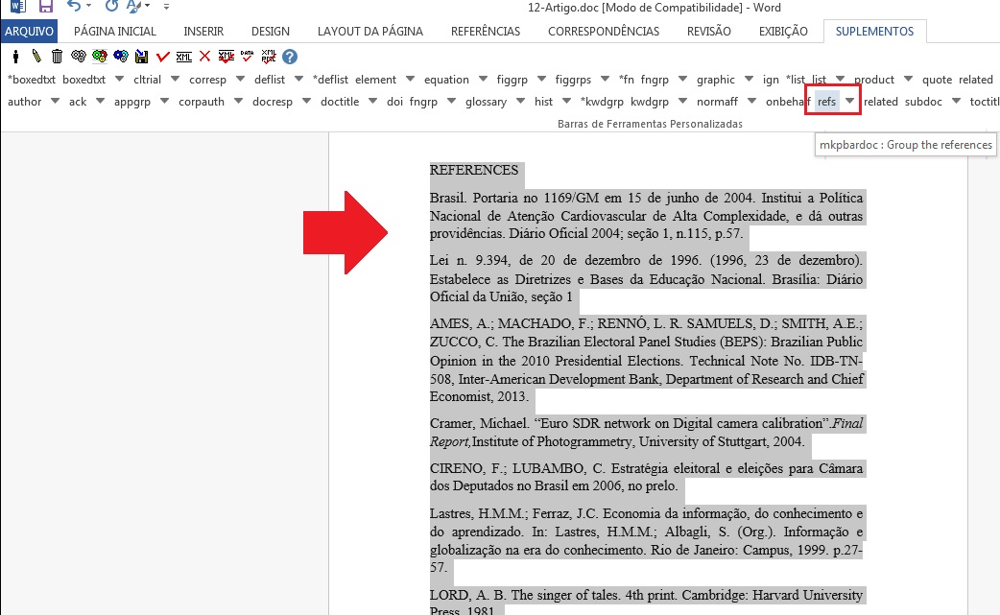

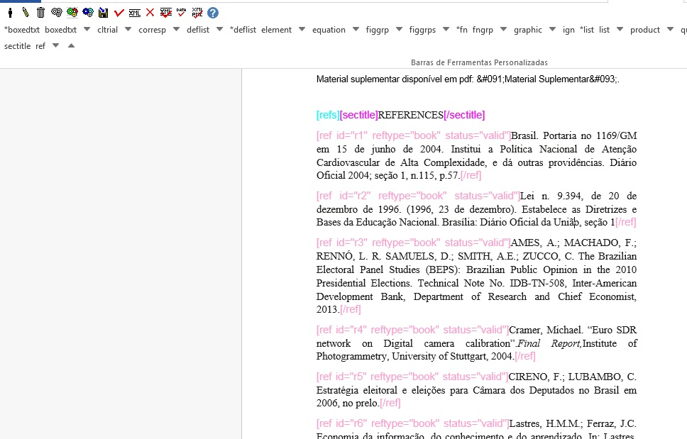

.. raw:: html

   <iframe width="560" height="315" src="https://www.youtube.com/embed/MoTVIJk21UM?list=PLQZT93bz3H79NTc-aUFMU_UZgo4Vl2iUH" frameborder="0" allowfullscreen></iframe> 

.. _tipos-de-referencias:

Tipos de Referências
--------------------

A partir da marcação feita, alguns tipos de referência serão alterados automaticamente sem intervenção manual (ex.: tese, conferência, relatório, patente e artigo de periódico); já para os demais casos, será necessária a alteração manual.
Para alterar o tipo de referência clique no elemento [ref], em seguida, no lápis "Editar Atributos" e em "reftype" para selecionar o tipo correto.

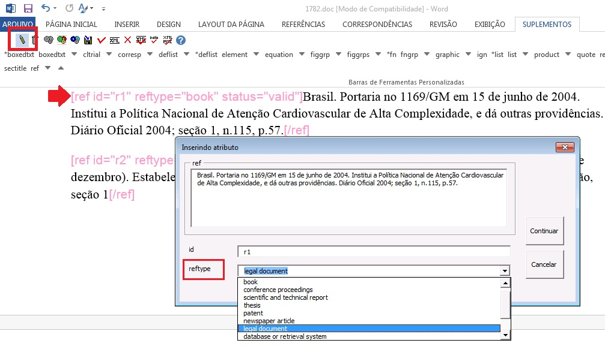

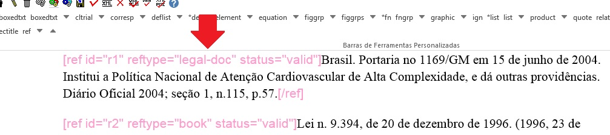

Recomenda-se a edição de "reftype" somente **após** marcar todos os elementos da [ref], pois dependendo dos elementos marcados o "reftype" pode ser alterado automaticamente pelo Markup. 

.. note:: Uma referência deve ter sua tipologia sempre baseada no seu conteúdo e nunca no seu suporte. Por exemplo, uma lei representa um documento legal, portanto o tipo de referência é “legal-doc”, mesmo que esteja publicado em um jornal ou site. Uma referência de artigo de um periódico científico, mesmo que publicado em um site possui o tipo “journal”. 
          É importante entender estes aspectos nas referências para poder interpretar sua tipologia e seus elementos. Nem toda referência que possui um link é uma “webpage”, nem toda a referência que possui um volume é um “journal”, livros também podem ter volumes.

Abaixo seguem os tipos de referência suportados por SciELO e a marcação de cada [ref].

.. _tese:

Thesis
^^^^^^
Utilizada para referenciar monografias, dissertações ou teses para obtenção de um grau acadêmico, tais como livre-docência, doutorado, mestrado, bacharelado, licenciatura etc. A seleção do elemento [thesgrp] determinará a alteração do tipo [book] para [thesis]. Ex:

   *PINHEIRO, Fernanda Domingos. Em defesa da liberdade: libertos e livres de cor nos tribunais do Antigo Regime português (Mariana e Lisboa, 1720-1819). Tese de doutorado, Departamento de História, Instituto de Filosofia e Ciências Humanas, Universidade Estadual de Campinas, 2013*

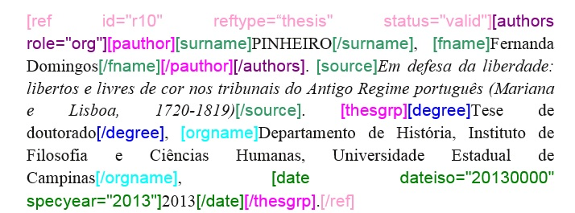

.. raw:: html

   <iframe width="560" height="315" src="https://www.youtube.com/embed/h1ytjcXZv5U?list=PLQZT93bz3H79NTc-aUFMU_UZgo4Vl2iUH" frameborder="0" allowfullscreen></iframe>

.. _conferencia:

Confproc
^^^^^^^^
Utilizada para referenciar documentos relacionados à eventos: atas, anais, convenções, conferências entre outros. Ao marcar o elemento [confgrp] o programa alterará o tipo de referência para [confproc]. Ex.:

   *FABRE, C. Interpretation of nominal compounds: combining domain-independent and domain-specific information. In: INTERNATIONAL CONFERENCE ON COMPUTATIONAL LINGUISTICS (COLING), 16, 1996, Stroudsburg. Proceedings... Stroudsburg: Association of Computational Linguistics, 1996. v.1, p.364-369.*

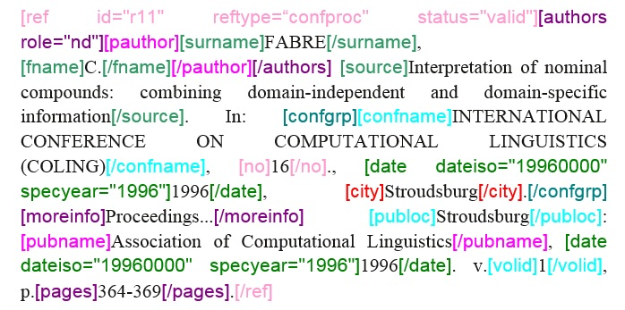

.. raw:: html

   <iframe width="560" height="315" src="https://www.youtube.com/embed/k0OWNjboFWE?list=PLQZT93bz3H79NTc-aUFMU_UZgo4Vl2iUH" frameborder="0" allowfullscreen></iframe>

.. _relatorio:

Report
^^^^^^
Utilizada para referenciar relatórios técnicos, normalmente de autoria institucional. Ao marcar o elemento [reportid] o programa alterará o tipo de referência para [report]. Ex.:

   *AMES, A.; MACHADO, F.; RENNÓ, L. R. SAMUELS, D.; SMITH, A.E.; ZUCCO, C. The Brazilian Electoral Panel Studies (BEPS): Brazilian Public Opinion in the 2010 Presidential Elections. Technical Note No. IDB-TN-508, Inter-American Development Bank, Department of Research and Chief Economist, 2013.*

.. image:: img/doc-mkp-ref-report.jpg
   :height: 250px
   :align: center

.. note:: Nos casos em que não houver número de relatório, a alteração do tipo de referência deverá ser feita manualmente.

.. _patente:

Patent
^^^^^^

Utilizada para referenciar patentes; a patente representa um título de propriedade que confere ao seu titular o direito de impedir terceiros explorarem sua criação.. Ex.:

   *SCHILLING, C.; DOS SANTOS, J. Method and Device for Linking at Least Two Adjoinig Work Pieces by Friction Welding, U.S. Patent WO/2001/036144, 2005.*

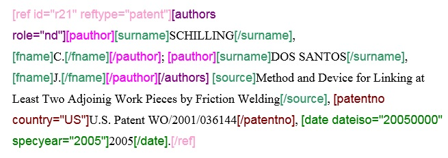

.. raw:: html

   <iframe width="560" height="315" src="https://www.youtube.com/embed/4BffTcmIkF8?list=PLQZT93bz3H79NTc-aUFMU_UZgo4Vl2iUH" frameborder="0" allowfullscreen></iframe>

.. _livro:

Book
^^^^

Utilizada para referenciar livros ou parte deles (capítulos, tomos, séries e etc), manuais, guias, catálogos, enciclopédias, dicionários entre outros.
Ex.: 

   *LORD, A. B. The singer of tales. 4th. Cambridge: Harvard University Press, 1981.*

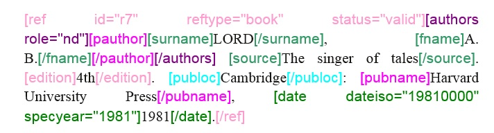

.. raw:: html

   <iframe width="560" height="315" src="https://www.youtube.com/embed/geq2_UgMYa0?list=PLQZT93bz3H79NTc-aUFMU_UZgo4Vl2iUH" frameborder="0" allowfullscreen></iframe>

.. _livro-inpress:

Book no prelo
^^^^^^^^^^^^^

Livros finalizados, mas ainda não publicados apresentam a informação "no prelo", "forthcomming" ou "“in press”" normalmente ao final da referência. Nesse caso, a marcação será feita conforme indicado abaixo:

   *CIRENO, F.; LUBAMBO, C. Estratégia eleitoral e eleições para Câmara dos Deputados no Brasil em 2006, no prelo.*

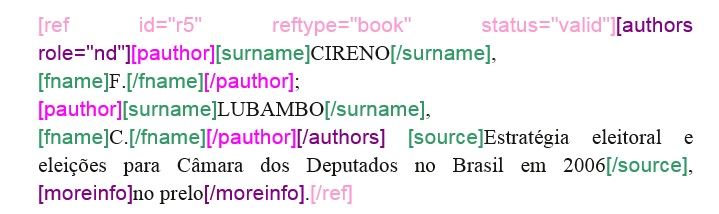

.. raw:: html

   <iframe width="560" height="315" src="https://www.youtube.com/embed/P2fiGsmitqM?list=PLQZT93bz3H79NTc-aUFMU_UZgo4Vl2iUH" frameborder="0" allowfullscreen></iframe>

.. _capitulo-de-livro:

Book Chapter
^^^^^^^^^^^^

Divisão de um livro (título do capítulo e seus respectivos autores, se houver, seguido do título do livro e seus autores) numerado ou não

   *Lastres, H.M.M.; Ferraz, J.C. Economia da informação, do conhecimento e do aprendizado. In: Lastres, H.M.M.; Albagli, S. (Org.). Informação e globalização na era do conhecimento. Rio de Janeiro: Campus, 1999. p.27-57.*

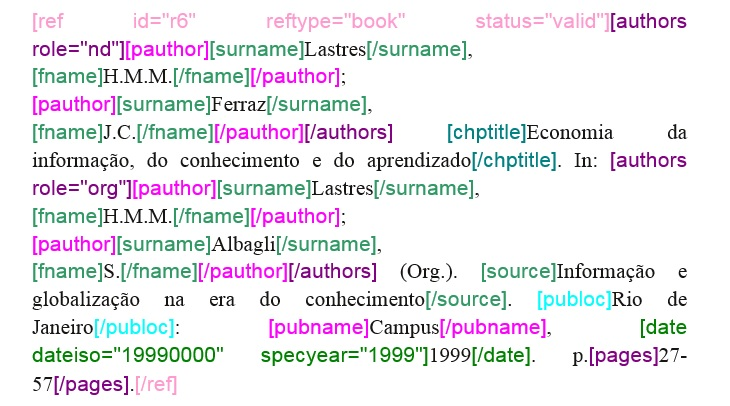

.. _revista:

journal
^^^^^^^

Utilizada para referenciar publicações seriadas científicas, como periódicos, boletins e jornais, editadas em unidades sucessivas, com designações numéricas e/ou cronológicas e destinada a ser continuada indefinidamente. Ao marcar [arttile-title] o programa alterará o tipo de referência para [journal]. Ex.:

   *Cardinalli, I. (2011). A saúde e a doença mental segundo a fenomenologia existencial. Revista da Associação Brasileira de Daseinsanalyse, São Paulo, 16, 98-114.*

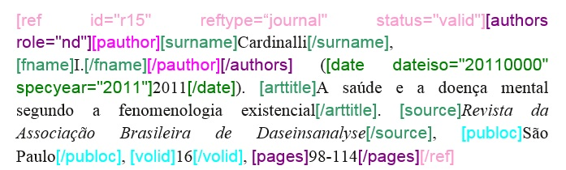

.. raw:: html

   <iframe width="560" height="315" src="https://www.youtube.com/embed/2gD6Ej1v0h4?list=PLQZT93bz3H79NTc-aUFMU_UZgo4Vl2iUH" frameborder="0" allowfullscreen></iframe>

Nas referências abaixo, seu tipo deverá ser alterado manualmente de [book] para o tipo correspondente.

.. _lei:

legal-doc
^^^^^^^^^

Utilizada para referenciar documentos jurídicos, incluem informações sobre, legislação, jurisprudência e doutrina. Ex.:

   *Brasil. Portaria no 1169/GM em 15 de junho de 2004. Institui a Política Nacional de Atenção Cardiovascular de Alta Complexidade, e dá outras providências. Diário Oficial 2004; seção 1, n.115, p.57.*

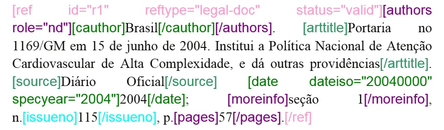

.. _jornal:

Newspaper
^^^^^^^^^
Utilizada para referenciar publicações seriadas sem cunho científico, como revistas e jornais. Ex.:

   *TAVARES de ALMEIDA, M. H. "Mais do que meros rótulos". Artigo publicado no Jornal Folha de S. Paulo, no dia 25/02/2006, na coluna Opinião, p. A. 3.*

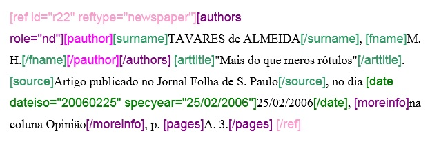

.. _base-de-dados:

Database
^^^^^^^^ 

Utilizada para referenciar bases e bancos de dados. Ex.:

	*IPEADATA. Disponível em: http://www.ipeadata.gov.br.  Acesso em: 12 fev. 2010.*

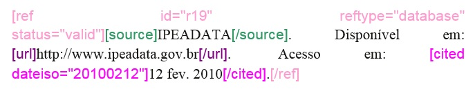

.. raw:: html

   <iframe width="560" height="315" src="https://www.youtube.com/embed/yXr97tNjDXA?list=PLQZT93bz3H79NTc-aUFMU_UZgo4Vl2iUH" frameborder="0" allowfullscreen></iframe>

.. _software:

Software
^^^^^^^^

Utilizada para referenciar um software, um programa de computador. Ex.:

	*Nelson KN. Comprehensive body composition software [computer program on disk]. Release 1.0 for DOS. Champaign (IL): Human Kinetics, c1997. 1 computer disk: color, 3 1/2 in.*

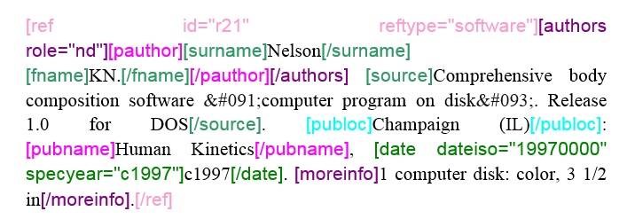

.. raw:: html

   <iframe width="560" height="315" src="https://www.youtube.com/embed/KMaiNAJ__U4?list=PLQZT93bz3H79NTc-aUFMU_UZgo4Vl2iUH" frameborder="0" allowfullscreen></iframe>

.. _web:

Webpage
^^^^^^^

Utilizada para referenciar, web sites ou informações contidas em blogs, twiter, facebook, listas de discussões dentre outros. 

**Exemplo 1**

   *UOL JOGOS. Fórum de jogos online: Por que os portugas falam que o sotaque português do Brasil é açucarado???, 2011. Disponível em <http://forum.jogos.uol.com.br/_t_1293567>. Acessado em 06 de fevereiro de 2014.*

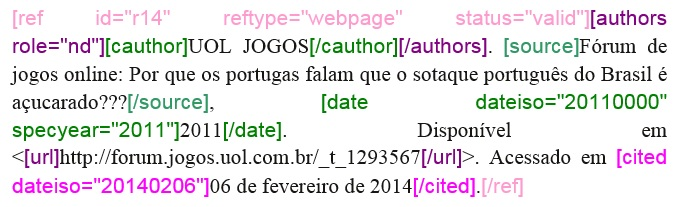

**Exemplo 2**

   *BANCO CENTRAL DO BRASIL. Disponível em: www.bcb.gov.br.*

.. image:: img/doc-mkp-ref-web-bb.jpg
   :align: center

.. raw:: html

   <iframe width="560" height="315" src="https://www.youtube.com/embed/EwufVmJ4R74?list=PLQZT93bz3H79NTc-aUFMU_UZgo4Vl2iUH" frameborder="0" allowfullscreen></iframe>

.. _outro:

Other
^^^^^

Utilizada para referenciar tipos não previstos pelo SciELO. Ex.:

   *INAC. Grupo Nacional de Canto e Dança da República Popular de Moçambique. Maputo, [s.d.].*

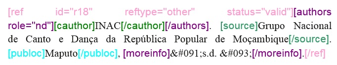

.. raw:: html

   <iframe width="560" height="315" src="https://www.youtube.com/embed/ulL9TlVNcJE?list=PLQZT93bz3H79NTc-aUFMU_UZgo4Vl2iUH" frameborder="0" allowfullscreen></iframe>

.. _previous:

"Previous" em Referências
=========================

Há normas que permitem que as obras que referenciam a mesma autoria repetidamente, sejam substituídas por um traço sublinear equivalente à seis espaços. Ex.:

*______. Another one bites the dust: Merck cans hep C fighter Victrelis as new meds take flight [Internet]. Washington: FiercePharma; 2015.*

Ao fazer a marcação de [refs] o programa duplicará a referência com previous da seguinte forma:

[ref id="r16" reftype="book"] [text-ref]______. Another one bites the dust: Merck cans hep C fighter Victrelis as new meds take flight &#91;Internet&#93;. Washington: FiercePharma; 2015[/text-ref]. *______. Another one bites the dust: Merck cans hep C fighter Victrelis as new meds take flight &#91;Internet&#93;. Washington: FiercePharma; 2015*[/ref]

.. note:: Em referências que apresentam o elemento [text-ref], o dado a ser marcado deverá ser o que consta após o [/text-ref]. 
          Nunca fazer a marcação da referência que consta em [text-ref][/text-ref].

Para identificação de referências com esse tipo de dado, selecione os traços sublineares e identifique com a tag [*authors] com asterisco. O programa recuperará o nome do autor previamente marcado e fará a identificação automática do grupo de autores, identificando o sobrenome e o primeiro nome.

.. _automata:

Marcação Automática
-------------------

O programa Markup dispõe de uma funcionalidade que otimiza o processo de marcação das referências bibliográficas que seguem a norma Vancouver. Caso haja adaptações na norma, o programa não fará a identificação corretamente.

**Selecione todas as referências**

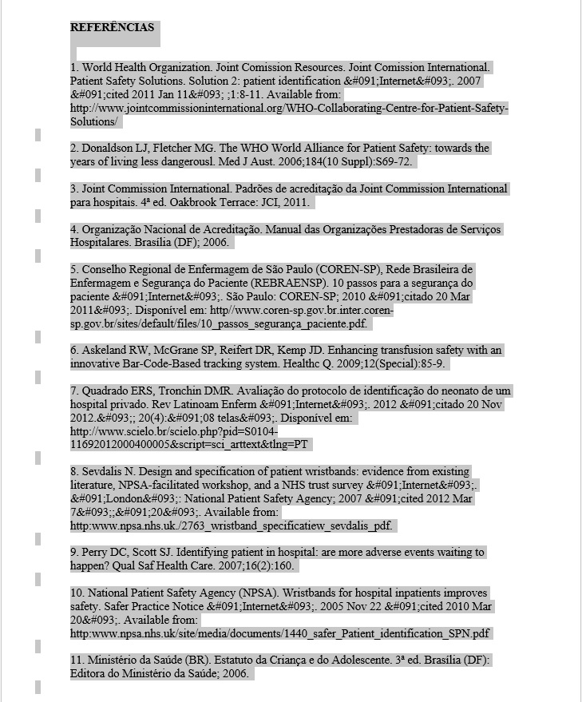

**Clique no botão "Markup: Marcação Automática 2"**

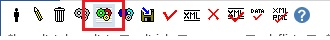

 Veja que todas as referências foram marcadas automaticamente e de forma detalhada.

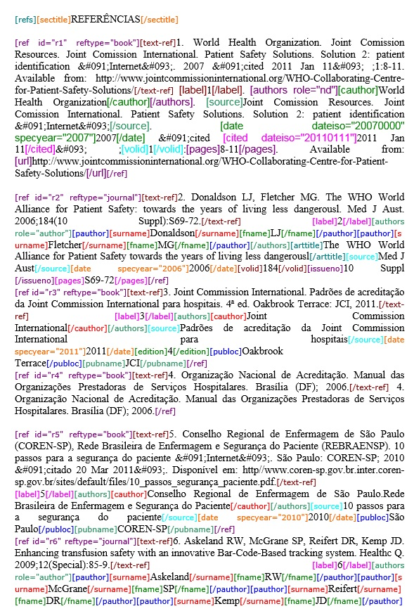

Apesar do programa fazer a marcação automática das referências, será necessário analisar atentamente referência por referência afim de verificar se algum dado deixou de ser marcado ou foi marcado incorretamente.
Se houver algum erro a ser corrigido, entre no nível de [ref] em "Barras de Ferramentas Personalizadas" e faça as correções e/ou inclua as marcações faltantes.

.. note:: O uso da marcação automática em referências só é possível caso as referências bibliográficas estejam de acordo com a norma Vancouver, seguindo-a literalmente. 
          Para as demais normas tal funcionalidade não está disponível.

.. _ref-numerica:

Referência numérica
-------------------
Alguns periódicos apresentam referências bibliográficas numeradas, as quais são referenciadas assim no corpo do texto. O número correspondente à referência também deve ser marcado.
Após a marcação do grupo de referências, desça um nível em [ref], selecione o número da referência e marque com o elemento [label]:

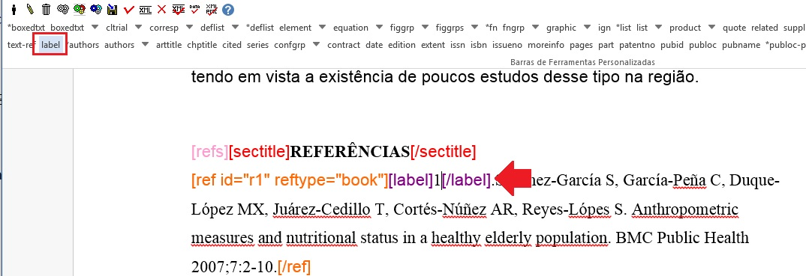

.. note:: O programa Markup não faz a identificação automática desse dado.

.. _nota-de-rodape:

Notas de Rodapé
===============

As notas de rodapé podem aparecer antes do corpo do texto ou depois. Não há uma posição específica dentro do arquivo .doc. Entretando é necessário avaliar a nota indicada, pois dependendo do tipo de nota inserido em fn-type, o programa gera o arquivo .xml com informações de notas de autores em ``<front>`` ou em ``<back>``. Para mais informações sobre essa divisão consultar na documentação SPS os itens <http://docs.scielo.org/projects/scielo-publishing-schema/pt_BR/1.2-branch/tagset.html#notas-de-autor> e <http://docs.scielo.org/projects/scielo-publishing-schema/pt_BR/1.2-branch/tagset.html#notas-gerais>.

Selecione nota e marque com o elemento [fngrp].

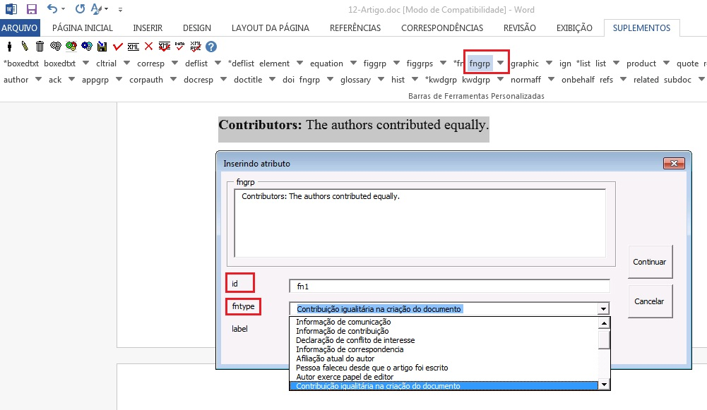

Caso a nota apresente um título ou um símbolo, selecione a informação e identifique com o elemento [label]:

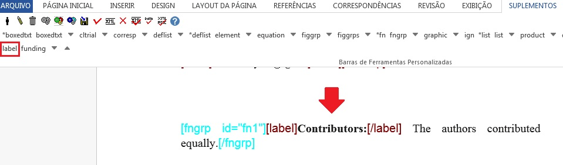

Tipos de notas
--------------

Suporte sem Informação de Financiamento
^^^^^^^^^^^^^^^^^^^^^^^^^^^^^^^^^^^^^^^

Para notas de rodapé que apresentam suporte de entidade, instituição ou pessoa física sem dado de financiamento e número de contrato, selecione a nota do tipo "Pesquisa na qual o artigo é baseado foi apoiado por alguma entidade":

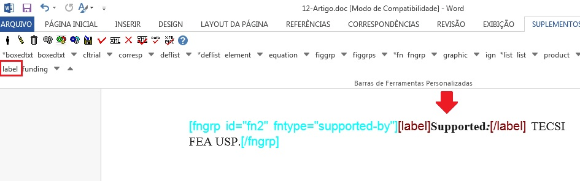

.. raw:: html

   <iframe width="560" height="315" src="https://www.youtube.com/embed/a_b9uzylEUU?list=PLQZT93bz3H79NTc-aUFMU_UZgo4Vl2iUH" frameborder="0" allowfullscreen></iframe>

Suporte com Dados de Financiamento
^^^^^^^^^^^^^^^^^^^^^^^^^^^^^^^^^^

Para notas de rodapé que apresentam dados de financiamento com número de contrato, selecione nota do tipo "Declaração ou negação de recebimento de financiamento em apoio à pesquisa na qual o artigo é baseado". Nesse caso, será preciso marcar os dados de financiamento com o elemento [funding]:

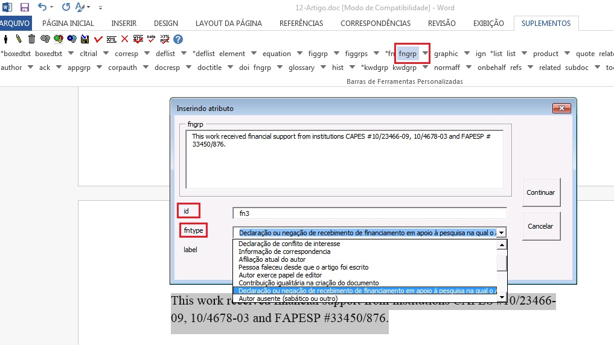

O próximo passo será selecionar o primeiro grupo de instituição financiadora + número de contrato e marcar com o elemento [award].

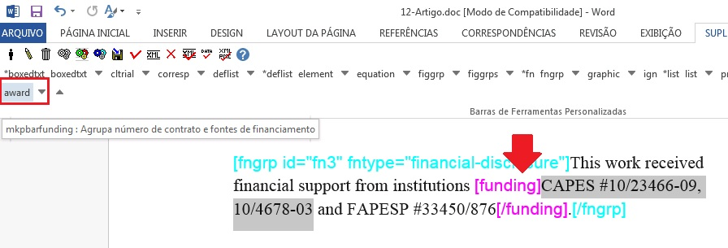

Em seguida, selecione a instituição financiadora e marque com o elemento [fundsrc]:

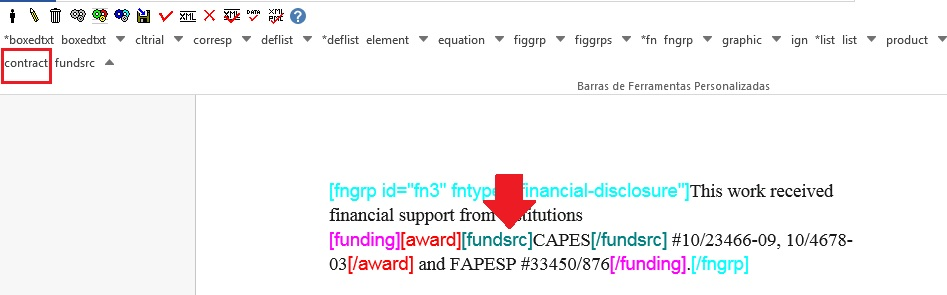

Depois selecione cada número de contrato e identifique com o elemento [contract]:

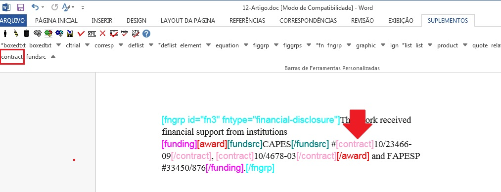

Caso a nota de rodapé apresente mais que uma instituição financiadora e número de contrato, faça a marcação conforme o exemplo abaixo:

.. image:: img/doc-mkp-mkp-fn-fund-2.jpg
   :height: 300px
   :align: center
   

.. raw:: html

   <iframe width="560" height="315" src="https://www.youtube.com/embed/FVTnNPGqWiU?list=PLQZT93bz3H79NTc-aUFMU_UZgo4Vl2iUH" frameborder="0" allowfullscreen></iframe>

.. _fn-automatico:

Notas de Rodapé - Identificação Automática
==========================================

Para notas de rodapé que estão posicionadas ao fim de cada página no documento, com formatação de notas de rodapé do Word, é possível fazer a marcação automática do número referenciado no documento e sua nota respectiva.

As chamadas de nota de rodapé no corpo do texto deverão estar com uma formatação simples: em formato numérico e sobrescrito.
Já as notas, deverão estar em formato de nota de rodapé do Word com um espaço antes da nota.

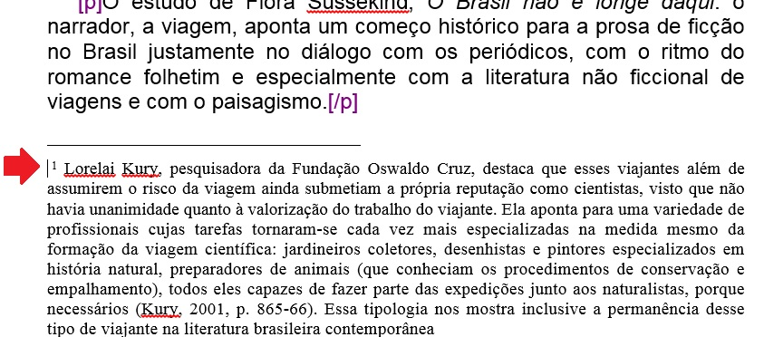

Estando formatado corretamente, clique com o mouse em qualquer parágrafo e em seguida clique na tag [*fn].

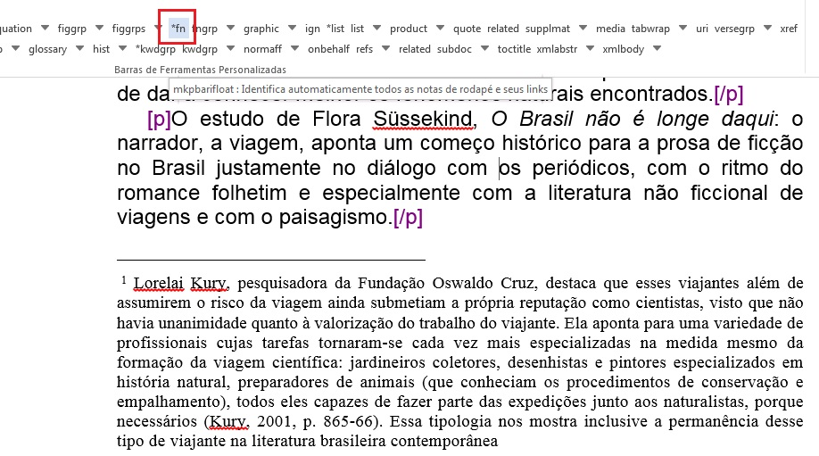

Ao clicar em [*fn] o programa fará a marcação automática de [xref] no corpo do texto e também da nota ao pé da página.

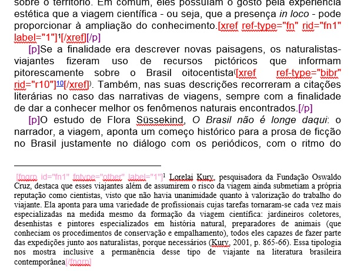

.. _apendice:

Apêndices
=========

A marcação de apêndices, anexos e materiais suplementares deve ser feita pelo elemento [appgrp]:

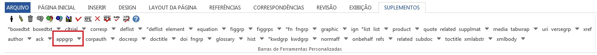

Selecione todo o grupo de apêndice, inclusive o título, se existir, e clique em [appgrp]:

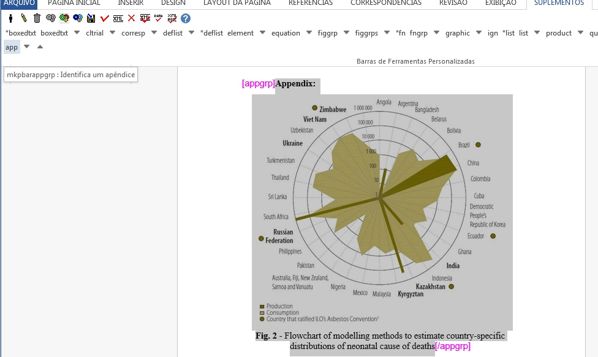

Selecione apêndice por apêndice e identifique com o elemento [app]

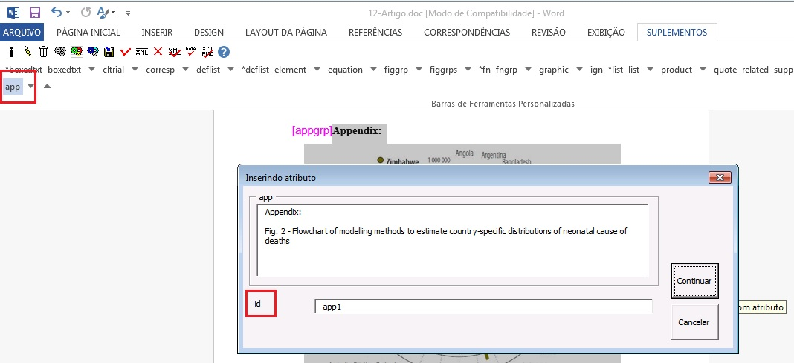

.. note:: o id deve ser sempre único no documento.

Caso o apêndice seja de figura, tabela, quadro etc, selecione o título de apêndice e marque com o elemento [sectitle]. Utilize os botões flutuantes (tabwrap, figgrp, *list, etc) do programa Markup para identificação do objeto que será marcado.

**botões flutuantes**

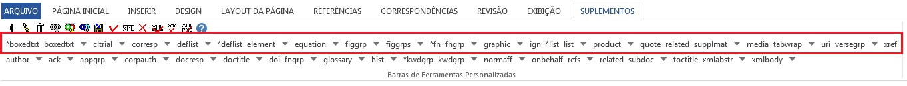

Exemplo, selecione a figura com seu respectivo label e caption e marque com o elemento [figgrp]

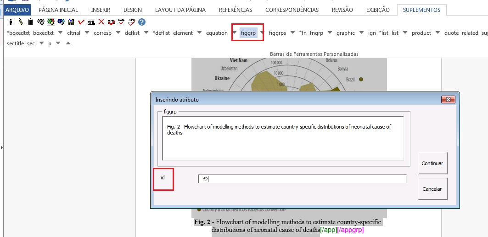

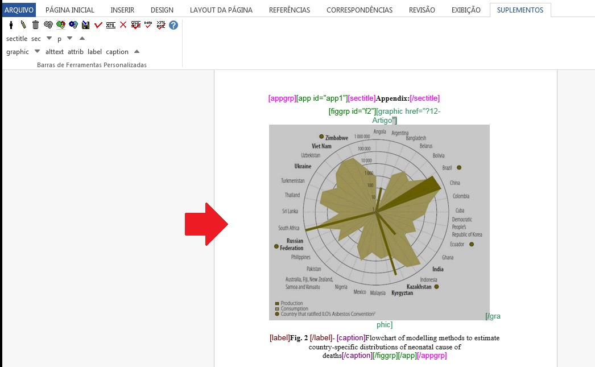

.. note:: Assegure-se de que o id da figura de apêndice é único no documento.

.. raw:: html

   <iframe width="560" height="315" src="https://www.youtube.com/embed/ZqjFc0Hg4P8?list=PLQZT93bz3H79NTc-aUFMU_UZgo4Vl2iUH" frameborder="0" allowfullscreen></iframe>

Para apêndices que apresentam parágrafos, selecione o título do apêndice e marque com o elemento [sectitle]

.. image:: img/doc-mkp-sectitle-app-paragrafo1.jpg
   :height: 300px
   :align: center

Selecione o parágrafo e marque com o elemento [p]

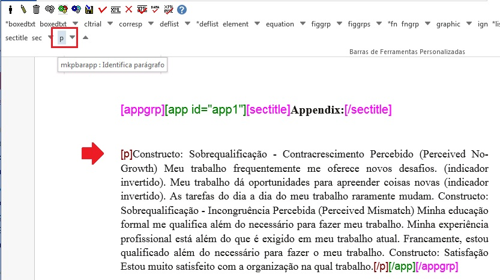

.. raw:: html

   <iframe width="560" height="315" src="https://www.youtube.com/embed/_BM7cKHcWoA?list=PLQZT93bz3H79NTc-aUFMU_UZgo4Vl2iUH" frameborder="0" allowfullscreen></iframe>

.. _agradecimentos:

Agradecimentos
==============

A seção de agradecimento, geralmente, encontra-se entre o final do corpo do texto e as referências bibliográficas. Para marcação automática dos elementos de agradecimento selecione todo o texto, inclusive o título desse item, e marque com o elemento [ack]. 

**selecionando [ack]**

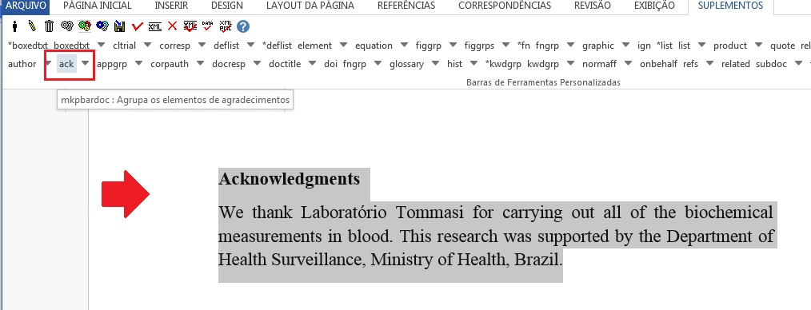

**Resultado esperado**

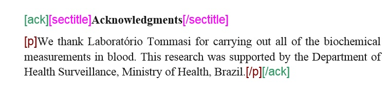

.. raw:: html

   <iframe width="560" height="315" src="https://www.youtube.com/embed/sxZlGq4vwhk?list=PLQZT93bz3H79NTc-aUFMU_UZgo4Vl2iUH" frameborder="0" allowfullscreen></iframe>

Comumente os agradecimentos apresentam dados de financiamento, com número de contrato e instituição financiadora. Quando presentes, marque os dados com o elemento [funding].

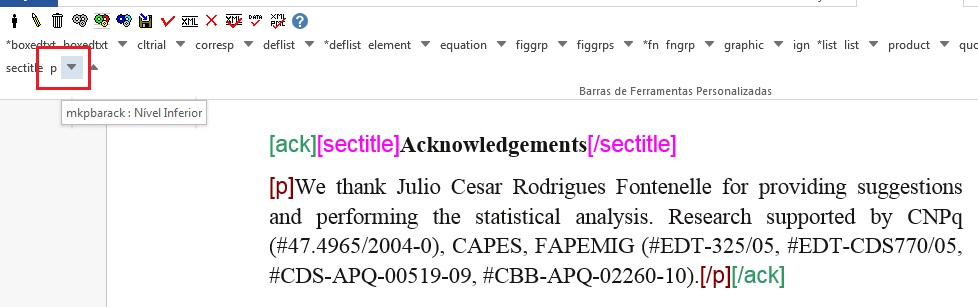

Selecione o primeiro conjunto de instituição e número de contrato e marque com o elemento [award]:

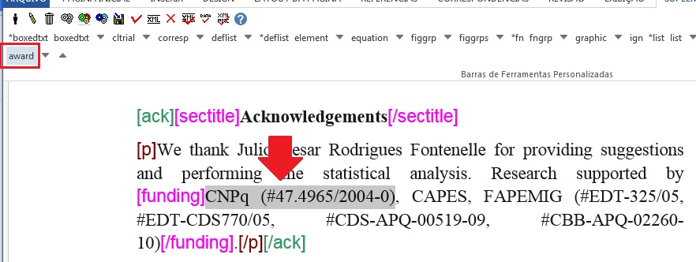

Selecione agora a instituição financiadora e marque com o elemento [fundsrc]:

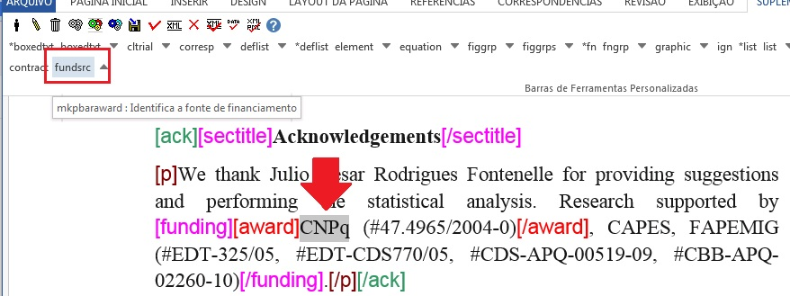

.. note:: Caso haja mais que uma instituição financiadora para o mesmo número de contrato, selecione cada instituição em um [fundsrc]

Marque o número de contrato com o elemento [contract]:

.. image:: img/doc-mkp-ack-contract1.jpg
   :height: 200px
   :align: center

Quando houver mais de uma instituição financiadora e número de contrato, marcar conforme segue:

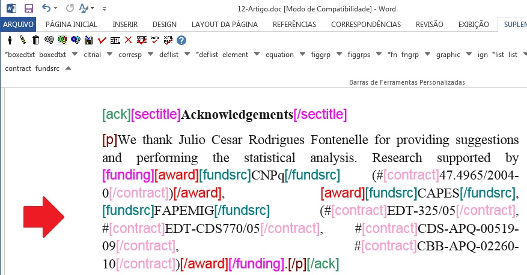

.. raw:: html

   <iframe width="560" height="315" src="https://www.youtube.com/embed/P-uM3_bpS1Q?list=PLQZT93bz3H79NTc-aUFMU_UZgo4Vl2iUH" frameborder="0" allowfullscreen></iframe>

.. _glossario:

Glossário
=========
Glossários são incluídos nos documentos após referências bibliográficas, em apêndices ou caixas de texto. Para marcá-lo, selecione todos os itens que a compõe e marque com o elemento [glossary]. Selecione todos os itens novamente e marque com o elemento :ref:`lista-definição`. Segue exemplo de marcação de glossário presente após referências bibliográficas:

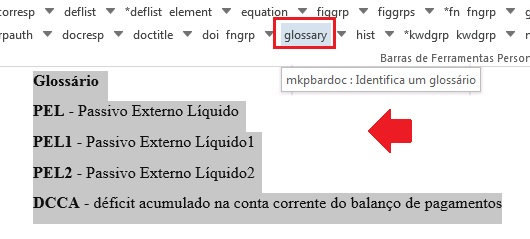

Selecione todos os dados de glossário e marque com o elemento :ref:`lista-definicao`:

.. image:: img/doc-mkp-select-gdef.jpg
   :height: 200px
   :align: center

Abaixo o resultado da marcação de glossário:

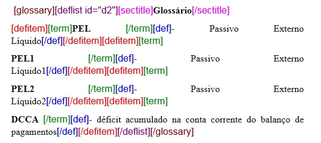

.. _xmlbody:

xmlbody
=======

Tendo formatado o corpo do texto de acordo com o ítem `Formatação do Arquivo <pt_how_to_generate_xml-prepara.html#formatacao-do-arquivo>`_ e após a marcação das referências bibliográficas, é possível iniciar a marcação do [xmlbody].

Selecione todo o corpo do texto e clique no botão [xmlbody], confira as informações de seções, subseções, citações etc as quais são apresentadas na caixa de diálogo e, se necessário, corrija e clique em “Aplicar”.

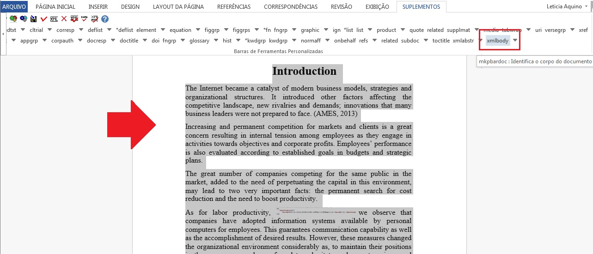

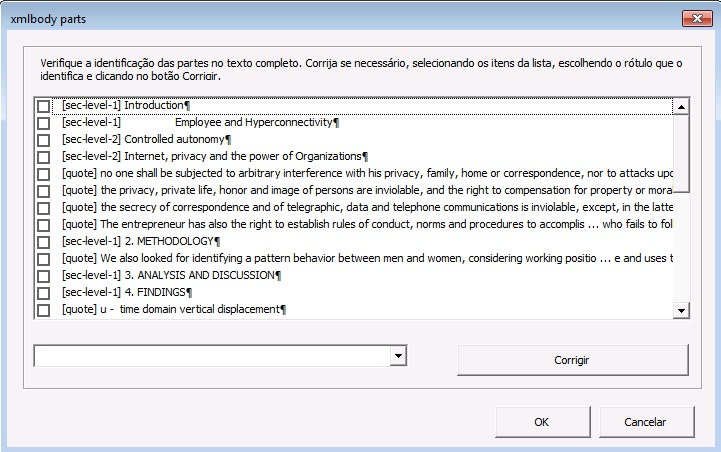

.. note:: Caso haja alguma informação incorreta, selecione o item a ser corrigido na janela, clique no menu dropdown ao lado do 
          botão “Corrigir”, selecione a opção correta e clique em “Corrigir”. Confira novamente e clique em “Aplicar”.

Ao clicar em "Aplicar" o programa perguntará se as referências no corpo do texto obedecem o padrão de citação author-data. Se o documento apresenta esse padrão clique em [sim], caso contrário, clique em [não].

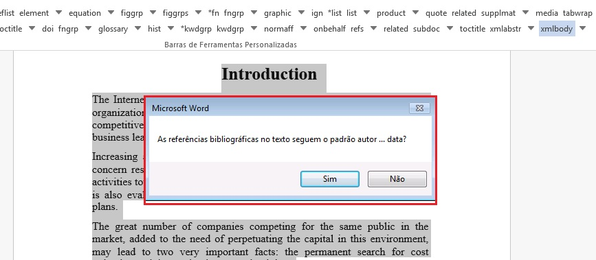

**Sistema author-data**

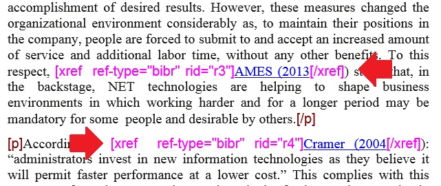

**Sistema numérico**

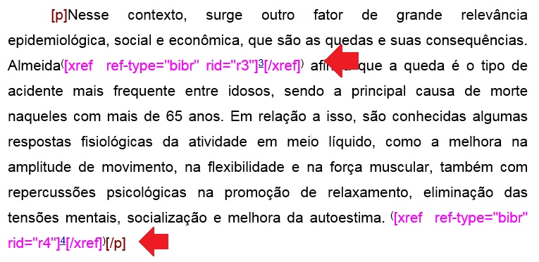

É a partir da formatação do documento indicada no `Formatação do Arquivo <pt_how_to_generate_xml-prepara.html#formatacao-do-arquivo>`_ que o programa marca automaticamente seções, subseções, parágrafos, referências de autores no corpo do texto, chamadas de figuras e tabelas, equações em linha etc.

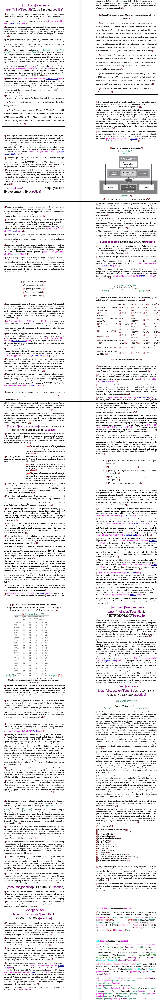

Verifique se os dados foram marcados corretamente e complete a marcação dos elementos ainda não identificados no documento.

.. raw:: html

   <iframe width="560" height="315" src="https://www.youtube.com/embed/rsz78JNpz44?list=PLQZT93bz3H79NTc-aUFMU_UZgo4Vl2iUH" frameborder="0" allowfullscreen></iframe>

.. _seção:

Seções e Subseções
------------------

Após a marcação automática do [xmlbody], certifique-se de que os tipos de seções foram selecionados corretamente.

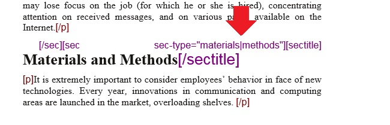

Em alguns casos, a marcação automática não identifica a seção corretamente. Nesses casos, selecione a seção, clique no lápis "Editar Atributos" e indique o tipo correto de seção.

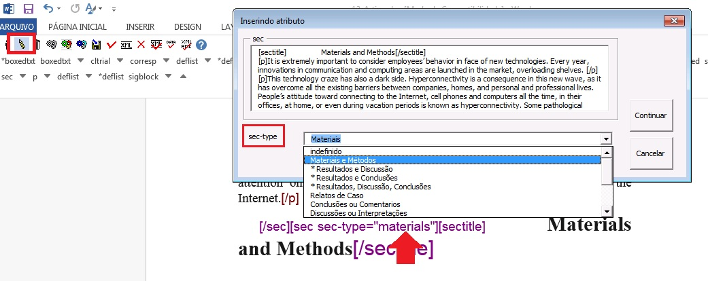

**Resultado**

.. note:: no menu dropdown as seções combinadas são precedidas por asterisco

.. raw:: html

   <iframe width="560" height="315" src="https://www.youtube.com/embed/P7fu28h7Cws" frameborder="0" allowfullscreen></iframe>

.. _xref:

Referência Cruzada de Referências Bibliográficas
------------------------------------------------

Referências no sistema autor-data serão identificados automaticamente no corpo do texto somente se o sobrenome do autor e a data estiverem marcados em Referências Bibliográficas e, apenas se o sobrenome do autor estiver presente no corpo do texto igual ao que foi marcado em [Refs].
Há alguns casos que o programa Markup não irá fazer a marcação automática de [xref] do documento. Ex.:

**Citações de autor**

*Sobrenome do autor + "in press" ou derivados:*

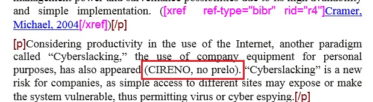

*Autor corporativo:*

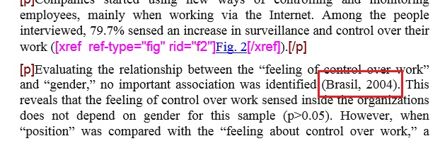

Para identificar o [xref] das citações que não foram marcadas automaticamente, primeiramente verifique qual o id da referência bibliográfica não identificada, em seguida selecione a citação desejada e marque com o elemento [xref].

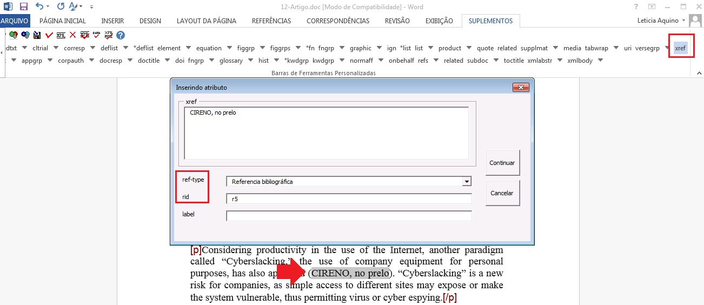

Preencha apenas os campos "ref-type" e "rid". Em "ref-type" selecione o tipo de referência cruzada que será feito, nesse caso "Referencia Bibliográfica", em seguida indique o id correspondente à referência bibliográfica citada. Confira e clique no botão [Continuar].

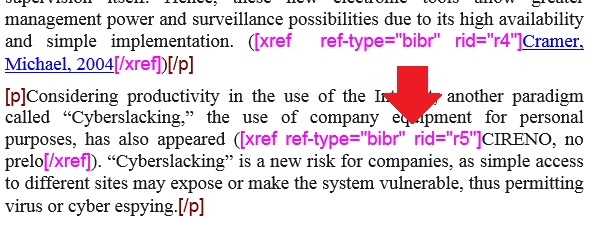

.. note:: Não insira hiperlink no dado a ser marcado.

**Chamada de Quadros, Equações e Caixas de Texto:**

A marcação das referências cruzadas de quadros, equações e caixas de texto segue as mesmas etapas descritas em referências bibliográficas.

**Quadro:**

Selecione [ref-type] do tipo figura e indique a sequência do ID no documento para este elemento.

.. image:: img/doc-mkp-chart.jpg
   :height: 100px
   :align: center

   *Resultado*

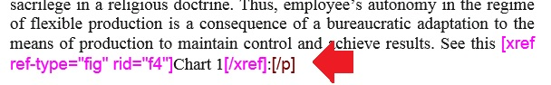

**Equações:**

Selecione [ref-type] do tipo equação e indique a sequência do ID no documento para este elemento.

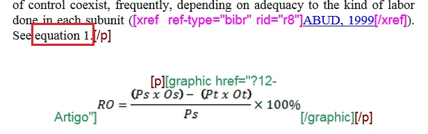

   *Resultado*

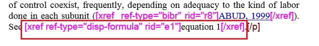

**Caixa de Texto:**

Selecione [ref-type] do tipo caixa de texto e indique a sequência do ID no documento para este elemento.

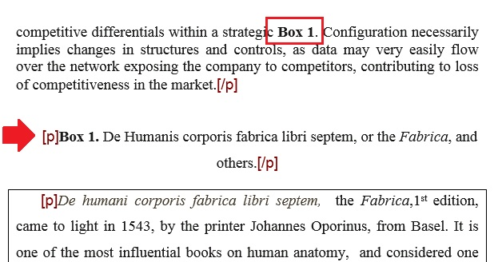

   *Resultado*

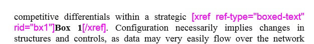

.. raw:: html

   <iframe width="560" height="315" src="https://www.youtube.com/embed/mGncaEawiKA?list=PLQZT93bz3H79NTc-aUFMU_UZgo4Vl2iUH" frameborder="0" allowfullscreen></iframe>

.. _paragrafo:

Parágrafos
----------

Os parágrafos são marcados automaticamente no corpo do texto ao fazer a identificação de [xmlbody]. Caso o programa não tenha marcado um parágrafo ou caso a marcação automática tenha identificado um parágrafo com o elemento incorreto, é possível fazer a marcação manual desse dado. Para isso, selecione o parágrafo desejado, verifique se o parágrafo pertence a alguma seção ou subseção e encontre o elemento [p] nos níveis de [sec] ou [subsec].

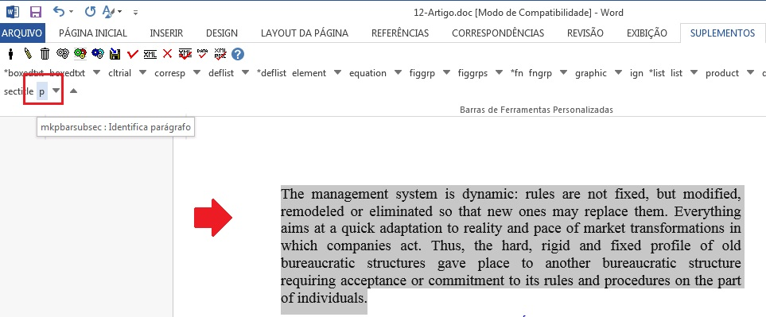

*Resultado*

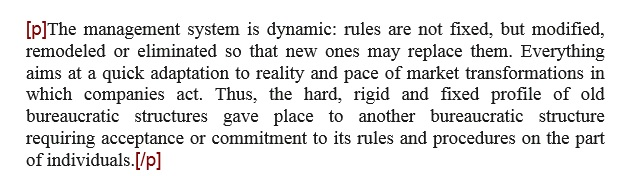

.. raw:: html

   <iframe width="560" height="315" src="https://www.youtube.com/embed/wjQ-YiMD6oc?list=PLQZT93bz3H79NTc-aUFMU_UZgo4Vl2iUH" frameborder="0" allowfullscreen></iframe>

.. _figura:
Figuras
-------

Ao fazer a marcação de [xmlbody] o programa identifica automaticamente as imagens com o elemento "graphic". 

Para marcar o grupo de dados da figura, selecione a imagem, sua legenda (label e caption) e fonte, se houver e marque com o elemento [figgrp].

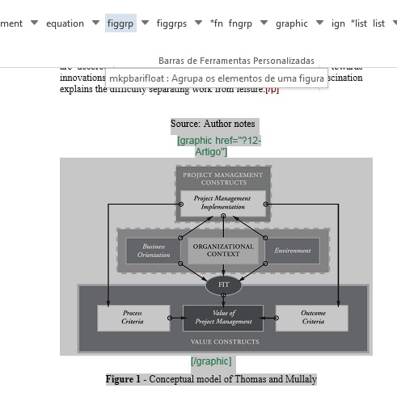

* Preencha "id" da figura na janela aberta pelo programa.

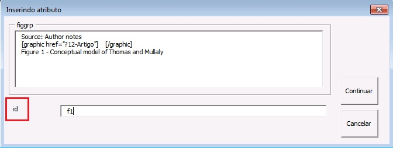

Certifique-se de que o id de figura é único no documento.

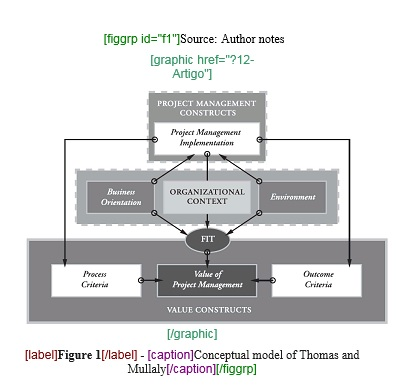

.. note:: A marcação completa de figura é de extrema  importância. Se a figura não for marcada com o elemento [figgrp] 
          e seus respectivos dados, o programa não gerará o elemento [fig] correspondente no documento.

* Após a marcação de [figgrp] caso a imagem apresente informação de fonte, selecione o dado e identifique com o elemento [attrib]:

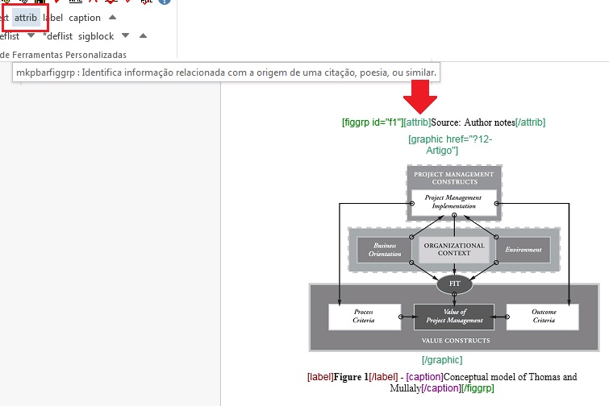

.. raw:: html

   <iframe width="560" height="315" src="https://www.youtube.com/embed/qbE3tLoYr3c?list=PLQZT93bz3H79NTc-aUFMU_UZgo4Vl2iUH" frameborder="0" allowfullscreen></iframe>

.. note:: A marcação de label e caption será automática se estiver conforme as instruções dadas em `Formatação do Arquivo <pt_how_to_generate_xml-prepara.html#formatacao-do-arquivo>`_, com label e caption abaixo da imagem no arquivo .doc. A informação de fonte deve estar acima da imagem. Veja o exemplo da imagem acima.

.. _tabela:

Tabelas
-------

As tabelas podem ser apresentadas como imagem ou em texto. As tabelas que estão como imagem devem apresentar o label, caption e notas (essa última, se existir) em texto, para que todos os elementos sejam marcados.
As tabelas devem estar, preferencialmente, em formato texto, usandos-se figuras para tabelas complexas (com células mescladas, símbolos, fórmulas, imagens etc).

Tabelas em Imagem
^^^^^^^^^^^^^^^^^

Ao fazer a marcação de [xmlbody] o programa identifica automaticamente o "graphic" da tabela. Selecione todos os dados da tabela (imagem, label, caption e notas de rodapé, se houver) e identifique com o elemento [tabwrap].

Mesmo estando na forma de figura, o id do elemento deverá ser o indicado para tabelas (t1, t2, t3 ...). Certifique-se de que o id de tabela é único no documento.

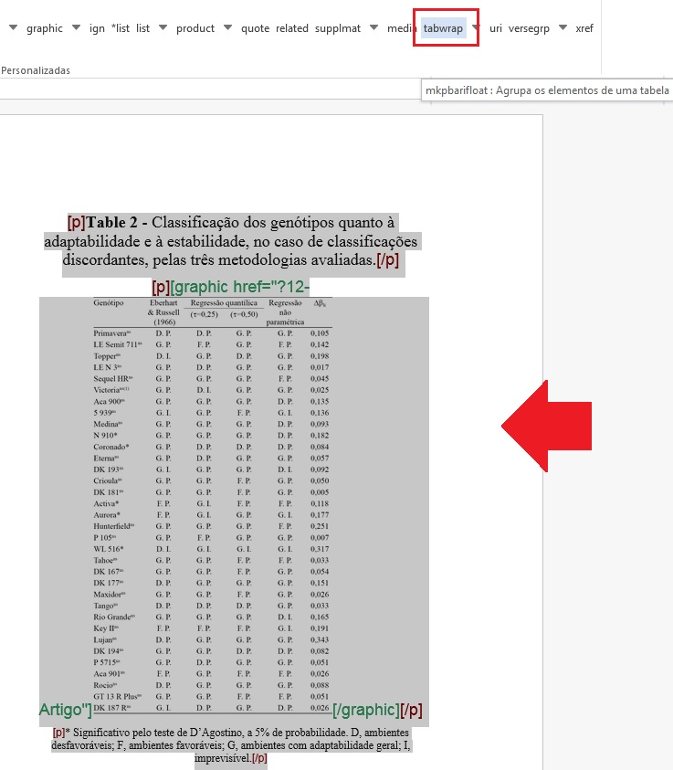

* Preencha o "id" da tabela na janela aberta pelo programa.

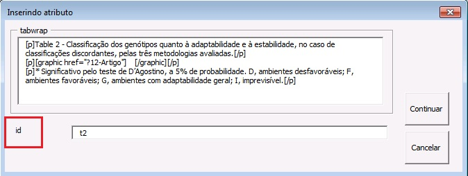

Certifique-se de que o id da tabela é único no documento.

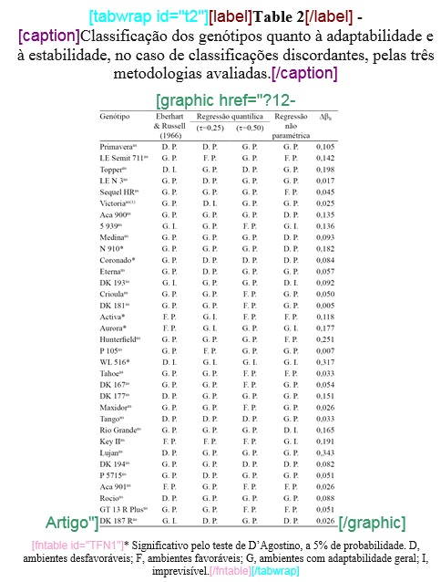

.. note:: O programa faz a marcação automática de label, caption e notas de rodapé de tabela.

Tabelas em Texto
^^^^^^^^^^^^^^^^

O programa também codifica tabelas em texto. Para isso, selecionte toda a informação de tabela (label, caption, corpo da tabela e notas de rodapé, se houver) e marque com o elemento [tabwrap].

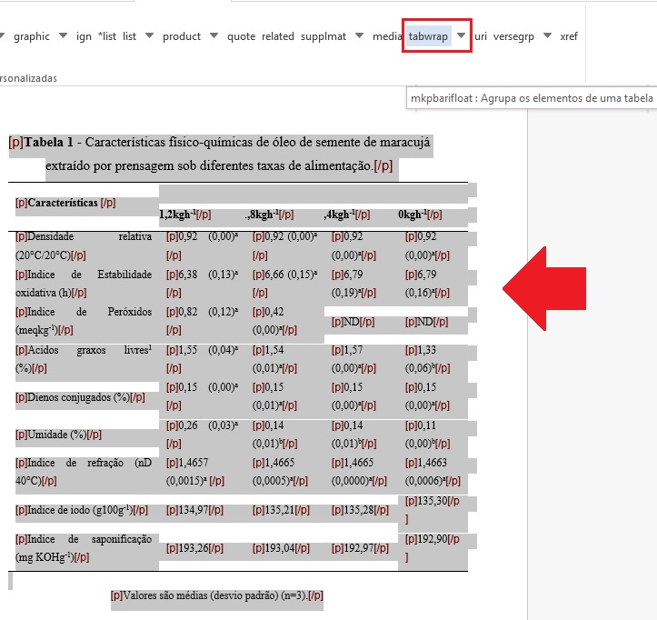

.. note:: O cabeçalho das colunas da tabela deve estar em negrito. Essa formatação é essencial para que o programa consiga fazer a identificação correta de [thead] e os elementos que o compõe.

* Preencha "id" da tabela na janela aberta pelo programa.

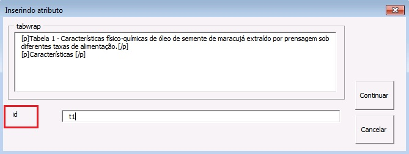

Certifique-se de que o id de tabela é único no documento.

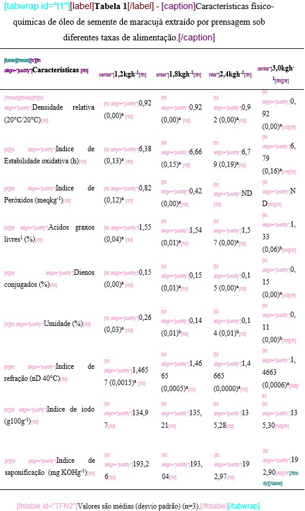

.. note:: Tabelas irregulares, com células mescladas ou com tamanhos extensos possivelmente apresentarão problemas de marcação.
          Nesse caso alguns elementos deverão ser identificados manualmente por meio do programa Markup ou no XML quando este for gerado.

.. _equação:

Equações
--------

Há dois tipos de equações que o programa suporta: as equações em linha (em meio a um parágrafo) e as equações em parágrafo.

**Equação em linha**

As equações em linha devem ser inseridas no parágrafo como imagem. A marcação é feita automaticamente pelo programa ao fazer a identificação de [xmlbody].

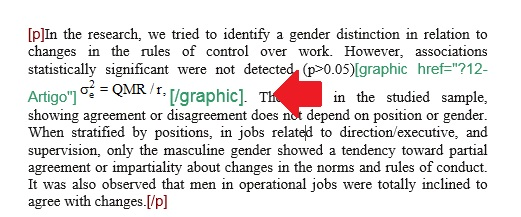

Se o programa não fizer a marcação automática da equação em linha, é possível fazer a marcação manualmente. Para isso selecione a equação em linha e clique no elemento [graphic].

.. image:: img/doc-mkp=eqline-man.jpg
   :height: 250px
   :align: center

No campo "href" insira o nome do arquivo:

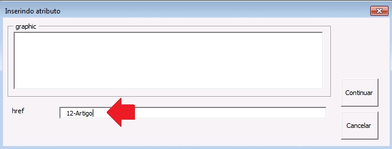

O resultado será:

**Equações**

As equações disponíveis como parágrafos devem ser identificadas com o elemento [equation]

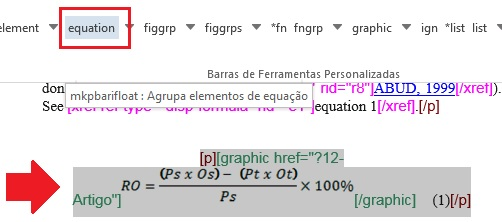

Preencha do "id" da equação na janela aberta pelo programa. Certifique-se de que o id da equação é único no documento.

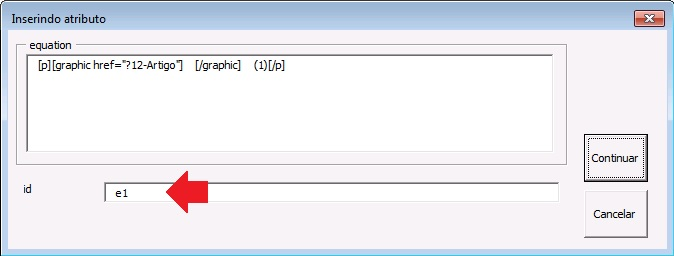

Ao fazer a marcação da equação, o programa identifica o elemento [equation]. Caso haja informação de número da equação, identifique-o com o elemento [label].

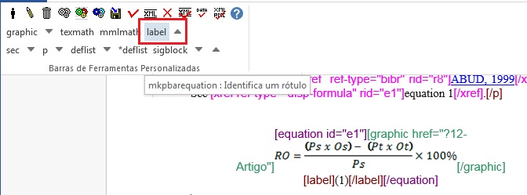

.. _caixa-de-texto:

Caixa de Texto
--------------

As caixas de texto podem apresentar figuras, equações, listas, glossários ou um texto. Para marcar esse elemento, selecione toda a informação de caixa de texto, inclusive o label e caption, e identifique com o botão [*boxedtxt]:

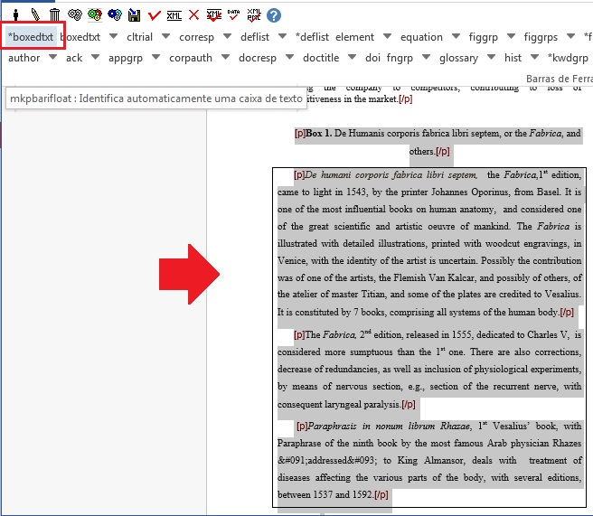

Preencha o campo de ID da caixa de texto na janela que se abrirá após a seleção de [*boxedtxt]. Certifique-se de que o id de boxed-text é unico no documento.

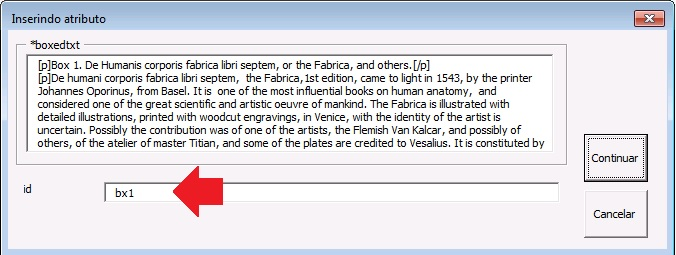

Utilizando o botão [*boxedtxt] o programa faz a marcação automática de título da caixa de texto e também dos parágrafos:

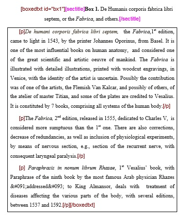

Caso a caixa de texto apresente uma figura, uma tabela, listas etc, é possível também utilizar o elemento [*boxedtxt] e depois fazer a marcação desses objetos através das tags flutuantes do programa.

.. raw:: html

   <iframe width="560" height="315" src="https://www.youtube.com/embed/M52p5PXceL8?list=PLQZT93bz3H79NTc-aUFMU_UZgo4Vl2iUH" frameborder="0" allowfullscreen></iframe>

.. _verso:

Marcação de Versos
------------------

Para identificar versos ou poemas no corpo do texto, selecione toda a informação, inclusive título e autoria, se existir, e identifique com o elemento [versegrp]: 

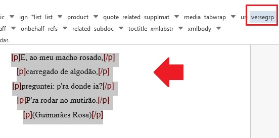

O programa identificará cada linha como [verseline]. Caso o poema apresente título, exclua a marcação de verseline, selecione o título e marque com o elemento [label]. A autoria do poema deve ser marcada com o elemento [attrib].

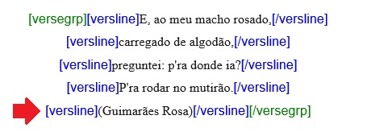

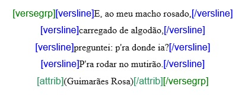

.. raw:: html

   <iframe width="560" height="315" src="https://www.youtube.com/embed/2ZmX8mrFjvU?list=PLQZT93bz3H79NTc-aUFMU_UZgo4Vl2iUH" frameborder="0" allowfullscreen></iframe>

.. _citação:

Citações Diretas
----------------

As citações são marcadas automaticamente no corpo do texto, ao fazer a marcação de [xmlbody], desde que esteja com a formatação adequada.

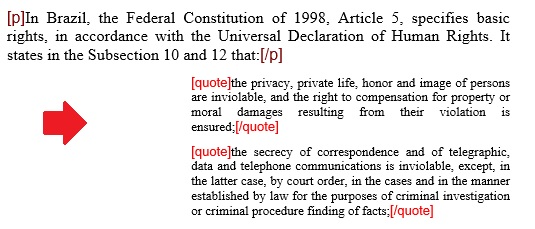

Caso o programa não faça a marcação automática, selecione a citação desejada e em seguida marque com o elemento [quote]:

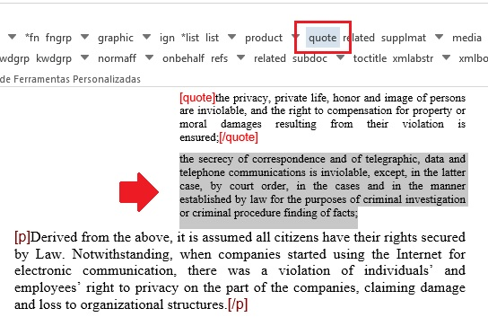

O resultado deve ser:

.. raw:: html

   <iframe width="560" height="315" src="https://www.youtube.com/embed/6oRIqNW4S6M?list=PLQZT93bz3H79NTc-aUFMU_UZgo4Vl2iUH" frameborder="0" allowfullscreen></iframe>

.. _lista:

Listas
------

Para identificar listas selecione todos os itens e marque com o elemento [*list]. Selecione o tipo de lista na janela aberta pelo programa:

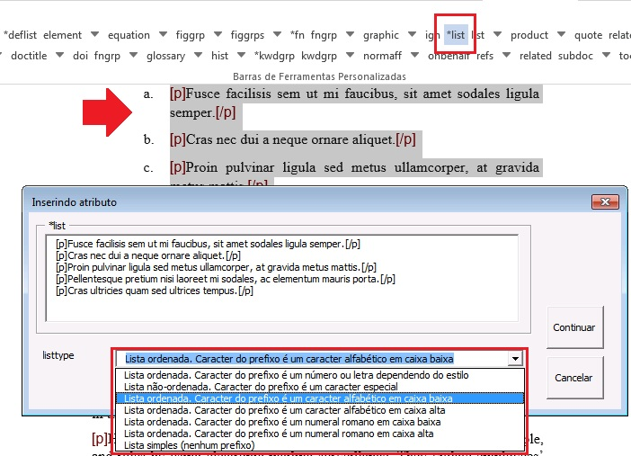

Verifique os tipos possíveis de lista em :ref:`elemento-list` e selecione o tipo mais adequado:

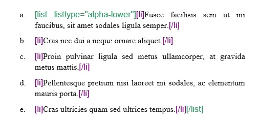

.. raw:: html

   <iframe width="560" height="315" src="https://www.youtube.com/embed/6697hJl4H7M?list=PLQZT93bz3H79NTc-aUFMU_UZgo4Vl2iUH" frameborder="0" allowfullscreen></iframe>

.. note:: O programa Markup não faz a marcação de sublistas. Para verificar como marcar sublistas, 
         consulte a documentação "Markup_90_O_que_ha_novo.pdf" item "Processos Manuais".

.. _elemento-list:

O atributo ``@list-type`` especifica o prefixo a ser utilizado no marcador da lista. Os valores possíveis são:

+----------------+-------------------------------------------------------------------+
| Valor          | Descrição                                                         |
+================+===================================================================+
| order          | Lista ordenada, cujo prefixo utilizado é um número ou letra       |
|                | dependendo do estilo.                                             |
+----------------+-------------------------------------------------------------------+
| bullet         | Lista desordenada, cujo prefixo utilizado é um ponto, barra ou    |
|                | outro símbolo.                                                    |
+----------------+-------------------------------------------------------------------+
| alpha-lower    | Lista ordenada, cujo prefixo é um caractere alfabético minúsculo. |
+----------------+-------------------------------------------------------------------+
| alpha-upper    | Lista ordenada, cujo prefixo é um caractere alfabético maiúsculo. |
+----------------+-------------------------------------------------------------------+
| roman-lower    | Lista ordenada, cujo prefixo é um numeral romano minúsculo.       |
+----------------+-------------------------------------------------------------------+
| roman-upper    | Lista ordenada, cujo prefixo é um numeral romano maiúsculo.       |
+----------------+-------------------------------------------------------------------+
| simple         | Lista simples, sem prefixo nos itens.                             |
+----------------+-------------------------------------------------------------------+

.. _lista-definicao:

Lista de Definição
------------------

Para marcar listas de definições selecione todos os dados, inclusive o título se existir, e marque com o elemento [*deflist]

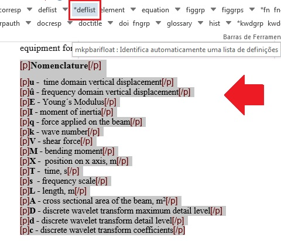

Na janela aberta pelo programa, preencha o campo de "id" da lista. Certifique-se de que o id é único no documento.

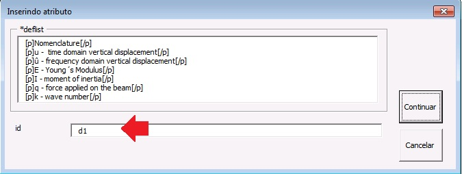

Após isso, confirme o título da lista de definição e em seguida a marcação do título:

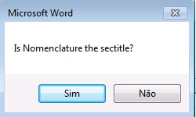

.. image:: img/doc-mkp-def-sectitle.jpg
   :height: 150px
   :align: center

Ao finalizar, verifique se a marcação automática de cada termo da lista de definição estão de acordo com o modelo abaixo.

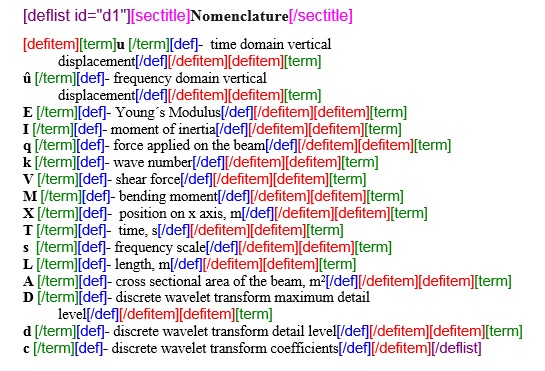

.. note:: O programa faz a marcação automática de cada item da lista de definições apenas se a lista estiver com 
          a formatação requerida pelo SciELO: com o termo em negrito, hífen como separador e a definição do termo sem formatação.

Caso o programa não faça a marcação automática da lista de definições, é possível identificar os elementos manualmente.

* Selecione toda a lista de denifições e marque com o elemento [deflist], sem asterisco:

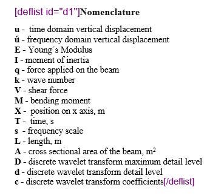

* Marque o título com o elemento [sectitle] (apenas se houver informação de título):

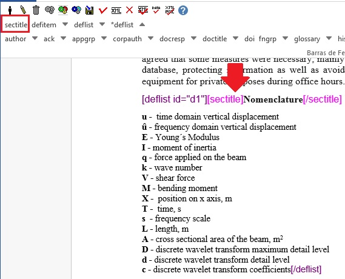

* Selecione o termo e a definição e marque com o elemento [defitem]:

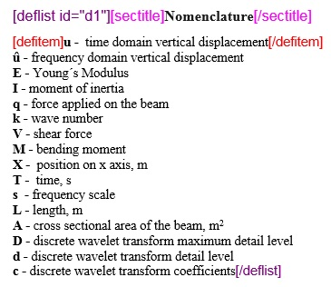

* Selecione apenas o termo e marque com o elemento [term]:

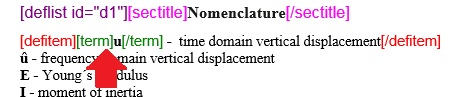

* O próximo passo será selecionar a definição e identificar com o elemento [def]:

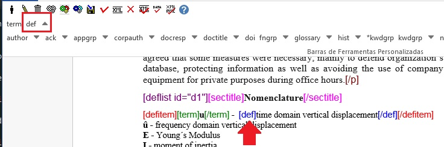

Faça o mesmo para os demais termos e definições.

.. _material-suplementar:

Material Suplementar
--------------------

A marcação de materiais suplementares deve ser feita pelo elemento [supplmat]. A indicação de Material suplementar pode estar em linha, como um parágrafo "solto" no documento ou como apêndice.

.. _suplemento-em-paragrafo:

Objeto Suplementar em [xmlbody]
^^^^^^^^^^^^^^^^^^^^^^^^^^^^^^^

Selecione todo o dado de material suplementar, incluindo label e caption, se existir, e marque com o elemento [supplmat]:

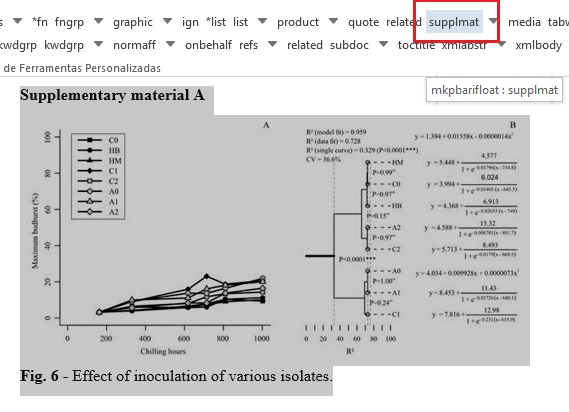

Na janela aberta pelo programa,  preencha o campo de "id", o qual deverá ser único no documento, e o campo "href" com o nome do arquivo .doc:

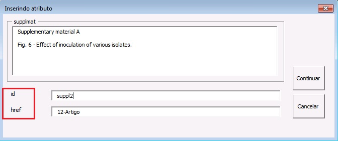

Na sequência, faça a marcação do label do material suplementar. Selecione todo o grupo de dados da figura e marque com o elemento [figgrp]. A marcação deverá ser conforme o exemplo abaixo:

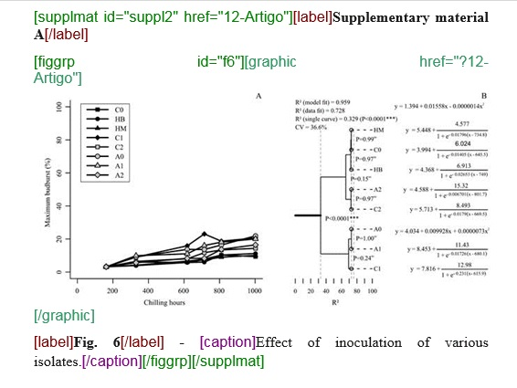

.. _suplemento-em-linha:

Material Suplementar em Linha
^^^^^^^^^^^^^^^^^^^^^^^^^^^^^

Selecione a informação de material suplementar e marque com o elemento [supplmat]:

.. image:: img/doc-mkp-selectms.jpg
   :height: 180px
   :align: center

Na janela aberta pelo programa,  preencha o campo de "id", o qual deverá ser único no documento, e o campo "href" com o nome do pdf suplementar exatamente como consta na pasta "src".

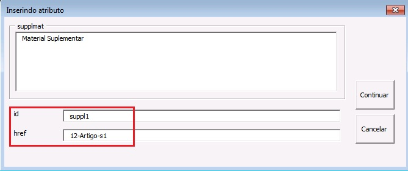

A marcação deverá ser conforme abaixo:

.. image:: img/doc-nkp-supple.jpg
   :align: center

.. note:: Antes de iniciar a marcação de material suplementar certifique-se de que o PDF suplementar foi incluído na 
          pasta "src" comentado em `Estrutura de Pastas <pt_how_to_generate_xml-prepara.html#estrutura-de-pastas>`_.

.. _suplemento-em-apendice:

Material Suplementar em Apêndice
^^^^^^^^^^^^^^^^^^^^^^^^^^^^^^^^

Nesse caso, marca-se, primeiramente, o objeto com o elemento [appgrp] e em seguida com os elementos de [app]. 

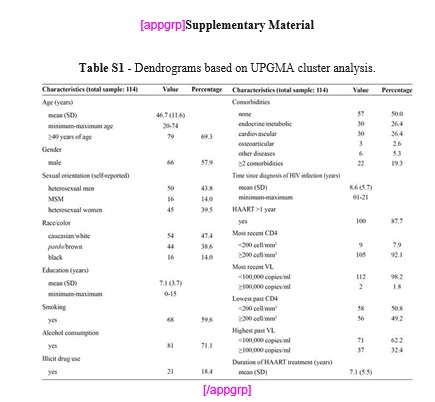

Selecione novamente todo dado de material suplementar e marque com o elemento [app]. Em seguida, marque o label do material com o elemento [sectitle]:

.. image:: img/doc-mkp-suppl-app.jpg
   :height: 400px
   :width: 350px
   :align: center

Selecione o material suplementar e identifique com o elemento [supplmat]:

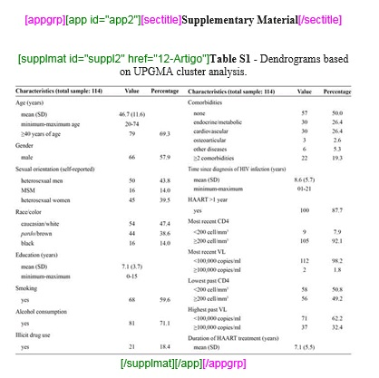
   

Após a marcação de [supplmat] marque o objeto do material com as tags flutuantes:

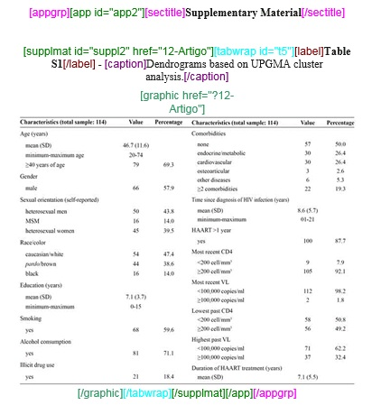

.. _subarticle:

Sub-article
===========

Tradução
--------
Arquivos traduzidos apresentam uma formatação específica. Veja abaixo os itens que devem ser considerados:

1. O arquivos de idioma principal devem seguir a formatação indicada em `Formatação do Arquivo <pt_how_to_generate_xml-prepara.html#formatacao-do-arquivo>`_
2. Após a última informação do arquivo principal - ainda no mesmo .doc ou .docx - insira a tradução do arquivo.

A tradução do documento deve ser simplificada:

1. Inserir apenas as informações que apresentam tradução, por exemplo:
    a. Seção - se houver tradução;
    b. Autores e Afiliações - apenas se houver afiliação traduzida;
    c. Resumos -  se houver tradução;
    d. Palavras-chave -  se houver tradução;
    e. Correspondência -  se houver tradução;
    f. Notas de autor ou do arquivo - se houver tradução;
    g. Corpo do texto.
    
2. Título é mandatório;
3. Não inserir novamente referências bibliográficas;
4. Manter as citações bibliográficas no corpo do texto conforme constam no PDF.

Verificar modelo abaixo:

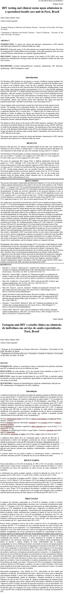

Identificando Arquivos com Traduções
^^^^^^^^^^^^^^^^^^^^^^^^^^^^^^^^^^^^

Com o arquivo formatado, faça a identificação do documento pelo elemento [doc] e complete as informações.
A marcação do arquivo de idioma principal não muda, siga as orientações anteriores para a marcação dos elementos.

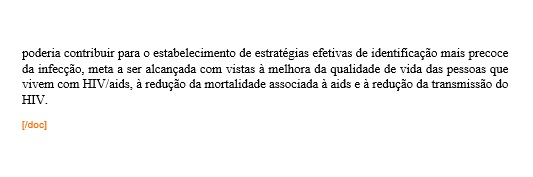

.. note:: É fundamental que o último elemento do arquivo como um todo seja o elemento [/doc]. Certifique-se disso.

Finalizado a marcação do arquivo de idioma principal selecione toda a tradução e marque com o elemento [subdoc].
Na janela aberta pelo programa, preencha os campos a seguir: 

* ID            - Identificador único do arquivo: S + nº de ordem;
* subarttp - selecionar o tipo de artigo: "tradução";
* language - idioma da tradução do arquivo.

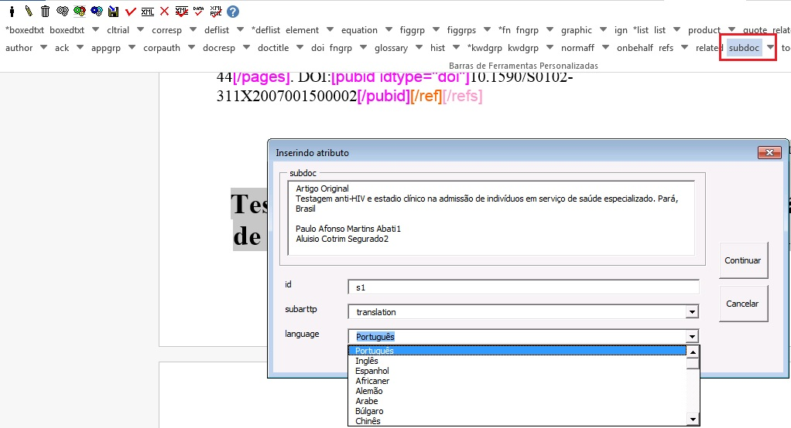

Agora, no nível de [subdoc], faça a marcação dos elementos que compõem a tradução do documento:

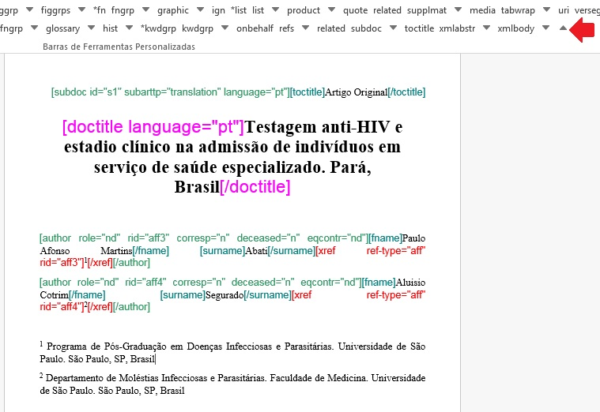

.. note::  O programa Markup não faz a identificação automática do arquivo traduzido.

Afiliação traduzida
^^^^^^^^^^^^^^^^^^^

A marcação de afiliação traduzida não segue o padrão de marcação do artigo de idioma principal.
As afiliações traduzidas não devem apresentar o detalhamento orientado anteriormente em afiliações. 
Em [subdoc] selecione a afiliação traduzida e identifique com o elemento [afftrans]:

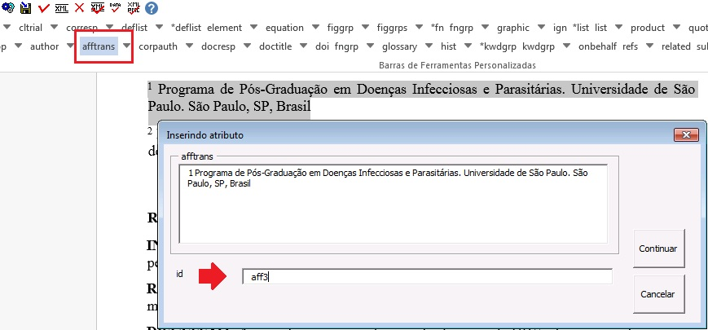

Tendo identificado todos os dados iniciais da tradução, siga com a marcação do corpo do texto.

.. attention:: O ID dos autores e afiliações devem ser únicos. Portanto, não inserir o mesmo ID do idioma principal.

Identificando 'body' de tradução
^^^^^^^^^^^^^^^^^^^^^^^^^^^^^^^^

A marcação do corpo do texto segue a mesma orientação anterior. Selecione todo o corpo do texto e marque com o elemento [xmlbody] do nível [subdoc]. 

O programa fará a marcação automática das referências cruzadas no corpo do texto inserindo o 'rid" correspondente ao 'id' das referências bibliográficas marcadas no artigo principal.

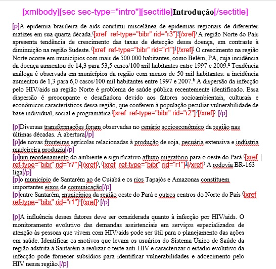

Nesse caso mantenha o RID inserido automaticamente.
Figuras, Tabelas, Equações, Apêndices etc devem apresentar ID diferente do inserido no arquivo principal.
Para isso, dê continuidade nos IDs. Por exemplo:

**Artigo principal apresenta 2 figuras:**

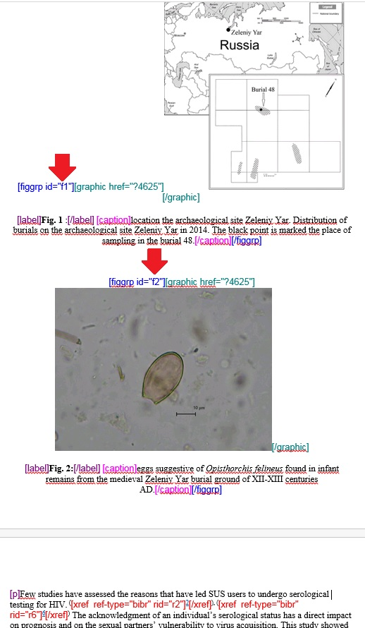

.. note:: O ID da última figura é: 'f2'.

**No artigo traduzido também é apresentado 2 figuras:**

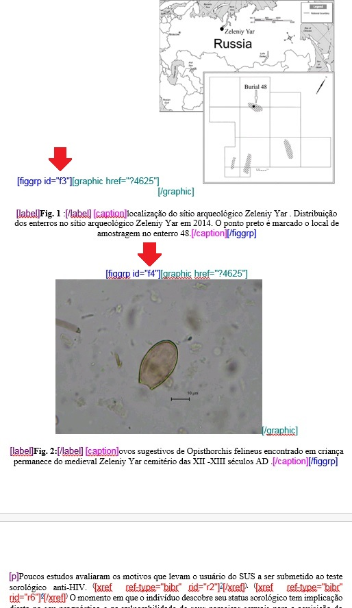

Perceba que foi dado sequência nos IDs das figuras.
Considere a regra para: Autores e suas respectivas afiliações, figuras, tabelas, caixas de texto, equações, apêndices etc.

.. note:: Caso haja mais de uma tradução no artigo, cmarcá-las separadamente com o elemento [subdoc].

.. _carta-resposta:

Carta e Resposta
----------------
A Carta e resposta também devem estar em um único arquivo .doc ou .docx.

1. A carta deve seguir a formatação indicada em `Formatação do Arquivo <pt_how_to_generate_xml-prepara.html#formatacao-do-arquivo>`_
2. Após a última informação da carta - ainda no mesmo .doc ou .docx - insira a resposta do arquivo.

A resposta deve estar no mesmo documento que a carta. Verifique abaixo quais são os dados que devem estar presentes na resposta:

1. Inserir seção;
2. Autores e Afiliações, se existente;
3. Correspondência, se existente;
4. Notas de autor ou do arquivo, se existente;
5. Título é mandatório;
6. Referências Bibliográficas, se a resposta apresentar.

Veja o modelo abaixo:

[imagem]

Identificando Carta e Resposta
^^^^^^^^^^^^^^^^^^^^^^^^^^^^^^

Com o arquivo formatado, faça a identificação do documento pelo elemento [doc] e complete as informações. Obs.: Em [doctopic] selecione o tipo "carta". 
A marcação da carta não muda, siga as orientações anteriores para a identificação dos elementos.

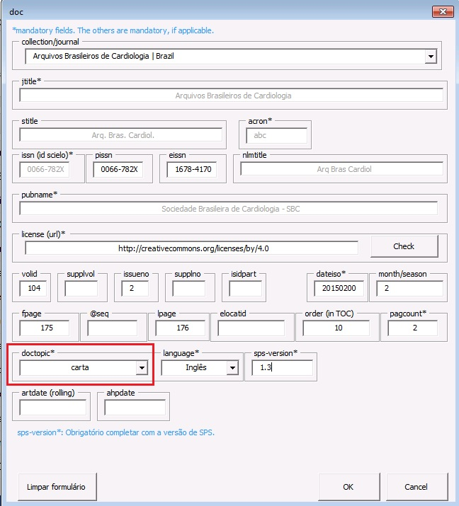

.. note:: É fundamental que o último elemento do arquivo como um todo seja o elemento [/doc]. Certifique-se disso.

Finalizada a marcação da carta, selecione toda a resposta e marque com o elemento [subdoc].
na janela aberta pelo programa, inclua os campos: 

* ID       - Identificador único do arquivo: S + nº de ordem;
* subarttp - selecionar o tipo de artigo: "reply";
* language - idioma da resposta da carta.

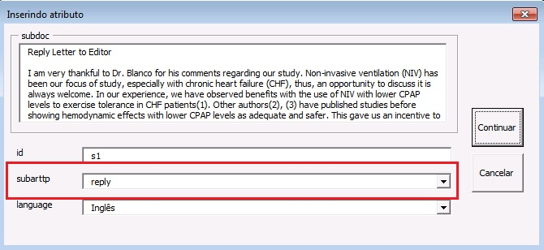

.. note::  O programa Markup não faz a identificação automática da resposta.

No nível de [subdoc], faça a marcação dos elementos que compõem a resposta do documento:

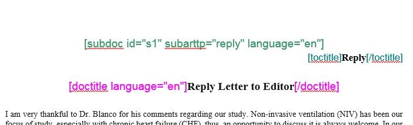

.. note:: Os dados como: afiliações e autores, objetos no corpo do texto e referencias bibliográficas devem apresentar IDs sequenciais, seguindo a ordem da carta. Exemplo, se a última afiliação da carta foi aff3, no documento de resposta a primeira afiliação será aff4 e assim por diante.

.. _errata:

Errata
======

Para marcar uma errata, verifique primeiramente se o arquivo está formatado corretamente conforme orientações abaixo:

* 1ªlinha: DOI
* 2ªlinha: Seção "Errata" ou "Erratum"
* 3ªlinha: título "Errata" ou "Erratum" (de acordo com o PDF)
* pular 2 linhas
* corpo do texto

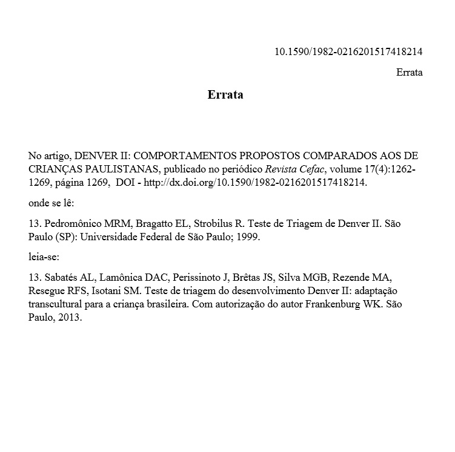

Marcando a errata
-----------------

Abra a errata no Markup e identifique com o elemento [doc].
Ao abrir o formulário, selecione o título do periódico e confira os metadados que são adicionados automaticamente.
Complete os demais campos e, em [doctopic], selecione o valor "errata" e  clique em [OK]
O programa marcará automaticamente os elementos básicos da errata como: seção, número de DOI e título:

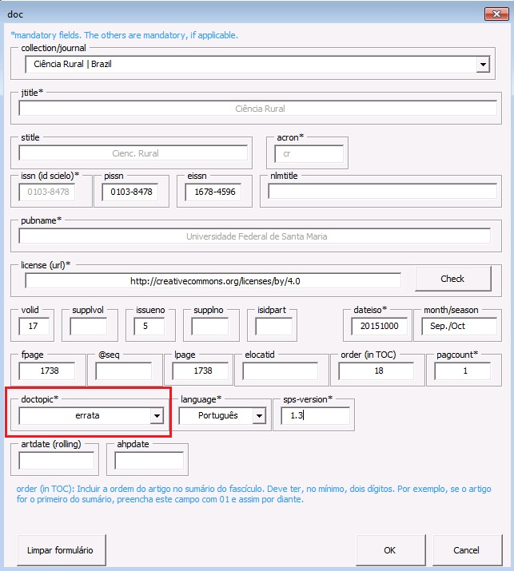

Para finalizar a marcação da errata, verifique se todos os elementos foram identificados corretamente e siga com a marcação.
Selecione o corpo do texto e identifique com o elemento [xmlbody]:

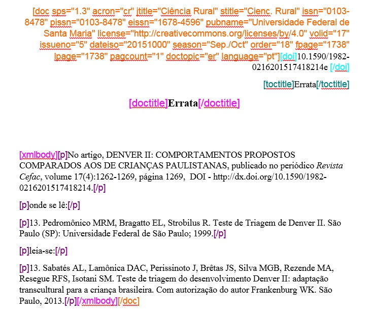

Insira o cursor do mouse antes do elemento [toctitle], e clique no botão [related].
Na janela aberta pelo programa, preencha os campos: [reltp] 'tipo de relação' com o valor "corrected-article" e [pid-doi] 'numero do PID ou DOI relacionado' com o número de DOI do artigo que será corrigido e clique em [Continuar]:
 
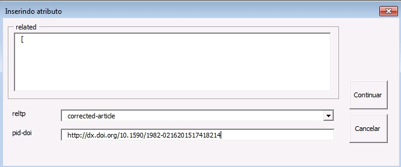

O programa insere o elemento [related] o qual fará link com o artigo que apresenta erro:

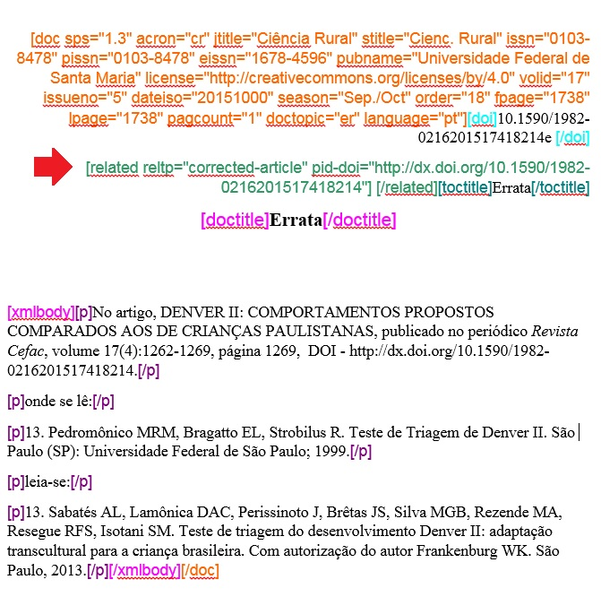

.. note:: A versão mais recente do programa Markup aceita os tipos: DOI, PID, SciELO-PID e SciELO-AID.

.. _ahead:

Ahead Of Print
==============

O arquivo Ahead Of Print (AOP) deve apresentar formatação indicada no ítem `Formatação do Arquivo <pt_how_to_generate_xml-prepara.html#formatacao-do-arquivo>`_. Como arquivos em AOP não apresentam seção, volume, número e paginação, após o número de DOI deixar uma linha em branco e em seguida inserir o título do documento:

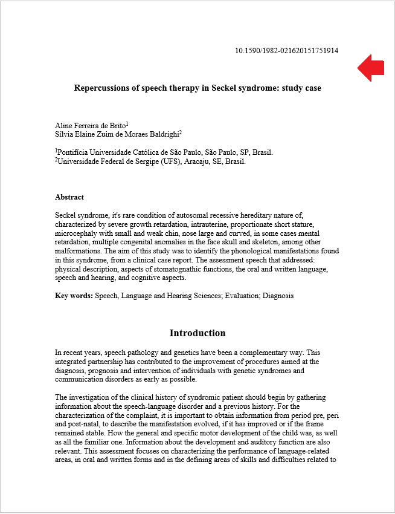

No preenchimento do formulário para Ahead Of Print, deve-se inserir o valor "00" para os campos: [fpage], [lpage], [volume] e [issue].

Em [dateiso] insira a data de publicação completa: Ano+Mês+Dia; já no campo [season], insira o mês de publicação.
O total de página, [pagcount*], para arquivos AOP deve ser sempre "1":

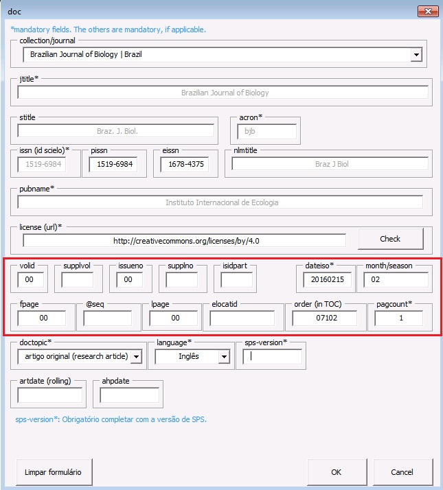

Selecione o valor "artigo original" para o campo [doctopic].

No campo [order] deve ser inserido 5 dígitos que obedecem a uma regra SciELO. Verifique abaixo a regra para construir o identificador do Ahead Of Print:

Para a construção do ID de AOP será utilizado uma parte da numeração do lote e outra da ordem do documento.

*1 - Copie os três primeiros dígitos do lote*

Exemplo lote da bjmbr número 7 de 2015 = lote 0715 **usar: 071**

*2- Insira os dois últimos dígitos que representará a quantidade de artigos no lote.*

+------------------------------------------------------------+
|        Exemplo lote bjmbr 0715 possui 5 artigos:           |
+=========================================+==================+
| 1414-431X-bjmbr-1414-431X20154135.xml   |  -> **usar: 01** |
+-----------------------------------------+------------------+
| 1414-431X-bjmbr-1414-431X20154316.xml   |  -> **usar: 02** |
+-----------------------------------------+------------------+
| 1414-431X-bjmbr-1414-431X20154355.xml   |  -> **usar: 03** |
+-----------------------------------------+------------------+
| 1414-431X-bjmbr-1414-431X20154363.xml   |  -> **usar: 04** |
+-----------------------------------------+------------------+
| 1414-431X-bjmbr-1414-431X20154438.xml   |  -> **usar: 05** |
+-----------------------------------------+------------------+

O campo order deverá apresentar o valor de order da seguinte forma:

**3 primeiros dígitos do lote + 2 dígitos da quantidade do lote**

Arquivo 1:

.. image:: img/mkp-other-aop1.jpg
   :align: center

Arquivo 2:

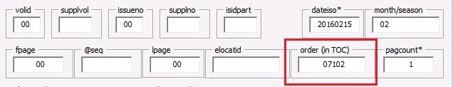

etc.

Em [ahpdate] insira a mesma data que consta em [dateiso]. Após preencher todos os dados, clique em [Ok].

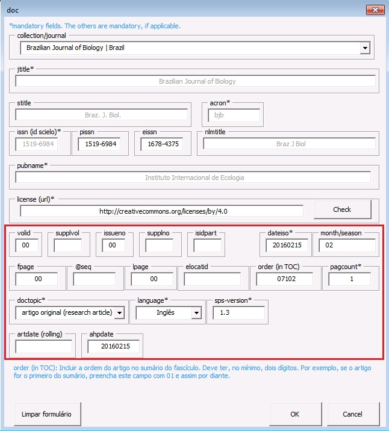

.. note:: Ao gerar o arquivo .xml o programa inserirá automaticamente o elemento <subject> com o valor "Articles", conforme recomendado pelo SciELO PS.

.. _rolling-pass:

Publicação Contínua (Rolling Pass)    
==================================
O arquivo Rolling Pass deve apresentar formatação indicada no ítem `Formatação do Arquivo <pt_how_to_generate_xml-prepara.html#formatacao-do-arquivo>`_. 

Antes de preencher formulário para Rolling Pass, deve-se saber o formato de publicação adotado pelo periódico, os quais podem ser:

**Volume e número**

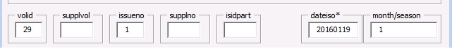

**Volume**

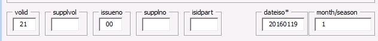

**Número**

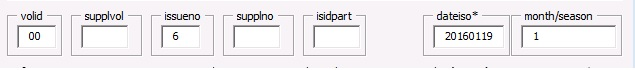

O campo [order] é composto por uma ordem que determinará a seção dos arquivos e também a ordem de publicação. Portanto, primeiramente defina cada centena para uma seção, por exemplo:

* Editorials: 0100
* Original Articles: 0200
* Review Article: 0300
* Letter to the Author: 0400
   …

Os artigos deverão apresentar um ID único dentro de sua seção, portanto recomendamos que seja criado uma planilha como a que apresento nesse momento para acompanhar qual ID já foi utilizado. Exemplo:

**Original Articles**

* 1234-5678-rctb-v10-0239.xml    0100
* 1234-5678-rctb-v10-0328.xml    0101
* 1234-5678-rctb-v10-0356.xml    0102
                 ...

O identificador eletrônico do documento deve ser inserido no campo [elocatid].

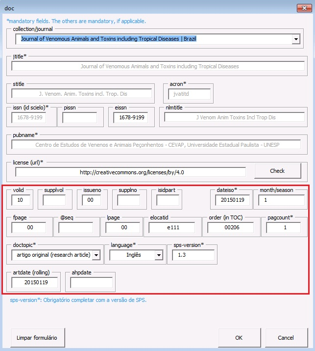

.. note:: Arquivos Rolling Pass apresentam elocation. Dessa forma, não deve-se preencher dados correspondentes a [fpage] e [lpage].

.. _resenha:

Resenha
=======

As resenhas geralmente apresentam um dado a mais que os arquivos comuns: a referência bibliográfica do livro resenhado.
A formatação do documento deve seguir a mesma orientação disponível em `Formatação do Arquivo <pt_how_to_generate_xml-prepara.html#formatacao-do-arquivo>`_ , incluindo-se referência bibliográfica do item resenhado antes do corpo do texto. 

Verifique modelo abaixo:

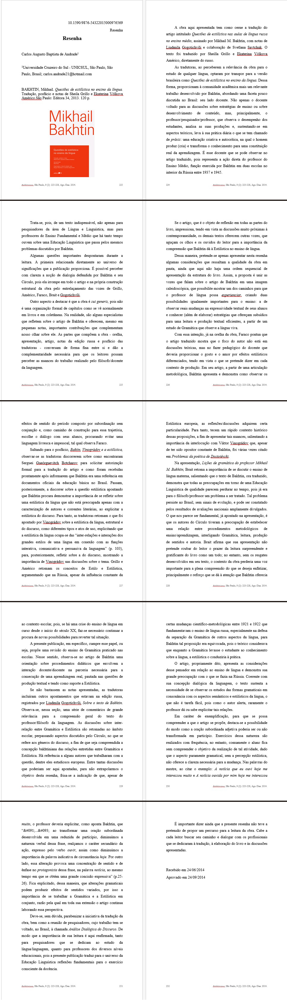

Identificando Resenhas
----------------------

Com o arquivo formatado, faça a identificação do documento pelo elemento [doc] e complete as informações. Em [doctopic] selecione o tipo "resenha (book review)". A marcação dos dados iniciais é semelhante às orientações anteriores, excetuando-se a marcação da referência do livro resenhado.

Para marcar a referência do livro, selecione toda a referência e marque com o elemento [product]. Na janela aberta pelo programa, insera o tipo de referência bibliográfica em [prodtype]:

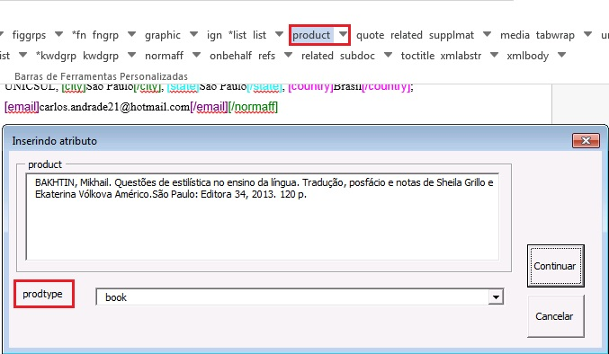

Na sequência, faça a marcação da referência usando os elementos apresentados no programa:

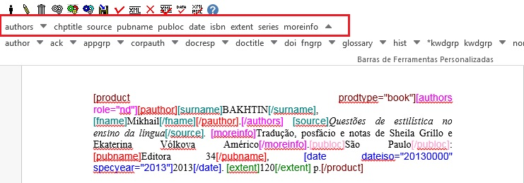

Finalize a marcação do arquivo e gere o XML.

.. note:: O programa não apresenta todos os elementos para marcação de referência bibliográfica no elemento [product]. Marque apenas os dados da referência com os elementos disponibilizados pelo programa.

.. _formato-abreviado:

Artigos em Formato Abreviado
============================

O formato abreviado de marcação é utilizados somente nos casos de inserção de números retrospectivos na coleção do periódico.
O arquivo no formato abreviado apresentará os dados básicos do documento (título do artigo, autores, afiliação, seção, resumo, palavras-chave e as referências completas).
O corpo do texto de um arquivo no formato abreviado deve ser suprimido, substituindo o texto por dois parágrafos:

   *Texto completo disponível apenas em PDF.*

   *Full text available only in PDF format.*

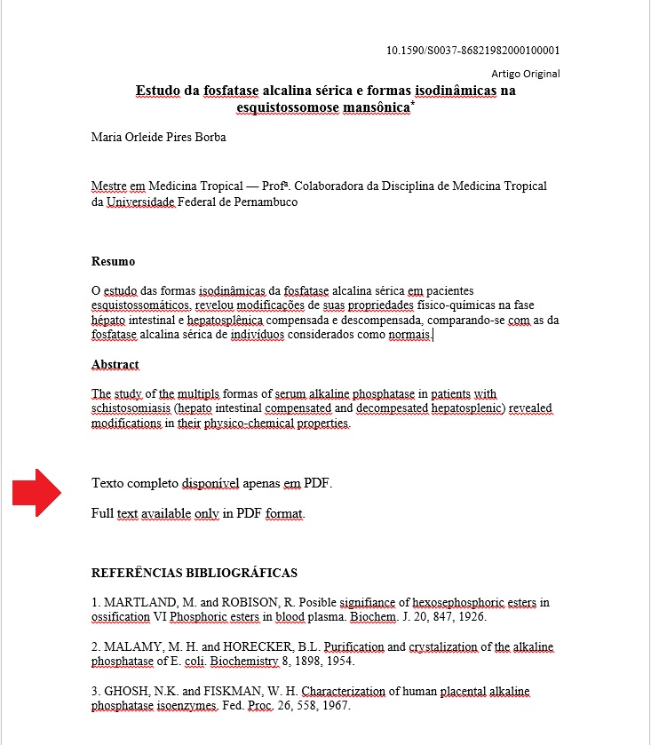

Identificando Formato Abreviado
-------------------------------

Com o arquivo formatado, faça a identificação do documento pelo elemento [doc] e complete as informações dos dados iniciais de acordo com os dados do arquivo. 

A marcação de arquivos no formato abreviado não exige uma ordem de marcação entre referências bibliográficas e [xmlbody].
Faça a marcação de referências bibliográficas de acordo com a orientação do item :ref:`_referencias`:

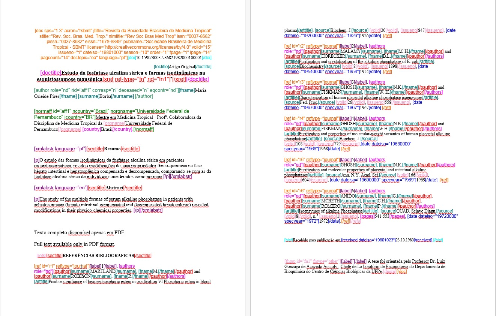

A marcação dos parágrafos deve ser feita pelo elemento [xmlbody], selecionando os dois parágrafos e clicando em [xmlbody]:

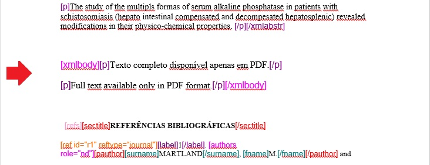

.. note:: A única informação que não será marcada no arquivo de 'Formato Abreviado' será o corpo do texto, o qual estará disponível no PDF.

.. _press-release:

Press Releases
==============

Por ser um texto de divulgação que visa dar mais visibilidade a um número ou artigo publicado em um periódico, o press realise não segue a mesma estrutura de um artigo científico. Dessa forma, não possue seção, número de DOI e, não há obrigatoriedade de inclusão de afiliação de autor.
Uma vez aprovados, os Press Releases poderão ser formatados para uma marcação mais otimizada.

* 1ª linha do arquivo: correspondente ao número de DOI, deve ficar em branco;
* 2ª linha do arquivo: correspondente à seção do documento, deve ficar em branco;
* 3ª linha do arquivo: insira o título do Press Release;
* 4ª linha do arquivo: pular;
* 5ª linha do arquivo: Insira o nome do autor do Press Release;
* 6ª linha do arquivo: pular;
* 7ª linha do arquivo: inserir afiliação (caso não exista, deixar linha em branco);
* 8ª linha do arquivo: pular
* Insira o texto do arquivo Press Release, incluindo a assinatura do autor (assinatura se houver).

Identificando o Press Release
-----------------------------

Com o arquivo formatado, faça a identificação do documento pelo elemento [doc] e considere os seguintes itens para arquivo PR:

* Nos campos 'volid' e 'issue' insira o número correspondente ao número que o Press Release está relacionado e em 'isidpart' insira a informação 'pr' qualificando o arquivo como um Press Release;
* Em [doctopic] selecione o tipo "Press Release";
* Caso o Press Release esteja relacionado a um número, insira a informação "00001" no campo [order] para que o Press Release seja posicionado corretamente no sumário eletrônico; caso o Press Release seja de artigo, apenas insira a informação "01".

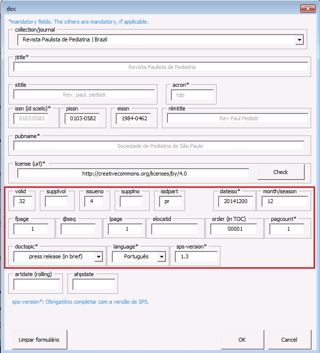

Ao clicar em [OK] o programa marcará automaticamente todos os dados iniciais, pulando número de DOI e os demais dados que o Press Release não apresenta.

Complete demais dados do Press Relase como: [xref] de autores, normalização de afiliações (esses dois últimos, se houver), corpo do texto com o elemento [xmlbody] e identificação de assinatura de autor com o elemento [sigblock].

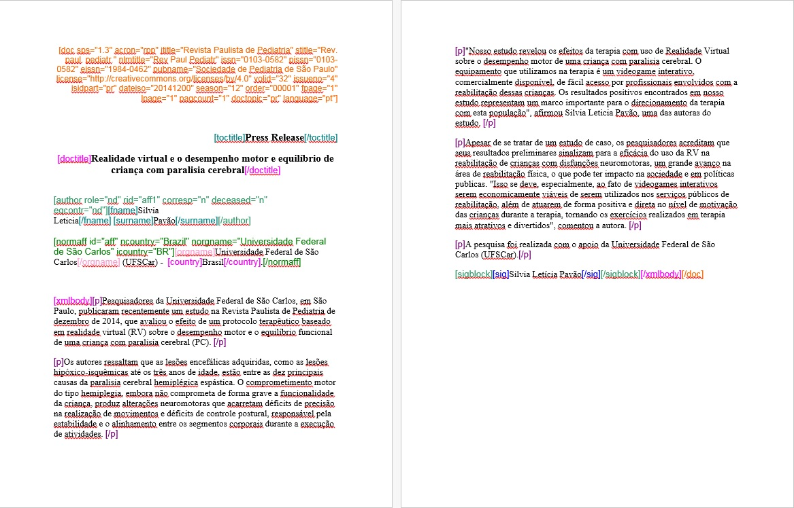

Caso o Press Release esteja relacionado a artigo específico, será necessário relacioná-lo ao artigo em questão.
Dessa forma, insira o cursor do mouse após o elemento [doc] e clique no elemento [related]. O programa abrirá uma janela onde deverá ser preenchidos os campos 'reltp' (tipo de relação) e o campo 'pid-doi'.
No campo 'reltp' selecione o valor 'press-release'; já em 'pid-doi' insira o número de DOI do artigo relacionado.

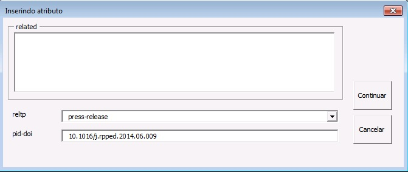

.. note:: A identificação pelo elemento [related] deve ser realizada apenas para Press Releases relacionado a um "artigo".

.. _processos-manuais:

Processos Manuais
=================

O programa de marcação atende mais 80% das regras estabelecidas no SciELO Publishing Schema. 
Há alguns dados que devem ser marcados manualmente, seja no próprio programa Markup, seja diretamente no arquivo xml gerado pelo programa.

Afiliação com mais de uma instituição
-------------------------------------
O programa Markup não realiza marcação de afiliações com mais que uma instituição. Nesse caso, o dado será incluído diretamente no arquivo .xml.
Abra o arquivo .xml em um editor de XML e inclua o elemento <aff> com um ID diferente do que já consta no documento:

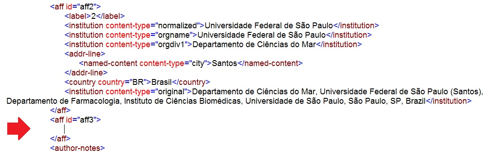

.. note:: A afiliação incluída manualmente não deve apresentar <label> e <institution content-type="original">, já que seus dados para apresentação no site já estão disponíveis na afiliação marcada no programa.

Verifique a segunda instituição da afiliação original e copie para a afiliação nova fazendo a marcação do dado com o elemento <institution content-type="orgname"> e <institution content-type="normalized">:

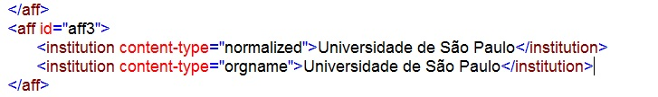

Caso essa instituição apresente divisões, faça a marcação do dado conforme as demais já feitas no documento.
Em seguida, marque seu país correspondente com o elemento <country country="xx">:

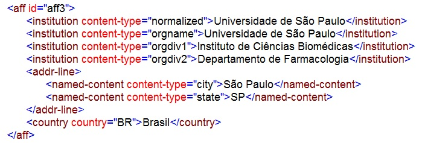

O próximo passo será relacionar essa afiliação <aff id="affx"> com o autor correspondente.
Considerando que o autor não apresenta mais que um label, insira a tag <xref> fechada:

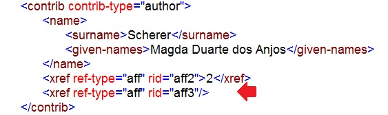

Salve o documento .xml e valide o arquivo.

.. _media:

Tipo de Mídia
-------------

O programa Markup faz também a identificação de mídias como: 

* vídeos
* áudios
* filmes
* animações

Desde que seus arquivos estejam disponíveis na pasta "src" com o mesmo nome do arquivo .doc, acrescentado de hífen e o ID da mídia. Exemplo:

      *Artigo12-m1.wmv*

A marcação da mídia no corpo do texto deve ser feita através do elemento [media]. Na janela aberta pelo programa, preencha os campos "id" e "href".
No campo "id" insira o prefixo "m" + o número de ordem da mídia. Exemplo: m1.

Já em "href" insira o nome da mídia com a extensão: "Artigo12-m1.wmv".

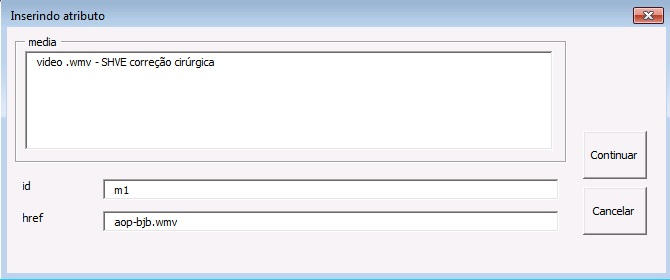

Feito isso gere o arquivo .xml.

Com o arquivo .xml gerado verifique se há erros e corrija, se necessário, os atributos que qualificam o tipo de mídia.
O Programa apresenta os atributos:

* mime-subtype - especifica o tipo de mídia como "video" ou "application".
* mimetype     - especifica o formato da mídia.

É possível que o programa insira valores incorretos nos atributos mencionados acima. Exemplo:

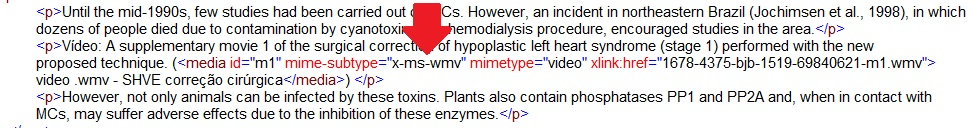

Para corrigir, exclua o valor "x-ms-wmv" e insira apenas "wmv" que é o formato do vídeo. Caso o atributo @mimetype apresente valor diferente de "application" ou "video", corrija o dado.

.. _sublista:

Identificação de sublistas
--------------------------

O programa Markup não faz a identificação de sublistas, portanto é necessário utilizar um editor de XML para ajustar os itens de sublista.
Há dois métodos para a marcação manual de sublistas:

Método 1:
^^^^^^^^^

Ainda no programa Markup, selecione toda a lista e identifique com a tag [*list] e gere o arquivo .xml.
Com o arquivo .xml gerado, encontre a lista e faça a seguinte alteração:

Primeiramente, encontre os itens de sublista:

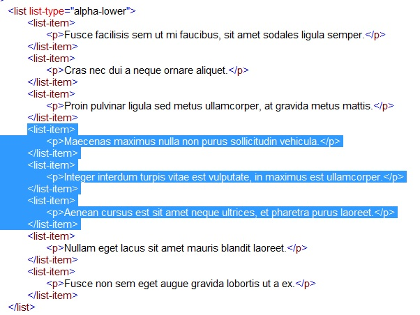

Adicione o elemento <list> acima do primeiro item <list-item> da sublista:

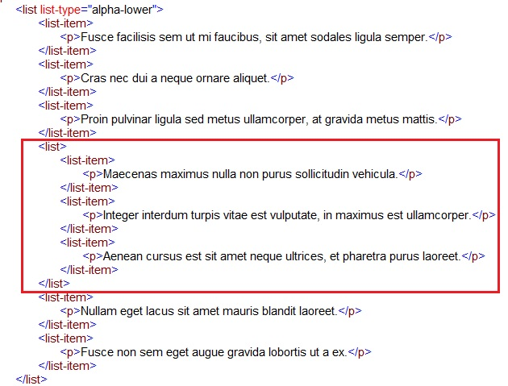

Recorte o elemento </list-item> que consta acima da tag <list> da sublista:

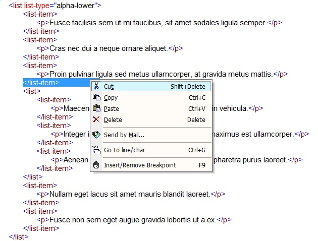

Cole o elemento </list-item> recortado logo abaixo da tag </list> da sublista:

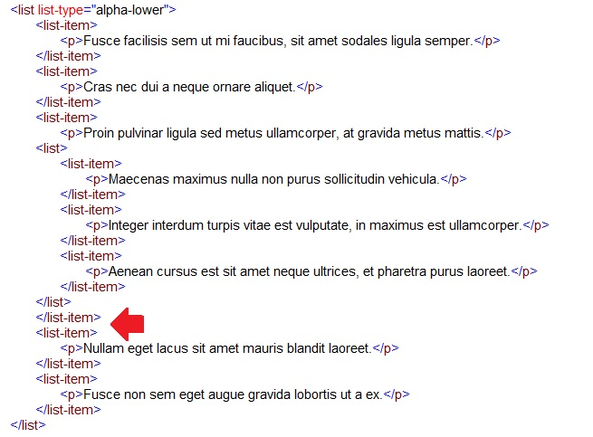

Caso a sublista apresente um marcador diferente do inserido na lista, é possível adicionar o atributo @list-type na tag <list> da sublista e inserir algum dos valores abaixo:

* order
* bullet
* alpha-lower
* alpha-upper
* roman-lower
* roman-upper
* simple

Método 2:
^^^^^^^^^

Caso a lista e sublista não tenham sido marcadas no programa Markup, é possível que ao gerar o arquivo .xml a lista tenha sido identificada como parágrafos.
Portanto será necessário fazer a identificação manual da lista e da sublista.

Primeiramente, retire todos os parágrafos da lista e sublista e a envolva com o elemento <list> acrescentando o atributo @list-type= com o valor correspondente ao marcador da lista:

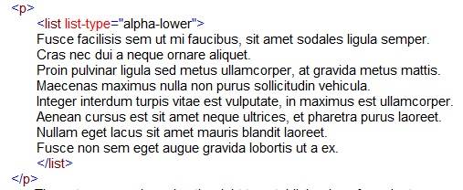

Agora insira o elemento <list-item> e 
 para cada item da lista:

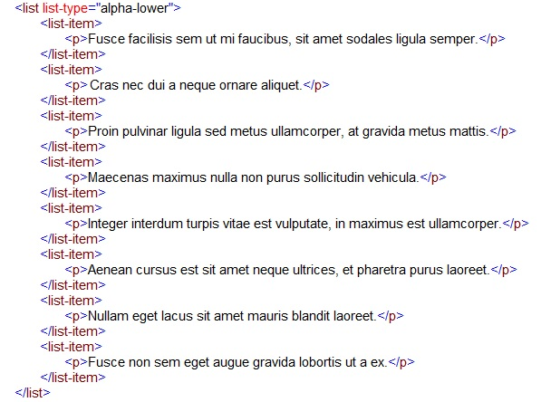

Identifique os itens de sublista:

Adicione um elemento <list> acima do primeiro elemento <list-item> da sublista:

Recorte o elemento </list-item> que consta acima do elemento <list> da sublista:

Agora cole o elemento </list-item> recortado logo abaixo de </list> da sublista:

.. _legenda-traduzida:

Legendas Traduzidas
-------------------

O Programa Markup não faz a marcação de figuras ou tabelas com legendas traduzidas. Para fazer essa marcação é necessário utilizar um editor de XML. Verifique a marcação de legendas de tabelas e de figuras abaixo:

**Tabelas**

Abra o arquivo .xml em um editor de sua preferência e localize a tabela que apresenta a legenda traduzida.

Insira o elemento <table-wrap-group> envolvendo toda a tabela, desde <table-wrap>:

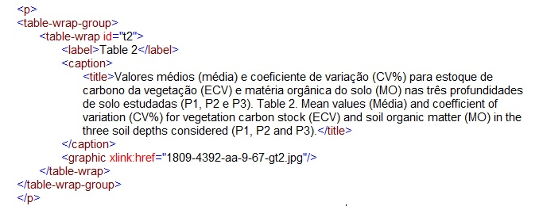

Apague o @id="xx" de <table-wrap> e insira o atributo de idioma @xml:lang="xx" com a sigla correspondente ao idioma principal da tabela. Em seguida, insira um @id único para o <table-wrap-group>:

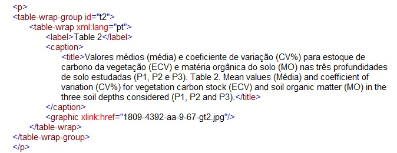

Insira um novo elemento <table-wrap> com <label>, <caption> e <title> logo abaixo de <table-wrap-group> com o atributo de idioma @xml:lang="xx" correspondente ao idioma da tradução. E insira a legenda traduzida em <title>:

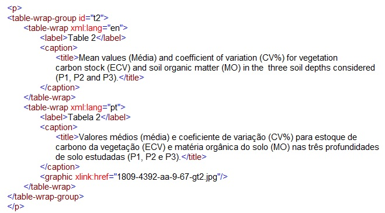

.. note:: Para tabelas codificadas o processo é o mesmo.

**Figuras**

Abra o arquivo .xml em um editor de sua preferência e localize a figura que apresenta a legenda traduzida.

Insira o elemento <fig-group> envolvendo toda a figura, desde <fig>:

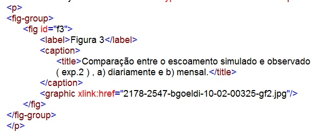

Apague o @id="xx" de <fig> e insira o atributo de idioma @xml:lang="xx" com a sigla correspondente ao idioma principal da figura. Em seguida, insira um @id único para o <fig-group>:

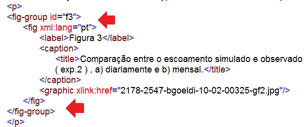

Insira um novo elemento <fig> com <label>, <caption> e <title> logo abaixo de <fig-group> com o atributo de idioma @xml:lang="xx" correspondente ao idioma da tradução. E insira a legenda traduzida em <title>:

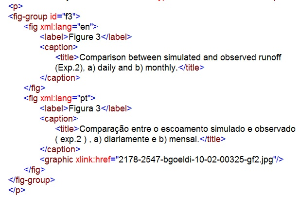

.. _author-sem-label:

Autores sem label
-----------------

Alguns autores não apresentam label em autor e em afiliação. Para marcar o dado, faça a marcação tradicional do autor no programa Markup e insira em afiliação o ID de cada autor.
Após gerar o arquivo .xml do documento, abra-o em um editor de XML e insira a <xref> fechada de cada autor.

.. image:: img/mkp-author-sem-label.jpg
   :align: center
