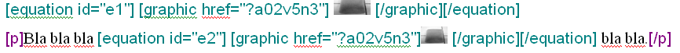
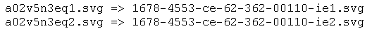
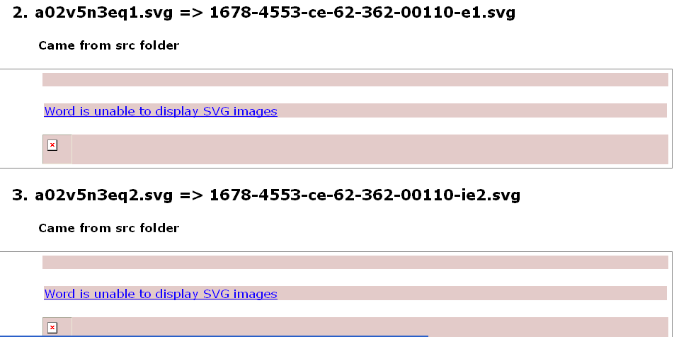
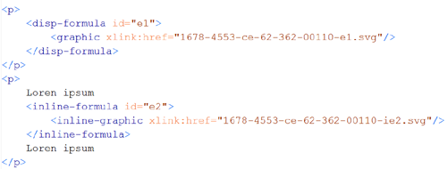
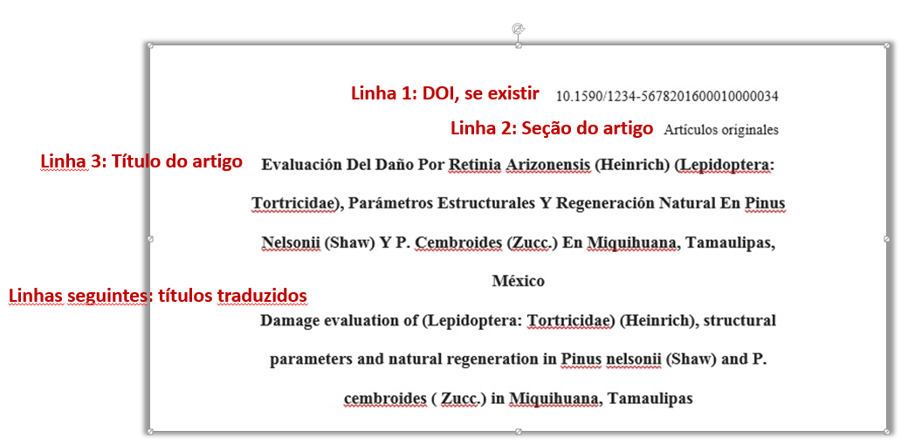
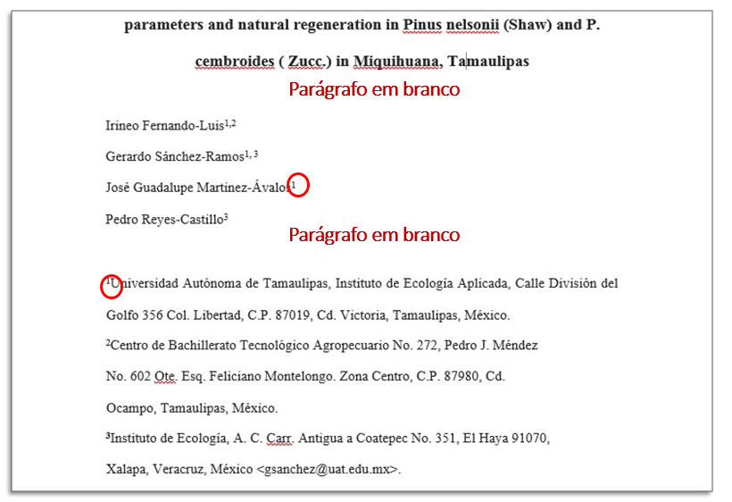
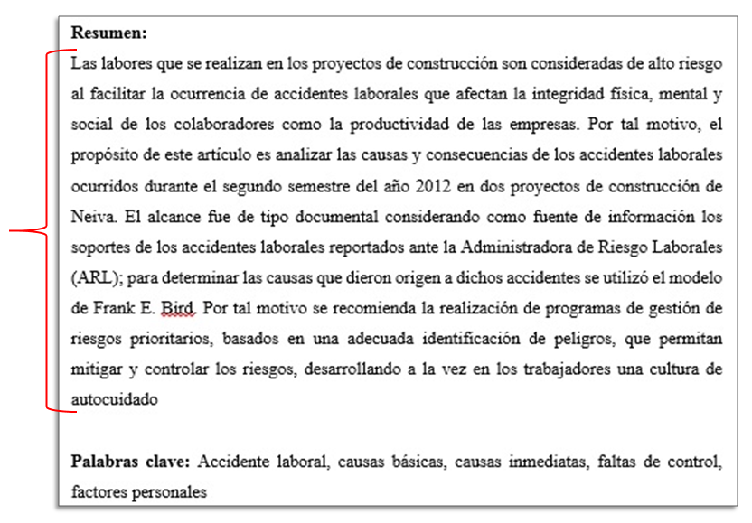
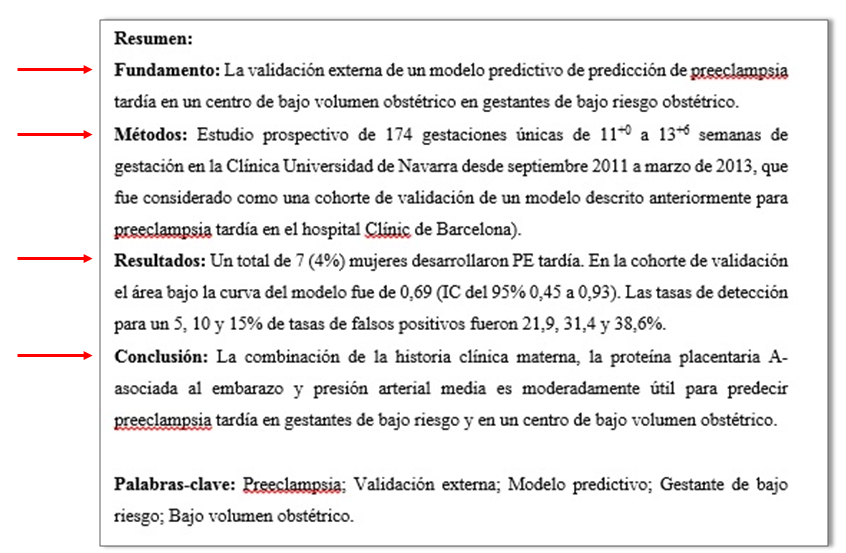
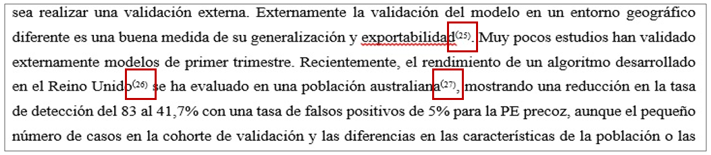

`Español <es_how_to_generate_xml-prepara.html>`_ | `English <how_to_generate_xml-prepara.html>`_ 

.. _pt_how_to_generate_xml-prepara:

=============================================
Preparação de arquivos para o programa Markup
=============================================

Introdução
==========
 
Antes de iniciar o processo de marcação, é necessário seguir alguns passos para preparação do arquivo que será marcado.
Veja abaixo os requisitos para a marcação do documento:
 
 * Os arquivos devem estar em formato Word (*.doc*) ou (*.docx*).
 * A estrutura de pastas deve seguir o padrão SciELO
 * Os arquivos devem ser formatados de acordo com a Formatação SciELO.
 

.. note:: A nomeação dos arquivos que serão trabalhados não deve conter espaços, acentos ou caracteres especiais.

Arquivos de entrada para o Markup
=================================

Periódicos do `SciELO.org <http://www.scielo.org/>`_
............................

Somente se estiver trabalhando com um periódico do `SciELO.org <http://www.scielo.org/>`_, use o menu para atualizar a lista de periódicos.

   .. image:: img/scielo_menu_download_journals.png

Selecione a coleção:

   .. image:: img/download_journals_data.png

Outros periódicos
.................

Não deve existir o arquivo */scielo/bin/markup/markup_journals_list.csv*. Se existe, apague-o.

No lugar, deve existir:

- *??_issue.mds*: atualizado/criado assim que qualquer dado de número é criado ou atualizado
- *journal-standard.txt*: atualizado/criado assim que qualquer dado de periódico é criado ou atualizado

Estes arquivos são gerados pelo programa `Title Manager <titlemanager.html>`_ ou `SciELO Manager <http://docs.scielo.org/projects/scielo-manager/en/latest/>`_.

.. note::
   Title Manager gera estes arquivos em */scielo/bin/markup* no computador onde é executado.
   Então, se o Markup será usado em outro computador, é necessário copiar estes arquivos para o computador onde ele será executado.

.. _estrutura-de-pastas:

Estrutura de pastas
===================

Antes de iniciar a marcação, é necessário garantir que a estrutura de pastas
esteja como segue:

.. image:: img/doc-mkp-estrutura.jpg
   :height: 200px
   :align: center

Veja que dentro da pasta *markup_xml* foram inseridas duas pastas, no mesmo nível:

 * *src*: utilizada para inserir os arquivos *PDF*, mídia, ativos digitais (imagens, tabelas etc) e suplementos.
 * *scielo_markup*: utilizada para inserir os arquivos *.doc* ou *.docx*.

..  note:: Se a recomendação de estrutura apresentada acima não for seguida, o processo de marcação não será iniciado.

.. raw:: html

   <iframe width="854" height="480" src="https://www.youtube.com/embed/RLizVtt5Ca8?list=PLQZT93bz3H79NTc-aUFMU_UZgo4Vl2iUH" frameborder="0" allowfullscreen></iframe>

.. _estrutura-de-pastas-src:

Pasta *src*
.........

Os arquivos referenciados no arquivo marcado, ou seja, aqueles identificados em **href**, devem estar na pasta *src* e devem ser nomeados da mesma forma no *.doc* (ou *.docx*). Nessa pasta também devem ser inseridos todos os arquivos que farão parte do pacote final, nas extensões desejadas. 

Exemplo: 

Em *scielo_markup*, há o arquivo *a01.doc*, que corresponde ao artigo 1.

Em *src*, devem ficar os seus arquivos relacionados, inclusive *PDF*.

A nomeação destes arquivos deve seguir a regra:

Figura
------

  * Mesmo nome do arquivo *.doc* (sem a extensão) + *f* + identificação da figura + extensão do arquivo de imagem; ou
  * Mesmo nome do arquivo *.doc* (sem a extensão) + *fig* + identificação da figura + extensão do arquivo de imagem.

Exemplo: *a01f01.svg*, *a01f01.tiff*, *a01f01.jpg*, *a01f01.png*, ...

  
Tabela
------

  * Mesmo nome do arquivo *.doc* (sem a extensão) + *t* + identificação da tabela + extensão do arquivo de imagem; ou
  * Mesmo nome do arquivo *.doc* (sem a extensão) + *tab* + identificação da tabela + extensão do arquivo de imagem.
  * Mesmo nome do arquivo *.doc* (sem a extensão) + *t*

Exemplo: *a01t01.svg*, *a01t01.tiff*, *a01t01.jpg*, *a01t01.png*, ...

  
Tabela codificadas em XHTML
---------------------------
 
 * Mesmo nome do arquivo *.doc* (sem a extensão) + *t* + identificação da tabela + extensão do arquivo html;
 * Mesmo nome do arquivo *.doc* (sem a extensão) + *tab* + identificação da tabela + extensão do arquivo html;

Exemplo: *a01t01.html*, *a01tab01.html*, ...

..  note:: No caso de SciELO Brasil, a codificação da tabela é obrigatória. 

Equation
--------

  * Mesmo nome do arquivo *.doc* (sem a extensão) + *eq* + identificação da equação + extensão do arquivo de imagem; ou
  * Mesmo nome do arquivo *.doc* (sem a extensão) + *frm* + identificação da equação + extensão do arquivo de imagem; ou
  * Mesmo nome do arquivo *.doc* (sem a extensão) + *form* + identificação da equação + extensão do arquivo de imagem.

Exemplo: *a01eq1.svg*, *a01eq1.tiff*, *a01eq1.jpg*, *a01eq1.png*, *a01eq1.gif*, ...

..  note:: No caso de SciELO Brasil, a codificação de equações é obrigatória.

No arquivo marcado, o Markup rotula automaticamente os objetos gráficos, identificando-os da seguinte forma **[graphic href="?a01"] {elemento gráfico fica aqui} [/graphic]**. Este valor não deve ser alterado, pois desta forma, o Markup é capaz de associar esta referência com os arquivos localizados na pasta *src*.

.. note:: As imagens dos artigos devem estar disponíveis no arquivo *.doc*, preferencialmente em formato *.jpeg* e *.png*.

O Markup também renomeia as imagens para o padrão já estabelecido. 

No entanto, quando os arquivos correspondentes na pasta *src* não existem, o Markup exporta a imagem inserida no próprio arquivo *.doc*, mas há perda da qualidade da imagem. Recomenda-se, então, que as imagens de boa qualidade estejam na pasta *src* antes da geração do *XML*.

O relatório indica de onde as imagens foram obtidas, se da pasta *src* ou extraídas do arquivo marcado *.doc*.

O Markup também ajusta automaticamente o nome dos arquivos no *XML*.

.. _formato-scielo:

Formatação do arquivo
=====================

Para otimizar o processo de marcação dos elementos básicos do arquivo, é necessário seguir o padrão de Formatação SciELO disponível abaixo:

**Instruções para formatação de dados básicos do artigo:**

 * Linha 1: inserir número de *DOI*, caso não exista começar pela seção do sumário;
 * Linha 2: inserir a seção do sumário, caso não exista deixar linha em branco;
 * Linha 3: título do artigo;
 * Linhas seguintes: Títulos traduzidos do arquivo;
 * Para separar autores de título, pular uma linha;
 * Cada autor deve estar em uma linha separada e ter o *label* de sua afiliação sbrescrito para que o programa consiga fazer a identificação automática;
 * Pular 1 linha para separar autores de afiliações;
 * Cada afiliação deve estar em uma linha separada e ter o *label* de sua afiliação sbrescrito para que o programa consiga fazer a identificação automática;
 * Pular 1 linha para separar afiliação de resumos;
 * O título do *resumo* deve estar em negrito em um parágrafo. O resumo deve começar no parágrafo seguinte;
 * No caso de *resumos estruturados*, título da seção em negrito e cada seção em um parágrafo;
 * O título do grupo de *palavras-chave:* deve estar em negrito. As palavras-chave devem ser separadas por vírgula ou ponto e vírgula;
 * Seções: negrito, 16 pt;
 * Subseções: negrito, 14 pt;
 * Subseção de subseção: negrito, 13 pt;
 * Texto: formatação livre;
 * Para tabelas, *label* e legenda devem estar na linha antes do corpo da tabela; e as notas de tabela após o corpo da tabela;
 * Separador de *label* e legenda: dois-pontos e espaço ou espaço + hífen + espaço ou ponto + espaço;
 * Para tabelas codificadas, o cabeçalho deve estar em negrito;
 * A citação do tipo autor/data no corpo do texto deve ser: sobrenome do autor, ano;
 * Para citação no sistema numérico no corpo do texto: número entre parênteses e sobrescrito;
 * Notas de rodapé no corpo do texto: se identificadas com número devem estar em sobrescrito, mas não entre parênteses;
 * Citação direta longa (*quote*): recuo de 4 cm da margem esquerda.

Exemplo:

Dados iniciais:

Autores e afiliação:

Resumo simples + palavras-chave:

Resumo estruturado + palavras-chave:

Figuras:
.. image:: img/ex-img.png
   :height: 400px
   :width: 200px
   :align: center

Tabelas:
.. image:: img/tabelas.png
   :height: 400px
   :width: 200px
   :align: center

Citação do tipo autor/data:
.. image:: img/cit-data.png
   :height: 400px
   :width: 200px
   :align: center

Citação numérica:

Citação direta longa:
.. image:: img/cit-direta.png
   :height: 400px
   :width: 200px
   :align: center

.. {"reviewed\_on": "20170320", "by": "carolina.tanigushi@scielo.org"}
.. {"reviewed\_on": "20171206", "by": "javani.araujo@scielo.org"}
