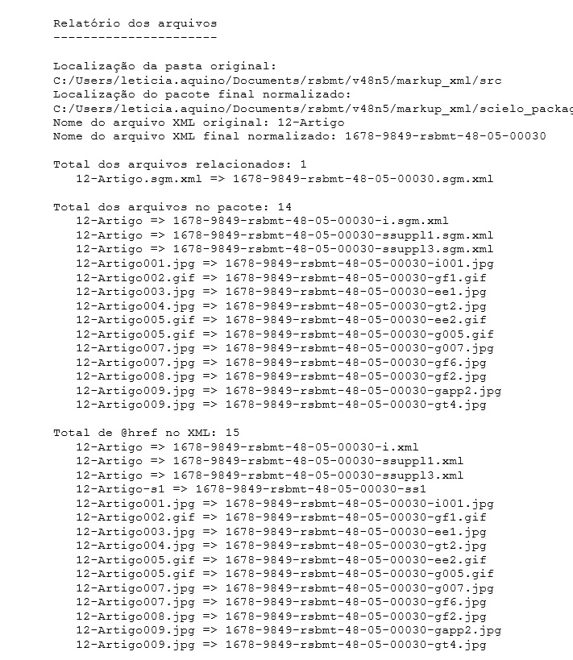
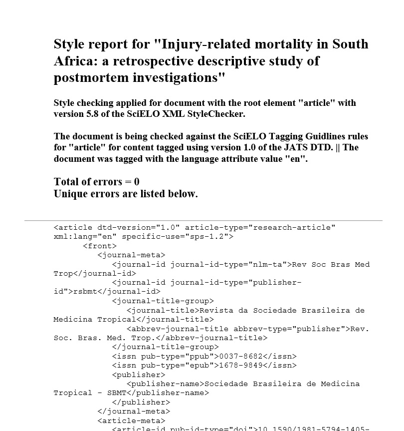
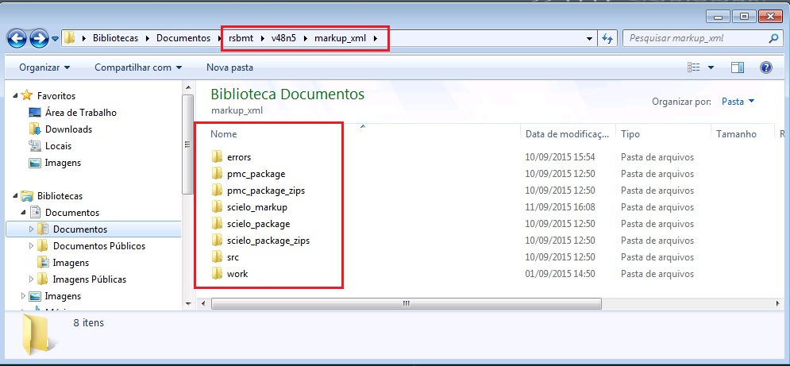

.. pt_how_to_generate_xml-results:

Gerando o Arquivo .xml
======================

Após a identificação de todos os dados do documento .doc, o próximo passo é gerar o arquivo .xml.

Antes de qualquer coisa, salve o arquivo marcado clicando no botão "Markup: Salvar":

Em seguida clique no botão "Markup: Gerar o XML":

.. relatorios:

Relatórios
==========
Ao gerar o arquivo .xml o programa Markup apresenta três relatórios: :ref:`report-arquivos`, :ref:`report-estilos` e :ref:`report-conteudo`.
Abaixo a função de cada relatório apresentado.

.. _report-arquivos:

Relatório de Erros de Arquivos
------------------------------

Ao clicar em "Markup: Gerar o XML" o programa apresenta um Relatório com as informações das alterações feitas no documento.

O resultado disso, é um relatório que apresenta as ações do programa ao gerar o XML a partir do arquivo .doc. O programa altera o nome do arquivo que, em .doc, era apresentado como "12-Artigo.doc" para ISSN-acronimo-volume-numero-paginação.xml e as imagens são extraídas do documento já com a nomeação convertida para o padrão SciELO.

.. _report-estilos:

Relatório de Estilos SciELO
---------------------------

Em seguida clique no botão ao lado "Relatório de Estilos SciELO" e verifique se há algum erro no documento:

O programa apresentará um relatório parecido com o que segue abaixo:

Veja que o relatório de erros não apresenta nenhum erro. Isso porque o xml gerado está de acordo com a estrutura de estilos requerida.

.. _report-conteudo:

Relatório de Erros de Conteúdo
------------------------------

Feita a verificação no Relatório de Estilos SciELO, o próximo passo é gerar o relatório de erros de dados/conteúdo.

Esse relatório é exatamente o mesmo que o programa Package Maker gera. Portanto, para verificar o manual de uso para validação e verificação dos erros apresentados, vá para o projeto `Package Maker <pt_how_to_validate_xml_package.html>`_ e confira as funcionalidades dessa ferramenta.

.. _relatorios-pastas:

Pastas Geradas
==============

Ao gerar o arquivo .xml o programa Markup cria 6 pastas no mesmo nível que "src" e "scielo_markup", conforme segue:

**pasta erros:**

	Nessa pasta há o relatório de erros de cada um dos arquivos .xml.  O arquivo final .rep apresenta os possíveis erros de estilo e o final .contents de conteúdo. São os mesmos relatórios apresentados no programa de marcação.

**pmc_package:**

	Para revistas que apresentam o título abreviado NLM, o programa retira os elementos de especificação SciELO e mantém apenas
	os elementos necessários para envio ao PMC.
	Os elementos que são retirados do documento XML para envio ao PMC são: detalhamento em afiliação, informação de financiamento
	em <funding-group> e <mixed-citation>.

**pmc_package_zips:**

	Ao validar o pacote pmc_package o programa, automaticamente, zipa a pasta que está pronta para envio.

**scielo_package:**

	No momento da validação do pacote XML o programa verifica as entidades (numéricas ou alfa-numéricas) que existem no documento
	e, automaticamente, converte para o caractere correspondente, evitando futuros problemas de entidades. O ideal é utilizar os 
	arquivos .xml validados nessa pasta em vez de utilizar os xmls do pacote.

**scielo_package_zips:**

	Ao validar o pacote scielo_package o programa, automaticamente, zipa a pasta já com a nomeação padrão SciELO que está pronta 
	para envio.

**work:**

	é uma pasta de arquivos temporários usadas para a geração do resultado. Ela pode ser apagada se desejado, mas também pode ser usada para fins de suporte.

Essa estrutura de pastas é a mesma apresentada se o usuário utilizar o programa `Package Maker <pt_how_to_validate_xml_package.html>`_. Para verificar os relatórios apresentados, basta entrar na pasta "errors" e abrir o documento com extensão: ".contents.html".

