.. _pt_como_validar_pacote_xml

Como validar o pacote XML SPS
=============================

Package Maker - Como usar?
--------------------------

Para utilizar o programa Package Maker clique no meu Iniciar do Windows, procure a pasta do Programa Markup que foi istalado em sua máquina e com o mouse verifique os itens disponíveis na pasta.
Clique no botão *XML Package Maker*

.. image:: img/scielo_menu_xpm.png

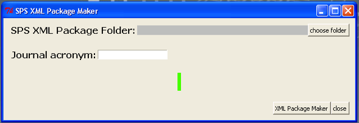

Agora clique no botão "Choose Folder" para escolher a pasta que contém os arquivos que serão validados 

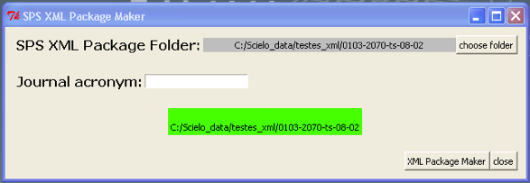

E clique em **XML Package Maker**.

Resultados
----------

* Para arquivos XML SciELO (verifique a pasta scielo_package e/ou scielo_package_zips)
* Para arquivos XML PMC (verifique a pasta pmc_package)
* Para Relatório de arquivos (verifique a pasta errors)

A pasta que é gerada pelo XPM "ISSN-acronimo-volume-numero_xml_package_maker_result" estará disponível no mesmo nível da pasta que foi utilizada para gerar o pacote:

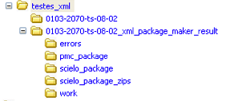

Relatórios
----------

Depois de validar e gerar os pacotes os relatórios serão disponibilizados automaticamente em um Web Browser.

Relatório Resumido
..................

Estatísticas de Validação
:::::::::::::::::::::::::

É apresentado o total de Erros fatais (Fatal Errors), erros (Errors), e alertas (Warnings), encontrados em todo o pacote.

FATAL ERRORS
   Representa os erros relacionados aos indicadores bibliométricos.

ERRORS
   Representa outros tipos de erros.

WARNINGS
   Representa algo que precisa de mais atenção.

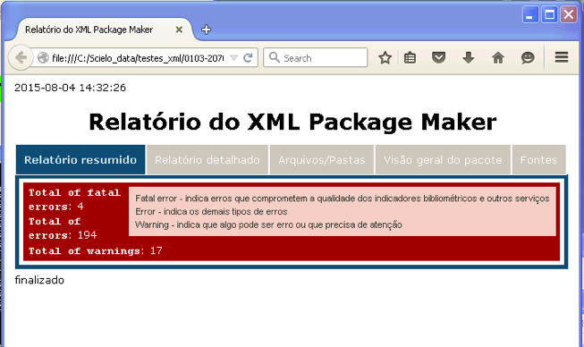

Relatório Detalhado
...................

Relatório Detalhado - Validações do Pacote
::::::::::::::::::::::::::::::::::::::::::

Primeiro de tudo O XPM valida alguns dados do pacote:

- Elementos que apresentam o mesmo valor em todos os arquivos XML, tais como:

 * journal-title
 * journal id NLM
 * journal ISSN
 * publisher name
 * issue label
 * issue pub date

-  Elementos que apresentam um valor único em cada arquivo XML, tais como:

 * doi
 * elocation-id, if applicable
 * fpage and fpage/@seq
 * order (used to generated article PID)

Exemplo de Erros Fatais (Fatal Error) por apresentar valor diferente para o elemento ``<publisher-name>`` 

 .. image:: img/xml_reports__toc_fatal_error_required_equal_publisher.jpg

Exemplo de Erros Fatais (Fatal Error) por apresentar valores diferentes em ``<pub-date>``

 .. image:: img/xml_reports_toc_fatal_error_required_equal_date.png

Exemplo de Erros Fatais (Fatal Error) pois é requerido um valor único

 .. image:: img/xml_reports_toc_fatal_error_unique.png.jpg

Relatório Detalhado - Validação do Documento
::::::::::::::::::::::::::::::::::::::::::::

O documento é apresentado em uma Tabela.

As colunas 'order', 'aop pid', 'toc section', '@article-type' estão destacadas, pois contém dados importantes.

A coluna **reports** possui **botões** para abrir/fechar o relatório detalhado de cada documento.

Cada linha possui um dado do documento:

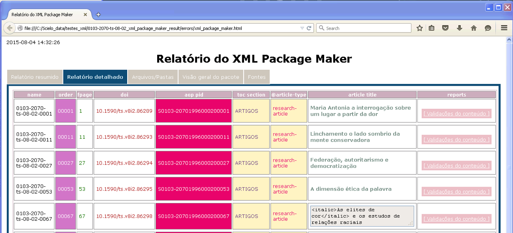

Relatório Detalhado - Validações
::::::::::::::::::::::::::::::::

Clique em **Validação de Conteúdo" para verificar os problemas apresentados.
O relatório detalhado é apresentado abaixo da linha.

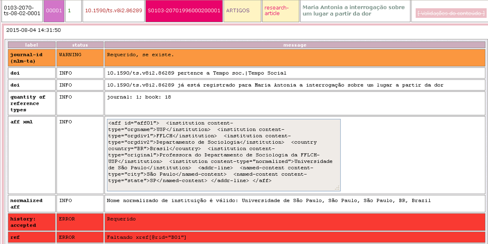

Arquivos/Pastas
...............

Apresenta os Arquivos e Pastas que foram gerados e validados.

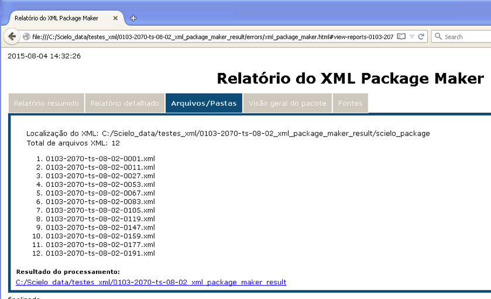

Visão Geral do Pacote
.....................

Visão Geral do Pacote - idiomas
:::::::::::::::::::::::::::::::

Apresenta os elementos que contém o atributo de idioma ``@xml:lang``. 

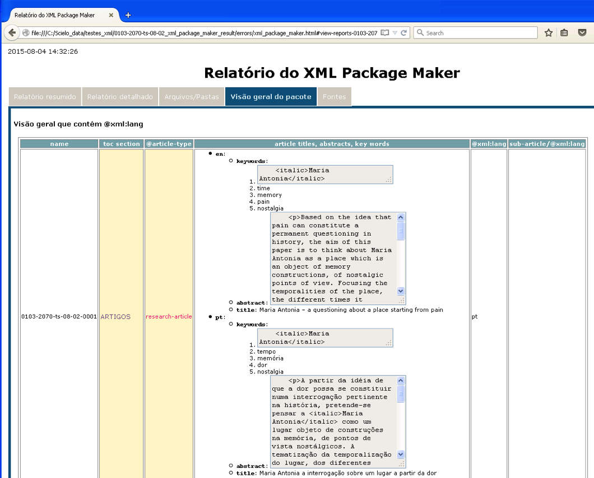

Visão Geral do Pacote - dados
:::::::::::::::::::::::::::::

Apresenta os dados encontrados no documento: publicação e histórico.
Apresenta o tempo esperado entre:  data de recebido e aceito, aceito e publicado, aceito e a data atual.

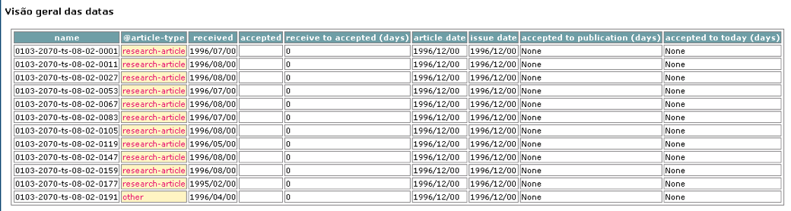

Visão Geral do Pacote - afiliações
::::::::::::::::::::::::::::::::::

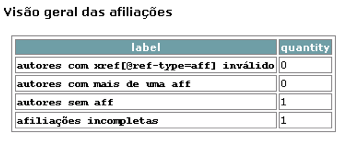

Visão Geral do Pacote - Referências
:::::::::::::::::::::::::::::::::::

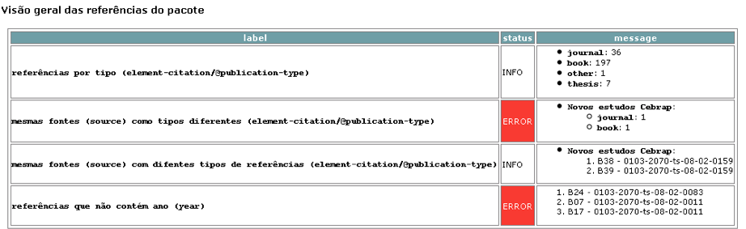

Relatórios Fonte
................

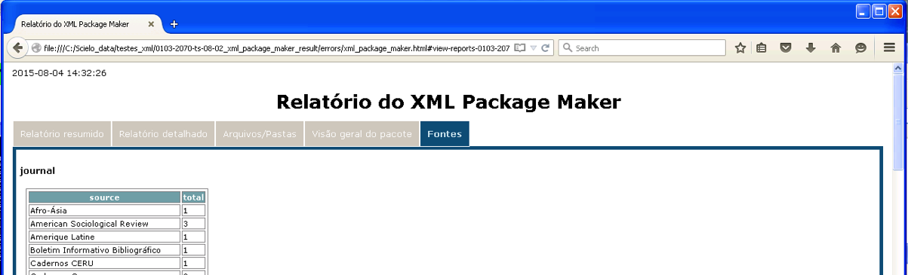

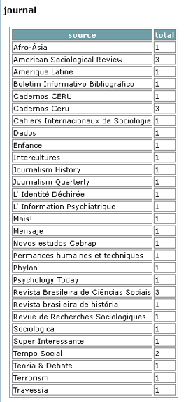

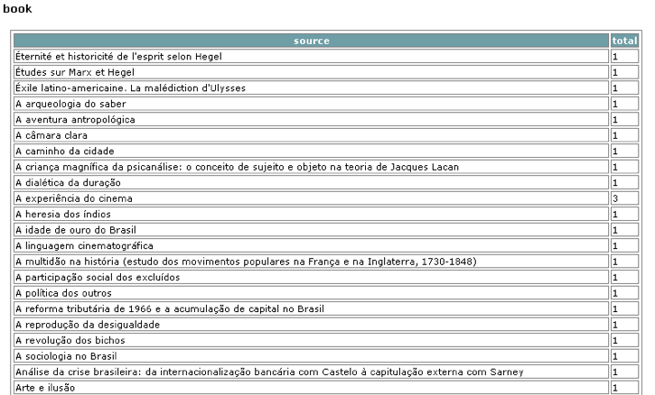

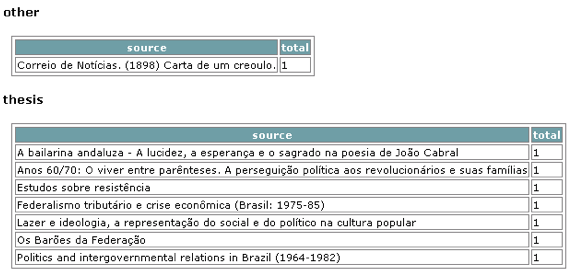
