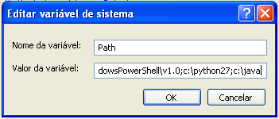

==============
Pré-requisitos
==============

Os pré-requisitos são procedimentos/programas que devem ser executados antes da instalação de SciELO PC Programs.

Uma vez cumpridos os requisitos, não é necessário executá-los todas as vezes que o SciELO PC Programs for instalado / atualizado.

Verificar os pré-requisitos
===========================

Verificar a localização e situação da pasta serial
--------------------------------------------------

**Somente** para os programas de **gestão de coleção**, que devem estar instalado em um servidor local.

Este servidor deve ter acesso à pasta **serial** e esta pasta tem que estar atualizada (title, section, issue etc) antes de executar a instalação de SciELO PC Programs.

    .. warning:: 

        **Não atualizar** o conteúdo da pasta **serial** após a instalação. Fazer antes da instalação. 

Verificar a instalação de Python + pip
--------------------------------------

1. **Sempre abrir uma nova** janela de Terminal para garantir que as atualizações estejam aplicadas na sessão do terminal.

2. Executar o comando no terminal:

    .. image:: img/installation_python_test.png

3. Verificar se o comando apresenta a versão do Python. Por exemplo:

    .. image:: img/installation_python_resultado.png

  .. note::

     ao executar o comando para verificar a versão do Python não necessariamente ela será igual a da imagem

4. Caso o resultado não seja o esperado, repetir todas as instruções anteriores.

5. Executar o comando no terminal:

    .. image:: img/installation_pip_test.png

6. Verificar se o comando apresenta a versão do pip. Por exemplo:

    .. image:: img/installation_pip_resultado.png

  .. note::

     ao executar o comando para verificar a versão de pip não necessariamente ela será igual a da imagem

7. Caso o resultado não seja o esperado, **reinstalar Python**.

Verificar a instalação de Pillow 
--------------------------------

Pillow é pré-requisito **somente** para **versões anteriores a SciELO PC Programs 4.0.094**.

Verificar se foi corretamente instalado, executando os comandos no terminal:

1. Executar python:

    .. image:: img/installation_python.png
    

2. Verificar que o resultado esperado será a apresentação do **terminal do Python**. 

    .. image:: img/installation_python_terminal.png

  .. note::

     ao executar este comando a versão de python não necessariamente tem que ser igual a da imagem

    

3. Executar *import PIL* (letras maiúsculas):

    .. image:: img/installation_import_pil.png
    

4. Verificar que o resultado esperado é:

    .. image:: img/installation_import_pil_resultado.png
   

   Mas se a mensagem for similar a

        .. code-block:: text

            Traceback (most recent call last):
              File "<stdin>", line 1, in <module>
            ImportError: No module named PIL

   **reinstalar pillow**.
    

5. Executar *exit()* para sair do terminal do Python

   .. image:: img/installation_python_exit.png

6. Verificar que saiu do terminal do Python

   .. image:: img/installation_python_exited.png

Verificar a instalação Java
---------------------------

1. Executar no terminal:

    .. code-block:: text

        java -version

2. Verificar se o resultado apresentado é similar a:

    .. image:: img/howtoinstall_path_conferir-java.jpg

  .. note::

     ao executar este comando a versão de **java** não necessariamente tem que ser igual a da imagem

  Caso a mensagem seja: *java não é um comando reconhecido ...*, repetir as instruções desta seção.

Instalar os pré-requisitos
==========================

Como instalar Python e pip igual ou superior a 2.7.10
-----------------------------------------------------

Primeiramente, garantir que tenha **apenas uma** versão de Python 2.7.x instalada. Caso seja necessário instalar uma versão mais recente de Python, remova a anterior antes de prosseguir.

Ao instalar Python, selecione todas as opções disponíveis, especialmente:
    
    - Add Python to PATH
    - pip

    .. image:: img/installation_add_python_to_path.png
       :height: 500
       :width: 500

Como instalar Pillow
--------------------

É pré-requisito somente para **versões anteriores a SciELO PC Programs 4.0.094**.

Executar o comando no terminal:

    .. image:: img/installation_pip_install_pillow.png

Como instalar Java
------------------

Depois de instalar Java, abrir a "Configuração do Sistema", indicar a localização do Java instalado para a variável de ambiente PATH.

.. _add-paths:

Adicionar aplicação no PATH
,,,,,,,,,,,,,,,,,,,,,,,,,,,

O atalho para abrir a janela é: Windows + Pause Break key.

.. image:: img/howtoinstall_path_atalho.jpg

Ou clique em **Computador** com o botão direito do mouse.

.. image:: img/howtoinstall_path_computer.png

Então clique em **Propriedades**.

.. image:: img/howtoinstall_path_computer_properties.png

**Configuração do Sistema**

.. image:: img/howtoinstall_path_variavel.jpg

 
Clique em configurações avançadas do sistema

.. image:: img/howtoinstall_path_conf-advanc.jpg

E depois em Variáveis de Ambiente 

.. image:: img/howtoinstall_path_open-variavel.jpg

Encontre o caminho da lista de variáveis

.. image:: img/howtoinstall_path_search-path.jpg

Selecione o Path e clique em **Editar**

.. image:: img/howtoinstall_path_select_variable.png

Coloque o cursor no final da linha, acrescente o caracter ponto-e-vírgula (;) e a localização do Java instalado.

