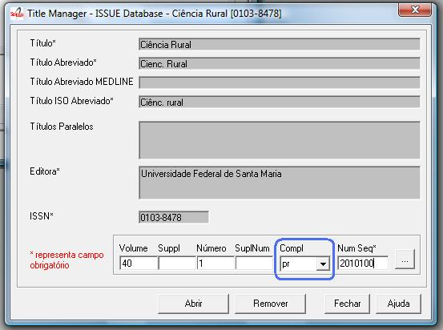
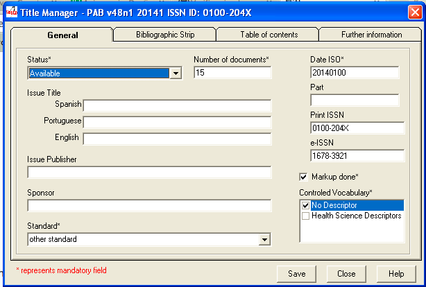
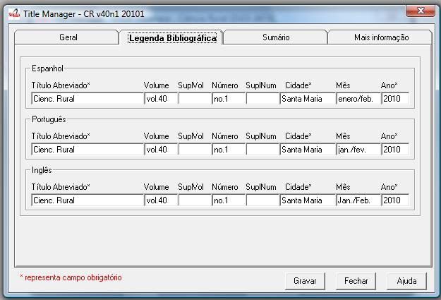
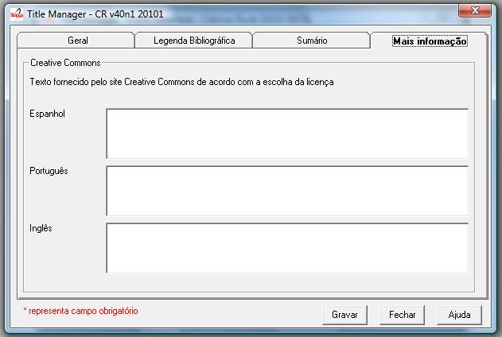

.. pcprograms documentation master file, created by
   You can adapt this file completely to your liking, but it should at least
   contain the root `toctree` directive.

Issues
======

How to open the program
-----------------------

1. Select File > Open > Issues

.. image:: img/titlemanager_menu_issue.jpg

2. Select a title and click on Open button

How to identify an issue
------------------------ 

================================  ======  ===============================================
label                             tag
--------------------------------  ------  -----------------------------------------------
volume                            31
supplement of volume              131
number                            32
supplement of number              132
complement                        41
sequential number                 36      YYYY + the order 
                                          of publication of the issue within the year.
                                          It is part of the PID of the issue and 
                                          it is the order in "All issues" of the website
================================  ======  ===============================================

    
Identifying regular issues
..........................

Fill in the volume and number fields.

The sequential number is the year followed by the order of the issue within the year. 
E.g.: 20101 (first issue within the year).

.. image:: img/titlemanager_issue_seq_number.jpg

Identifying supplements
.......................

If there are supplements, fill in volume, number (if applicable), and the corresponding supplement fields. 
 
If the supplement is identified only with the label **Supplement**, fill in with 0, otherwise the label which identifies the supplement, for example, 1, A, etc.

On the website, in the "All issues" pages, if it is required the supplements be after all the regular issues within the year, the sequential numbers of the supplements must be greater than the last regular issue's sequential number.

E.g.: If there are 4 regular numbers in the year, then the order of the sequential number for the supplements starts from 5.

.. image:: img/titlemanager_issue_seq_number_for_supplement.jpg

Identifying ahead issues
........................

Fill in the **number** field the word ahead, for ahead issue. By convention the order of the sequential number is 50.

.. image:: img/titlemanager_issue_seq_number_for_ahead.jpg

Identifying press release issues
.................................

Fill in the same fields according to the rules above, plus **pr** in the complement field.
The sequential number is the year followed by the order of the issue within the year, but by **convention** starts in 100.

Problems with filling in the sequential number
----------------------------------------------

If the sequential number and the issue identification do not match, the program presents two situations:

1. Sequential number belongs to another issue

.. image:: img/titlemanager_issue_sequential_number_belongs_to_another_issue.jpg

Solution: 
    List the issues and select the issue

2. Mistake or replacement?

.. image:: img/titlemanager_issue_mistake_or_replacement.jpg

If the sequential number and the issue identification do not match, but the `sequential number <concepts.html#sequential-number>`_ **DOES NOT BELONG TO** another issue, the program will ask to:

- open the issue, with the corrected sequential number
- change the sequential number, as informed 

    .. warning::

        The sequential number is part of the PID. 
        It must not be changed if the issue is already published on the website.
        The program does not know if the issue is already published or not. 

How to list the issues
---------------------- 

How to list the issue numbers of a volume
.........................................

1. Fill in the volume field.
2. Click on the 

.. image:: img/titlemanager_list_button.jpg 

button.

How to list all
...............

1. Click on the 

.. image:: img/titlemanager_list_button.jpg 

button.

List of the issues
..................

.. image:: img/titlemanager_issues.jpg

The first, highlighted line  in orange, is an example of ahead numbers of the year 2009.

The second, highlighted line in blue,   is an example of a regular number.

The third, highlighted line  in purple, is an example of press release number of v43n5 (blue).

The fourth line, highlighted in red,    is an example of number press release ahead to 2009 (orange).

The lines, highlighted       in green,   are examples of supplement of volume.

Creating/editing an issue
-------------------------

#. Identify the issue. See `How to identify an issue`_.
#. Click on the Open button.
   

General data
------------

Status
......

Field: 42 

Status of the issue. It indicates if the issue would be available on the website.

Number of documents
................... 

Field: 122

Number of documents (articles and texts) of the issue. Converter checks this value with the amount of files in the folder serial/<acronimo>/<issueid>/markup.

Date ISO
........

Field: 65

Date of publication of the issue in ISO format (YYYYMMDD) = 4 digit year, followed by two digits for month, 2 digits for day, with possible 00 if the day is not important. 

This date is used to generate the bibliographic strip (next screen) and it is also used by Converter to check the date.

Issue's title
.............

Field: 33

This field must be filled, if there is/are the issue's title. 
Thematic or special issues usually have it.

Cover
.....

Field: 97

Part
....

Field: 34

Issue ISSN
..........

Removed from Title Manager since 4.0.072. Replaced by Print ISSN and Electronic ISSN.

Field: 35

Fill in with the current ISSN.

Print ISSN
..........

Field: 435, subfield ^t = 'PRINT'

Enter the Print ISSN if it is a current ISSN, if applicable.

Electronic ISSN
...............

Field: 435, subfield ^t = 'ONLIN'

Enter the Electronic ISSN if it is a current ISSN, if applicable.

Editor issue
............

Field: 62

This field must be filled, if there is/are the issue's editor.

Sponsor
.......

Field: 140

This field must be filled, if there is/are the issue's sponsor.

Standard
........

Field: 117

Standard used by the journal.

Markup done
...........

Field: 200

It indicates whether the Markup of this issue has already been done. If so, the issue will not be listed on Markup program.

Controlled Vocabulary
.....................

Field: 85

Controlled vocabulary used by the journal.

Bibliographic strip
-------------------

Field 43, one occurrence for each language (es, en, pt).

* Subfield l: possible values: es (for Spanish), pt (for Portuguese) or en (for English)
* Subfield t: abbreviated title, value from the Title/Field 150.
* Subfield v: volume
* Subfield w: Supplement of Volume
* Subfield n: number
* Subfield s: Supplement of number
* subfield c: publisher location
* Subfield m: month of publication, generated automatically by the ISO date provided in the previous screen, however, editable
* Subfield y: year of publication, automatically generated by the ISO date provided in the previous screen. This value is checked against ISO date.

Table of contents
-----------------
   
.. image:: img/titlemanager_issue_toc.jpg

On this screen, the table of contents.

The user must choose the sections that are part of the issue.

The program will present the table below, sorted by language.

If there are missing sections, the user must click on **Create sections** which open a screen for the `Sections' form <titlemanager_section.html>`_.

Header of table of contents
...........................

Field: 48, one occurrence for each language (es, pt, en). 

- Subfield l: language header. pt (Portuguese), es (Spanish), en (English)
- Subfield h: header. Sumario (en), Tabla de contenido (es), Table of Contents (en)

Sections Data
.............

Field: 49

- Subfield l: language of the section pt (Portuguese), es (Spanish), en (English)
- Subfield c: section code/id, formed by `acronym <titlemanager_title.html#acronym>`_, followed by number with 3 digits. E.g.: 010, 020, etc
- Subfield t: section title

Creative Commons License
------------------------

Text provided by the Creative Commons website according to the adopted license 

Field: 540, for each language an occurrence (es, en, pt). 

- Subfield l: language of the license text (pt (Portuguese), es (Spanish), en (English))
- Subfield t: license text in HTML format

Deleting issue
--------------
1. Inform the issue identifcation and its sequential number
2. Click on Remove button

.. note:: This option only delete the record of the issue database. This action will not be reflected immediately on the website. 

-----

Last update: Feb 7, 2014
