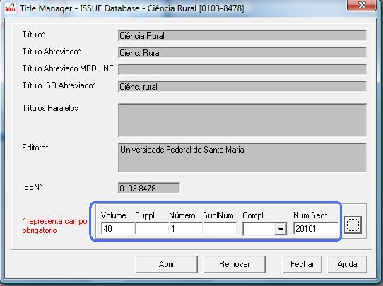
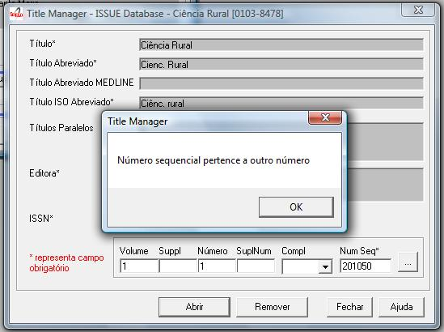

.. pcprograms documentation master file, created by
   You can adapt this file completely to your liking, but it should at least
   contain the root `toctree` directive.

Issues
======

Opening the program
-------------------

1. Select File-> Open-> Issues

2. Select a title and click on Open button

Important concepts
------------------

Read:

- `type of issues <concepts.html#type-of-issues>`_
- `sequential number <concepts.html#sequential-number>`_
- `folders structure <concepts.html#folders-structure>`_ 

Issues form
-----------

From this screen, you have the following options:

- List the issues
- Create an issue
- Edit an issue
- Delete an issue

    .. image:: img/en/01_iss_01.jpg

Listing issues
-------------- 

    .. image:: img/en/01_iss_02.jpg

#. Clicking on the 

    .. image:: img/en/01_iss_botao.jpg 

button to list all the issues.

#. If you want to list all the numbers of a given volume, fill the volume field, then click on the 

    .. image:: img/en/01_iss_botao.jpg 

button.

    .. image:: img/en/01_iss_03_reg_supl_ahead_pr.jpg

The first highlighted line  in orange is one example of ahead numbers of the year 2009.

The second highlighted line in blue is an example of a regular number.

The third highlighted line in purple is an example of press release number of v43n5 (blue).

The fourth line highlighted in red is an example of number press release ahead to 2009 (orange).

The lines highlighted in green are examples of supplement of volume.

    .. image:: img/en/01_iss_03_review.jpg

The lines are highlighted examples of numbers **review / provisional**.

Identifying the issue and its sequential number
-----------------------------------------------
To create, edit or remove, identify the issue, filling the volume, issue, supplement, complement, sequential number. 
`Read about it <concepts.html>`_.

Issue identification
--------------------

================================  ======  ==========================================
label                             field
--------------------------------  ------  ------------------------------------------ 
volume                            31
supplement of volume              131
number                            32
supplement of number              132
complement                        41
sequential number                 36      The sequential number is the year followed by the order for publication of the issue within a year.
                                          The sequential number is part of the PID of the issue. Must not be modified after publication of the issue.
                                          It also is used for the presentation of issues on the page **all** the issues, giving their order of presentation in the table.
================================  ======  ==========================================

    
Identifying regular issues
..........................

Fill the volume and number.

The sequential number is the year followed by the order of the issue within a year. Eg: 20101 (first issue within a year).

Identifying supplements
.......................

When they exist, fill volume, supplement of volume (when there is no number), number, and supplement of number.
 
If the supplement is identified only with the word **Supplement**, fill in with 0, otherwise the label which identifies the supplement, for example, 1, A, etc.

On the site, so that all supplements are presented after the regular issues within a year, the sequential numbers of the supplements must be greater than the sequential number of the last regular issue.
Eg: If there are 4 regular numbers in the year, then the sequential number for the supplements starts in 5.

Identifying ahead or review / provisional issues
................................................

Fill in the **number** field the word ahead, for ahead issue. By convention its sequential number is 50.
Fill in the **number** field the word review, for review or provisional issue. By convention its sequential number is 75.

The sequential number is the year followed by the order of the issue within year, but by convention:

- Ahead is equal to 50
- Review / provisional is equal to 75 

Identifying press release issues
.................................

Populate the same fields in accordance with the rules above, plus **pr** in the complement.
The sequential number is the year followed by the order of the issue within a year, but by **convention** starts in 100.

Problems on filling the sequential number
-----------------------------------------

When the sequential number and the issue identification do not match, the program  presents two conflict situations:

Sequential number belonging to another issue
............................................

When the user informs a sequential belonging to another issue, the program does not open the issue data, and informs the sequential number belongs to another issue.

It is also possible that the user have misinformed the issue identification and not the sequential number.
The user is responsible for checking and correcting the data filled in before proceeding. 

Mistake or replacement?
.......................

When the user reports an issue identification and a `sequential number <concepts.html#sequential-number>`_  which do not match and the sequential number **DOES NOT BELONG TO** another issue, the program allows to:

- open the issue, using the identification informed, but correcting its sequential number 
- change the issue's sequential number to the informed one

    .. warning::

        The sequential number is part of the PID, so it must not be changed if the issue is already published on the site.
        The program allows the change of sequence number, if it does not belong to any other issue.
        The program does not know if the issue is already published or not. The user must be responsible for knowing it.

Creating/editing an issue
-------------------------

#. Identify the issue. Read `Issue identification`_.
#. Click on the Open button
   

General data
............

    .. image:: img/en/titlemanager_issue_form_01.jpg

Status
......
Field: 42 

Status of the issue. It indicates if the issue would be available on the website.

Number of documents
................... 
Field: 122

Number of documents (articles and texts) of the issue. Converter checks this value with the amount of files in the folder serial/<acronimo>/<issueid>/markup.

Date ISO
........

Field: 65

Date of publication of the issue in ISO format (YYYYMMDD) = 4 digit year, followed by two digits for month, 2 digits for day, with possible 00 if the day is not important. 

This date is used to generate the bibliographic strip (next screen) and it is also used by Converter to check the date.

Issue's title
.............

Field: 33

This field must be filled, if there is/are the issue's title. 
Thematic or special issues usually have it.

Cover
.....
Field: 97

Part
....
Field: 34
Into disuse.

Issue ISSN
..........

Removed from Title Manager since 4.0.072. Replaced by Print ISSN and Electronic ISSN.

Field: 35

Fill it with the ISSN used by the journal at the time this issue was published.

Print ISSN
..........

Field: 435, subfield ^t = 'PRINT'

Enter the Print ISSN if it is a current ISSN.

Electronic ISSN
...............

Field: 435, subfield ^t = 'ONLIN'

Enter the Electronic ISSN if it is a current ISSN.

Editor issue
............
Field: 62

This field must be filled, if there is/are the issue's editor.

Sponsor
.......
Field: 140

This field must be filled, if there is/are the issue's sponsor.

Standard
........
Field: 117

Standard used by the journal.

Markup done
...........
Field: 200

It indicates whether the Markup of this issue has already been done. If so, the issue will not be listed on Markup program.

Controlled Vocabulary
.....................
Field: 85

Controlled vocabulary used by the journal.

Bibliographic strip
-------------------

   .. image:: img/en/01_iss_08.jpg

Field 43, one occurrence for each language (es, en, pt).

* Subfield l: possible values: es (for Spanish), pt (for Portuguese) or en (for English)
* Subfield t: abbreviated title, value from the Title/Field 150.
* Subfield v: volume
* Subfield w: Supplement of Volume
* Subfield n: number
* Subfield s: Supplement of number
* subfield c: publisher location
* Subfield m: month of publication, generated automatically by the ISO date provided in the previous screen, however, editable
* Subfield y: year of publication, automatically generated by the ISO date provided in the previous screen. This value is checked against ISO date.

Table of contents
-----------------
   
   .. image:: img/en/01_iss_09.jpg

On this screen, the table of contents.

The user must choose the sections that are part of the issue.

The program will present the table below, sorted by language.

If there are missing sections, the user must click on **Create sections** which open a screen for the `Sections' form <titlemanager_section.html>`_.

Header of table of contents
...........................

    Field: 48, one occurrence for each language (es, pt, en). 

    - Subfield l: language header. pt (Portuguese), es (Spanish), en (English)
    - Subfield h: header. Sumario (en), Tabla de contenido (es), Table of Contents (en)

Sections Data
.............

Field: 49

   - Subfield l: language of the section pt (Portuguese), es (Spanish), en (English)
   - Subfield c: section code/id, formed by `acronym <titlemanager_title.html#acronym>`_, followed by 010, or 020, or 030, and so on
   - Subfield t: section title

Creative Commons License
........................

   .. image:: img/en/01_iss_10.jpg

Text provided by the Creative Commons site in accordance with the choice of license 

Field: 540, for each language an occurrence (es, en, pt). 

- Subfield l: language of the license text (pt (Portuguese), es (Spanish), en (English))
- Subfield t: license text in HTML format

Deleting issue
--------------
 1. Informing the issue and its sequential number
 1. Click on Remove button

**NOTE:** This option only delete the record of the issue database, does not remove the issue from the website. 

Issue database
--------------

ISIS Base. One record per issue. Each record contains the following tags:

===  =  ========================================================================================
---  -  ----------------------------------------------------------------------------------------
030      Short Title. Corresponds to 150 of TITLE
031      Volume
032      Number
033      Title of the issue
034      Party
035      ISSN. Corresponds to the field of 400 TITLE
036      Seq Num
041      Complement. Identify a press release number||
042      Status
043      Legend
043  v   volume
043  w   Supplement volume
043  n   number
043  s   Supplement number
043  y   Year
043  c   City
043  m   last
048  l   Language header summary
048  h   Header Summary (Table of contents, summary, etc.)
049  c   Code sections
049  l   Language Sections
049  t   Title of the sections
062      Editor of the issue
064      Date of publication.   for the year (four digits),   m month (two digits)
065      Date ISO
085      Controlled Vocabulary
091      Date ISO to register the update date||
097      Cover
117      Standard (vancouver, ISO, ABNT, etc.)
122      Number of documents
130      Title of the journal. Corresponds to the field of 100 of TITLE database||
131      SuplVol
132      SuplNum
140      Sponsor
200      Markup done
230      corresponds to the same field of TITLE database
540      Text provided by the Creative Commons site in accordance with the choice of license
700      position of the record on the basis of an issue. Value equal to 0, first record
701      Counter record type. Value of 1
706      type / name of the record. Value of i (of issue)
930      Journal's acronym  in uppercase
935      ISSN of the journal at the time the issue had been published. Corresponds to the field of 935 TITLE
===  =  ========================================================================================

