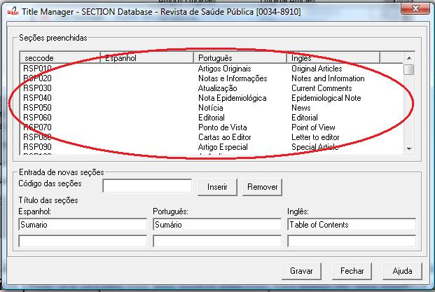
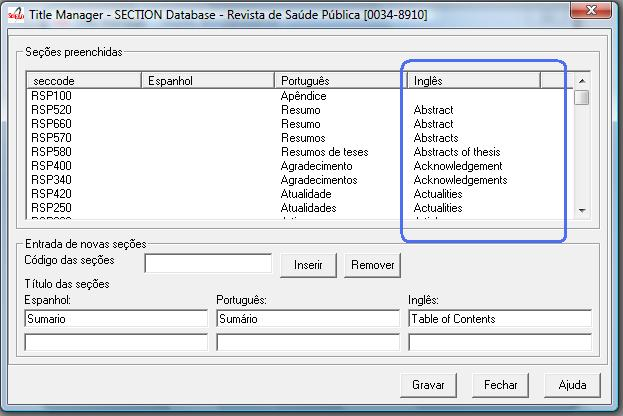
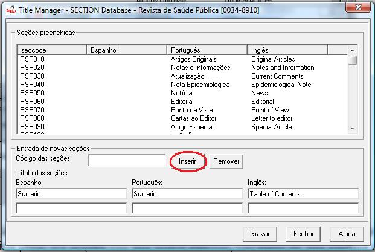

Sections
========

It manages all the sections of the table of contents of the all the journal issues. 

Opening the journal sections form
---------------------------------

1. Select File > Open > Sections

.. image:: img/en/01_menu_section.jpg

2. Select a title and click on Open button

Sections form
-------------

As opening the form, it will be presented a screen with four columns:

* Seccode (code sections)
* titles of the section in Spanish
* titles of the section in Portuguese
* titles of the section in English

The code of sections are formed by the `Journal acronym <titlemanager_title.html#acronym>`_, followed by numbers with 3 digits, for example, 010, or 020, or 030, and, so on.

The title of the sections may or not be in all the languages of the interface.

The list can be sorted, by clicking on any column (seccode and languages: English, Portuguese, Spanish). 
Example: click on the English column.

Creating a section
------------------

1. Register the section code according to the `acronym format <titlemanager_title.html#acronym>`_,
followed by 3 digits number, in any order. The only rule is it can not be repeated.

.. image:: img/01_sec_code.jpg

2. Register the sections title in the languages, if applicable.

.. image:: img/01_sec_titles.jpg

3. Click on Insert button
4. Click on Save button

Editing the section
-------------------

1. Click on the row of the section to edit. The seccoode and the section titles are displayed in the fields.

.. image:: img/01_sec_edition.jpg

2. Edit the section titles
3. Click on Insert button

4. Click on Save button

Deleting a section
------------------

1. Click on the row of the section to edit. The seccoode and the section titles are displayed in the fields.

.. image:: img/01_sec_edition.jpg

2. Click on Remove button

    Figure 7 - Remove button

3. Click on Save button

-----

Last update: Feb 7, 2014
