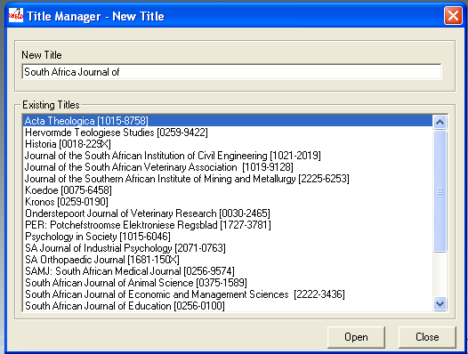
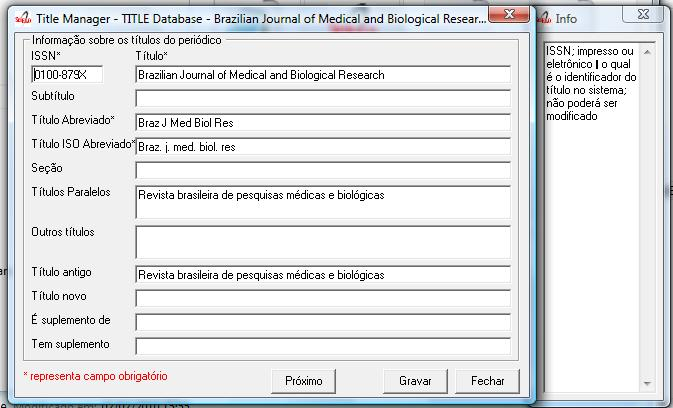
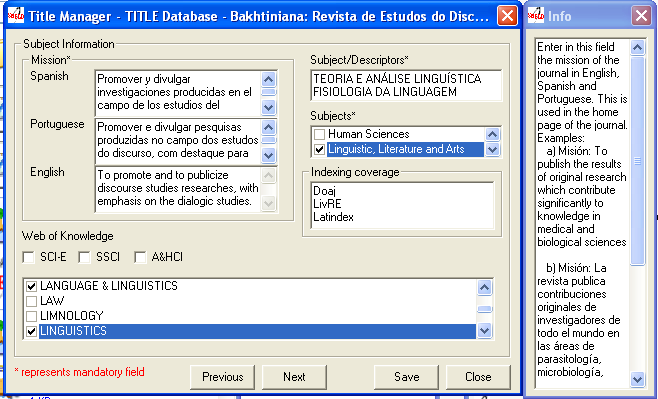
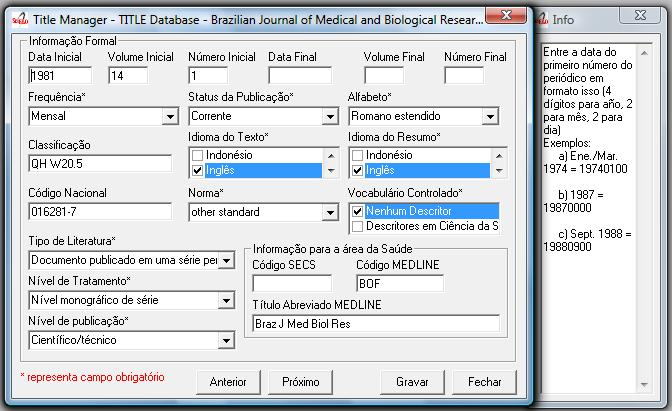
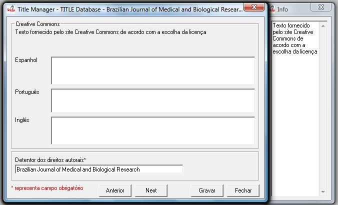
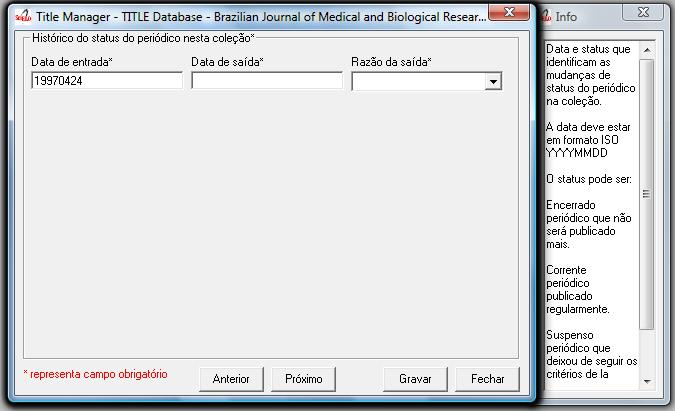
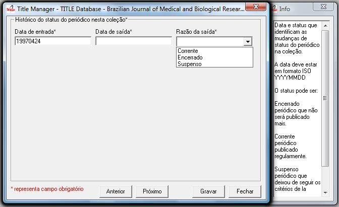
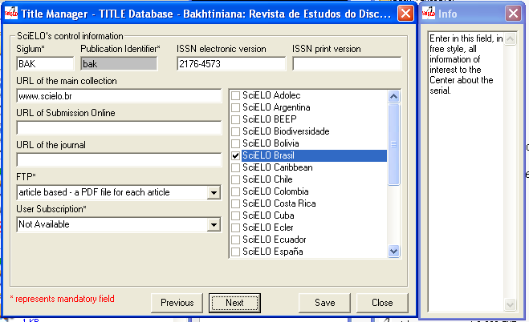

.. pcprograms documentation master file, created by

   You can adapt this file completely to your liking, but it should at least

   contain the root `toctree` directive.

Journals
========

.. image:: img/titlemanager_title_menu.png

Creating a new record  
---------------------

1. Select File-> Open-> Journals-> New.
2. Write the title of the journal and click on Open button.

3. Register the journal data. Read `Journal form`_.   
4. Click on Save button

Opening a record to edit the journal data 
-----------------------------------------

1. Select File-> Open-> Journals-> Open 
2. Select the journal you want to edit

.. image:: img/titlemanager_title_edit.jpg

3. Register the journal data. Read `Journal form`_.   
4. Click on Save button

Deleting records of journals and their issues
---------------------------------------------
It is used to remove records of one or more titles.
Use it **only** if you are sure the journal **HAS NEVER BEEN PUBLISHED**.

.. attention:: **IT Is MANDATORY** to keep all the titles registered, although ceased or removed off the collection, they must keep published.

If the journal has to be disabled, read `Journal history`_.
It deletes the records of the databases title and issue locally. So, only after `GeraPadrao`_, the title will be deleted from the website.

1. Select File-> Open-> Journals-> Delete

.. image:: img/titlemanager_title_menu_remover.jpg

2. Select the titles to be removed.
3. Click on Remove button.

Journal form
============

Journal form: Titles
--------------------

ISSN ID
.......

Field: 400

ISSN – print or electronic – which can not be changed because it is used as an ID.

Publication Title
.................

Field: 100

Main title or title proper of the serial, in the language and form in which it appears. 

Examples:

    - Publication title: British journal of surgery

    - Publication title: Journal of pediatrics

    - Publication title: Pediatrics (London)

    - Publication title: Pediatrics (New York)

    - Publication title: Abboterapia (English ed.)

    - Publication title: Abboterapia (Spanish ed.)

Subtitle
........

Field: 110

- Publication Title: MMWR       
   Subtitle:          morbidity and mortality weekly report

Short Title
...........

Field: 150

Enter the abbreviated title respecting the upper case letters, lower case letters and accentuation of the corresponding language, according to the standard.adopted by the journal

ISO Short Title
................

Field: 151

Enter the abbreviated title respecting the upper case letters, lower case letters and accentuation of the corresponding language, according to ISO standard 4-1984 and List of serial title word abbreviations.    
This field is mandatory for titles indexed in LILACS and/or MEDLINE.    Examples:

- Publication title: West Indian medical journal
   Abbreviated title: West Indian med. j.    

- Publication title: Abboterapia (English ed.)
   Abbreviated title: Abboterapia (Eng. ed.)    

- Publication title: Pediatrics (London)       
   Abbreviated title: Pediatrics (London)

Section
.......

Field: 130

Enter in this field the name of the Section, Part or Supplement, if exists, as it appears on the title page or its substitute, recording the first letter of the first word in upper case. 

Examples:

- Publication Title:  Acta ophtalmologic
   Title Section/Part: Supplement    

- Publication Title:  Bulletin signaletique 
   Section/Part: Section 330
   Title Section/Part: Sciences pharmacologiques

Parallel Titles
...............

Field: 230

Enter parallel titles in accordance with the sequence and typography in which they appear on the title page or its substitute, according to ISBD(S) rules.
In case of more than one parallel title, enter them in the sequence which appears on the title page, separated by ENTER (one by line)

Examples:

- Publication Title: Archives of toxicology
   Parallel Title:    Archiv fur Toxikologie    

- Publication Title: Arzneimittel Forschung     
   Parallel Title:    Drug research 

Other Titles
............

Field: 240

Other forms of the title which appear in the serial such as: cover title which differs from the title on the title page, full title and other variant forms of the title.    Include here lesser variants of the title proper which do not require a new record, but which justify their retrieval.    In case of more than one title form, enter them in the sequence in which they appear, separated by ENTER (one by line)

Examples:

- Publication Title:    Obstetrics and Gynecology Clinics of North America
   Other Forms of Title: Obstetrics and Gynecology Clinics    
- Publication Title:    Journal of the National Cancer Institute
   Other Forms of Title: JNCI: Journal of the National Cancer Institute

Old Title
.........

Field: 610

Enter the preceding title, if there is one. If this title exists in the collection, in the journal homepage is presented a link from the current title to the preceding and vice-versa.

New Title
.........

Field: 710

Enter the subsequent title of the serial. If this title belongs to the collection, in the site there will be a link between the title and its subsequent title, and vice versa.

Is Supplement
.............

Field: 560

Link note: Note which acts as a link between the title of the supplement/insert and the main title or title proper.    
Enter the main title or title proper to which the supplement/insert is linked. 

Has Supplement
..............

Field: 550

Link note: Note which acts as a link between the main title or title proper and its supplements/inserts (titles generally published in separate form, with its own numbering, which complements the main title.
Enter in this field the title of the supplement/insert.

Journal Form: Subject areas
---------------------------

Mission
.......

Field: 901

Enter in this field the mission of the journal in English, Spanish and Portuguese. This is used in the home page of the journal. 
Examples: 
   
- Misión: To publish the results of original research which contribute significantly to knowledge in medical and biological sciences       
- Misión: La revista publica contribuciones originales de investigadores de todo el mundo en las áreas de parasitología, microbiología, medicina tropical, así como estudios básicos en bioquímica, inmunología, biología celular y molecular, fisiología, y genética relacionados con esas áreas    

Subject/Descriptors 
...................

Field: 440

Descriptors; Standard terms used for the subject representation of the serial being described.    Terms must be entered in capital letters.    Cooperating Centers of BIREME System should use terms taken from DeCS (Descriptors in Health Sciences)

In case of more than one descriptor, enter them in sequence, separating them by ENTER, an item by line.Enter a maximum of 4 descriptors.    

Examples:
     
- Descriptors: OCCUPATIONAL MEDICINE         
- Descriptors: PEDIATRICS         
- Descriptors: NEUROLOGY PEDIATRICS         
- Descriptors: GYNECOLOGY OBSTETRICS

Study Area 
..........

Field: 441

Select one or more subjects related to the journal. The site uses this content to presents the journal title in the site in the list by subject.

Indexing Coverage
.................

Field: 450

Indexing Coverage – Enter in this field all the database in which the title is indexed. 
Each database in one line. 
Examples:     

Index Medicus
LILACS
Index Medicus Latino Americano
Excerpta Medica
Biological Abstracts

Web of Knowledge Databases
..........................

Field: 854 

Indicate the Web of Knowledge Databases which the journal is registered.

Subject categories
..................

Field: 851

Select all the categories which the journal is related to.

Journal form: formal information
--------------------------------

Initial Date 
............

Field: 301

Enter the date of the first issue of the journal in ISO format (year in 4 digits, month 2 digits, day in 2 digits).    
Examples:
     
- Initial date: Jan./Mar. 1974  
   19740100         
- Initial date: 1987
   19870000         
- Initial date: Sept. 1988
   19880900

Initial Volume
..............

Field: 302

Enter the initial volume in arabic numerals.    Omit this information for serials which do not include clear information on the volume.    Examples:
     
- Initial volume: 1         
- Initial volume: 4 

Initial Number 
..............

Field: 303

Enter the initial number in arabic numerals.    

Examples:
     
- Initial number: 1         
- Initial number: 2 

Terminate Date 
..............

Field: 304

Date, in ISO format, in which the journal was published for the last time.Examples:
     
- Termination date: 1984  19840000         
- Termination date: 1988  19880000

Final Volume
............

Field: 305

Number of the last published volume of the serial.    Enter the final volume in arabic numerals.    

Examples:
     
- Final volume: 10         
- Final volume: 12 

Final Number
............

Field: 306

Enter the final number in arabic numerals.    

Examples:
     
- Final number: 7         
- Final number: 10 

Frequency
..........

Field: 380

Code which identifies the intervals of time in which the issues of the serial are published.

Publication Status 
..................

Field: 50

Code which identifies if this title can be or already is published in the collection. In other words, if this title which can be processed by gerapadrao.

- Current – title which can be accessed on the web site of the collection
- Unknow – title which belongs to the collection, although it is not ready to be published    
- Ceased – title which does not belong to the collection but it is related to title of the collection 
- Reports only – title which does not belong to the collection but it is used in reports

Alphabet 
........

Field: 340

Enter data in this field the alphabet of the Original Title of the journal title.

Classification
...............

Field: 430

Subject classification number assigned to the serial according to the classification system used by the Center.

Text Idiom 
..........

Field: 350

Languages in which the articles are published, including the translations. This field is related to the presentation of all the full texts of the site.

Abstract language 
.................

Field: 360

Languages of the Abstracts

National Code 
.............

Field: 20

Code which identifies the title in the national system of serials of each country (or its equivalent) with the purpose of facilitating the transfer of data between this and other related systems.    Enter in this field the code assigned by the institution responsible for the national system of serials of each country (or its equivalent).    Examples:
     
- National Code: 001060-X (Code assigned by the Brazilian National Union List)         
- National Code: 00043/93

Standard
.........

Field: 117

Standard used to the bibliographic references presentation. This content is related to the Markup program.

Controled Vocabulary
....................

Field: 85

Enter in this field the controlled vocabulary used to the key words

Type of Literature
..................

Field: 5

Type of literature

Treatment Level 
...............

Field: 6

Level of publication
....................

Field: 330

SECS Code 
.........

Field: 37

Enter in this field the number assigned by BIREME which identifies the title in SeCS (Health Science Serials) database.    Mandatory field for Cooperating Centers which input data to SeCS database.    This field is used by the system to generate the holding files which are to be transfered to SeCS database.    This field must be entered if SECS is recorded in Field 040; Related Systems.    

Examples:     
- SECS Number: 2         
- SECS Number: 4 

MEDLINE Code
............

Field: 420

Code of the journal title when it is indexed in MEDLINE databases.

MEDLINE Short Title 
...................

Field: 421

Short title registered in MEDLINE

Journal form: publishers and sponsors
-------------------------------------

.. image:: img/titlemanager_title_form_04.jpg

Publisher 
.........

Field: 480

Name of the publisher and/or issuing body of the serial.    Enter the name of the publisher responsible for the serial as it appears in the publication.    When the publisher is the same as the issuing body, it is not necessary to repeat it in this field, except when it is indispensable for purposes of acquisition.    In case of more than one publisher, enter the first one that appears on the publication or the one that coincides with the place of publication.    

Examples: 

- Publisher: Pergamon Press         
- Publisher: Plenum Press 

Publisher's Country 
...................

Field: 310

Country of the Publication

Publisher's State 
.................

Field: 320

State/Province – Enter in this field the location in the country of the publication, but not the city or town. 

Examples:
     
- State/Province: SP         
- State/Province: RJ

Publisher's City 
................

Field: 490

Enter the name of the city in full in the language in which it appears in the publication.    When the title appears in more than one language, enter the city in the language of the title proper.    When it is not possible to determine the place of edition and/or publication of the serial, enter the abbreviation s.l.    

Examples:
     
- Place of publication: Port of Spain         
- Place of publication: London         
- Place of publication: s.l

Address 
.......

Field: 63

Enter in this field the address and phone numbers. This data is presented in the foot page and is used to conctact the  publisher.

Examples:    

- Rua Capitão Adelmio Norberto da Silva, 736
    14025-670 Ribeirão Preto, SP; Brasil
    Telephone and Fax: (55 16) 621.8540, 620.1251, 620.1253     

- Avenida Lineu Prestes, 2227; Caixa Postal 8216
    Cidade Universitária Armando de Salles Oliveira
    05508-900 São Paulo, SP; Brasil
    Telefone: (55 11) 818.7861
    Fax: (55 11) 818.7413

Electronic Address
..................

Field: 64

Enter in this field the e-mail address of the publication, used in the process of publication. DO NOT USE PERSONAL e-mails. This information is presented in the foot page of the site.

Sponsor 
.......

Field: 140

Enter the name of the financial sponsors

Journal form: license or copyright
----------------------------------

Text provided by Creative Commons site according to the license choice
.......................................................................

Field: 540tl

Enter in HTML in English, Portuguese, Spanish, a text, which inform the license to use the content of the journal (Creative Commons). 

Copyright holder 
................

Field: 62

Copyright holder

Examples:    
- Brazilian Journal of Medical and Biological Research    
- Sociedade Brasileira de Genética    
- Instituto Universitário de Pesquisas do Rio de Janeiro     
- Revista Brasileira de Ciências Sociais    

Journal form: history of journal's status in the collection 
-----------------------------------------------------------

Journal history
...............

Field: 51abcd

Date and status which identify the changes of the journal's status in the collection.    Date must be in ISO format YYYYMMDD     Status can be:

- Ceased (D): journal will not be published any more.
- Current (C): journal published currently.
- Suspended (S):journal is no longer according to collection´s criteria. In the future it can become current.

Journal's status history in this collection
...........................................

Field: 51

Repetitive.

- subfield a: initial date, ISO format
- subfield b: status which value is C
- subfield c: final date, ISO format
- subfield d: status which value is D or S

Journal form: website
---------------------

Acronym (Lowercase and/or Uppercase letters)
............................................

Field: 930

Enter in this field the acronym of the journal, max 8 characters length, in capital letter or not. It must be unique comparing to the other titles. It is used for the name of the folder in which are saved all the files related to the journal (markup, body, images, et
- and also used for the prefix to the sections code of the journal.

Acronym
.......

Field: 68

Name of the folder which contains the files of the journals and which is in serial folder. It is automatically  filled as filling in the field acronym of the title of the journal

ISSN Type
.........

Removed from Title Manager since 4.0.072. Replaced by Print ISSN and Electronic ISSN.

Field: 35

Identifies the type of the CURRENT ISSN.

Current ISSN 
............

Removed from Title Manager since 4.0.072. Replaced by Print ISSN and Electronic ISSN.

Field: 935

Enter the current ISSN. It can be different or equal to the ISSN used as ID, but it is usually the online ISSN.

Print ISSN
..........

Field: 435, subfield ^t = 'PRINT'

Enter the Print ISSN if it is a current ISSN.

Electronic ISSN
...............

Field: 435, subfield ^t = 'ONLIN'

Enter the Electronic ISSN if it is a current ISSN.

URL of the main collection 
..........................

Field: 690

Enter the URL of the main collection site. If the journal is published in SciELO Brazil, then www.scielo.br

URL of Submission Online
.........................

Field: 692

Enter the URL of the submission site

URL of the journal
..................

Field: 69

If the journal is published in another site, enter in this field the other site location

FTP 
...

Field: 66

Enter in this field the information about PDF files of the articles.

- article based: a PDF file for each article
- issue based: a PDF file for each issue
- na: Not Available

User Subscription 
.................

Field: 67

Identifies how to access to the articles by subscription. 

Select the corresponding option:

- sub: regular subscription 
- reg: electronic subscription 
- na: not available

Publishing Model
................

Field: 699

Select the publishing model. 

- countinous: journal publishes articles in batch (rolling pass)
- undefined: journal publishes articles in issues

SciELO Net
..........

Field: 691

Select the collections to which the journal belong to.

Journal form: other information
-------------------------------

.. image:: img/titlemanager_title_form_08.jpg

Notes 
.....

Field: 900

Enter in this field, in free style, any further information about the journal.

Center Code
...........

Field: 10

Code which identifies the center responsible for the markup process.

Identification Number
.....................

Field: 30

Sequential number assigned and controlled by the Center which identifies the journal in the database.
Enter in this field the number corresponding to the title being described.    
This field is used in the system in order to link the title record with its corresponding issues, therefore being mandatory.    

Examples:
     
- Record identification: 1050
- Record identification: 415

Creation Date 
.............

Field: 940

Automatically filled with the date of the registration.

Documentalist (Creation)
........................

Field: 950

Initials of the responsible for the register creation.

Update Date 
...........

Field: 941

Automatically filled with the updating date.

Documentalist (Update)
......................

Field: 951

Initials of the responsible for the register updating.

