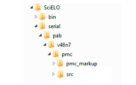

XML Markup workflow
===================

.. toctree::
   :maxdepth: 3

Files specifications
--------------------
- one document (article or text) by file
- .doc or .html
- all the files related to the document must have the same name or start with same name plus hyphen. For instance, a01.pdf, a01-f01.jpg (image of the figure 1), a01-en.pdf (PDF of the English version)

Files location
--------------

Organize the files according to this files/folders structure.

- .doc, .docx file:
    /<ANY_LOCATION>/<acron>/<issue_identification>/markup_xml/scielo_markup
- images, pdf, etc:
    /<ANY_LOCATION>/<acron>/<issue_identification>/markup_xml/src

For instance:

Article Files Template for doc DTD 4.0.090
------------------------------------------
Having the document formated according to the template, the Markup Program will be able to identify semi/automatically most of the elements.

First line: DOI number. Only the number, not the URL, if applicable.

Following line: Section title

Following line: Original article title

Following lines: translation of article titles, one title by line, if applicable.

New line in order to separate the article titles from authors

Following lines: authors, one author by line with their corresponding links to affiliations or notes identified by superscript format.

E.g.:

    José da Silva :sup:`1`

    Maria de Lourdes Camargo :sup:`2`

If the link text is a number, it is automatically identified as xref, otherwise, the user must be manually identified it.

New line in order to separate the authors from affiliations.

Following lines: affiliations, one affiliation by line.

New line in order to separate the affiliations from the continuation of the document.

abstracts
.........
For structured abstracts (which have titles: Introduction, Methods, etc)
Titles must be in bold style

key words
.........
Separators: comma, semicolon.

<body>
......

- Body section: use bold, centralized, size=16
- Subsection (level 1): use bold, centralized, size=14
- Subsection (level 2): use bold, centralized, size=13
- quote: identation 4 cm from left margin
- required format for citations (references): 

  - last name, year
  - :sup:`(number)`
  - :sup:`(number, number)`
  - :sup:`(number-number)`
  - :sup:`(number, number-number, number)`

.. note:: for notes, use only :sup:`number`, no ()

tables
......
Required order:

- label: bold
- allowed separators between label and caption: (label. caption or label - caption or label: caption)
- caption: in the same line of label
- table: image or Word table object
- Word table object: header in bold
- footnotes: one footnote by line

.. note:: if Word table object is a uniform table the program is able to identify it correctly the cells and rows

figures
.......
Required order:

- image: 
- attribution: source of the image, photo, graphic, etc 
- label: bold
- allowed separators between label and caption: (label. caption or label - caption or label: caption)
- caption: in the same line of label

references
..........
One reference by paragraph

Input files for Markup
----------------------

Journals of www.scielo.org
...........................

Only if it is a journal of www.scielo.org, use the menu to update the journal list.

   .. image:: img/scielo_menu_download_journals.png

Other journals
..............

You must not have /scielo/bin/markup/markup_journals_list.csv. If you do, delete it.

Instead, you must have:

- ??_issue.mds: updated/created as any issue number’s data is updated/created
- issue.mds: updated/created as any issue number’s data is updated/created
- journal-standard.txt: updated/created as any journal’s data is updated/created

These files are generated by `Title Manager <titlemanager.html>`_ or `SciELO Manager <http://docs.scielo.org/projects/scielo-manager/en/latest/>`_.

.. note::
   Title Manager generates these files in the /scielo/bin/markup in the computer where Title Manager runs.
   So, if you use Markup in other computer, you have to copy these files to the computer where Markup runs.
    

Markup
------

Use the Markup program according to `its documentation <markup.html>`_.

How to identify the document using doc DTD
,,,,,,,,,,,,,,,,,,,,,,,,,,,,,,,,,,,,,,,,,,

Select [doc] tag. The program will display a form to complete.

The program will ask if the document is according to the template.

If it is true, it will try to identify automatically some elements from the top to affiliations.

These elements are not complete identified, you have to complete the markup.

Use the pencil button to edit attributes.

Use the tag buttons to identify other elements.

Use down and up button to navigate between the levels.

Before identifying [xmlbody], you must identify the references block.

This procedure helps the Markup program to identify the citations in the body.

.. note:: Although refs is not vancouv, if the references uses Vancouver standard, it is possible to apply **Automata 2** for the whole references block.

Some other automations are described in: `SciELO Markup Elements and Attributes <markup_tags.html#automations>`_

After identifying the [xmlbody], find the equations, tables, and figures.

For these elements, you have to select their whole block, it means, for table, from label to footnotes, for figure, from image to caption, etc, then apply the corresponding tag button (tabwrap, figgrp, etc). The program can identify most of the elements automatically. Complete or fix the markup.

Recommended ID/RID prefixes
,,,,,,,,,,,,,,,,,,,,,,,,,,,

+----------------+--------------------+---------+--------------------+
|XML element     | Description        | Prefix  | Example            |
+================+====================+=========+====================+
| aff            | Affiliation        | aff     | aff1, aff2...      |
+----------------+--------------------+---------+--------------------+
| app            | Appendix           | app     | app1, app2...      |
+----------------+--------------------+---------+--------------------+
| author-notes/  | footnotes          | fn      | fn1, fn2 ...       |
|   fn           |                    |         |                    |
+----------------+--------------------+---------+--------------------+
| corresp        | Correspondence     | c       | c1, c2 ...         |
+----------------+--------------------+---------+--------------------+
| def-list       | definitions list   | d       | d1, d2 ...         |
+----------------+--------------------+---------+--------------------+
| disp-formula   | equation           | e       | e1, e2 ...         |
+----------------+--------------------+---------+--------------------+
| fig            | figure             | f       | f1, f2 ...         |
+----------------+--------------------+---------+--------------------+
| media          | media              | m       | m1, m2 ...         |
+----------------+--------------------+---------+--------------------+
| ref            | bibliographic      | B       | B1, B2 ...         |
|                | references         |         |                    |
+----------------+--------------------+---------+--------------------+
| sec            | Sections           | sec     | sec1, sec2 ...     |
+----------------+--------------------+---------+--------------------+
| supplementary- | supplementary      | suppl   | suppl1, suppl2 ... |
|material        | material           |         |                    |
+----------------+--------------------+---------+--------------------+
|table-wrap-foot/| table footnote     | TFN     | TFN1, TFN2 ...     |
|   fn           |                    |         |                    |
+----------------+--------------------+---------+--------------------+
| table-wrap     | Table              | t       | t1, t2 ...         |
+----------------+--------------------+---------+--------------------+

Results
-------

scielo_package
..............
    XML Files according to `SPS <http://docs.scielo.org/projects/scielo-publishing-schema/>`_

    purpose
        used by `XML Converter <xml_converter.html>`_
    location
        /<ANY_LOCATION>/<acron>/<issue_identification>/markup_xml/scielo_package

scielo_package_zips
...................
    Compacted files of `scielo_package`_

    purpose
        to send to SciELO
    location
        /<ANY_LOCATION>/<acron>/<issue_identification>/markup_xml/scielo_package_zips

errors
......
    Reports of XML files generation and validations

    purpose
        inform errors of the generation process
        inform errors found in XML files generated to be fixed by the user
    location
        /<ANY_LOCATION>/<acron>/<issue_identification>/markup_xml/errors
    note
        must be sent to SciELO with `scielo_package_zips`_

work
....
    Temporary folder used during the generation/validation of XML files

    purpose
        used to get any support from SciELO Team, otherwise can be deleted
    location
        /<ANY_LOCATION>/<acron>/<issue_identification>/markup_xml/work

----------------

Last update of this page: August 2015
