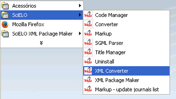
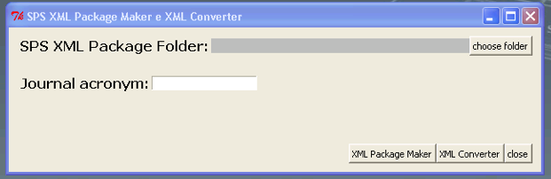
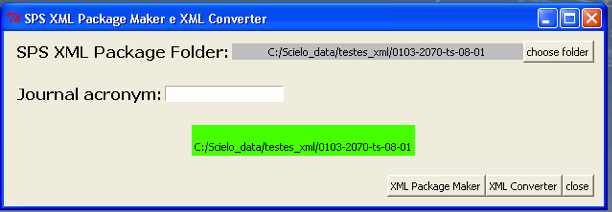
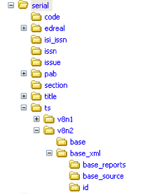
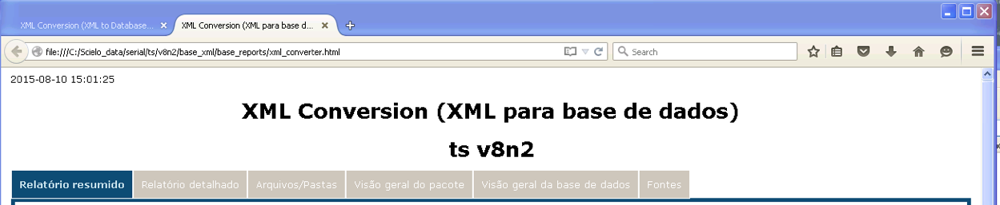
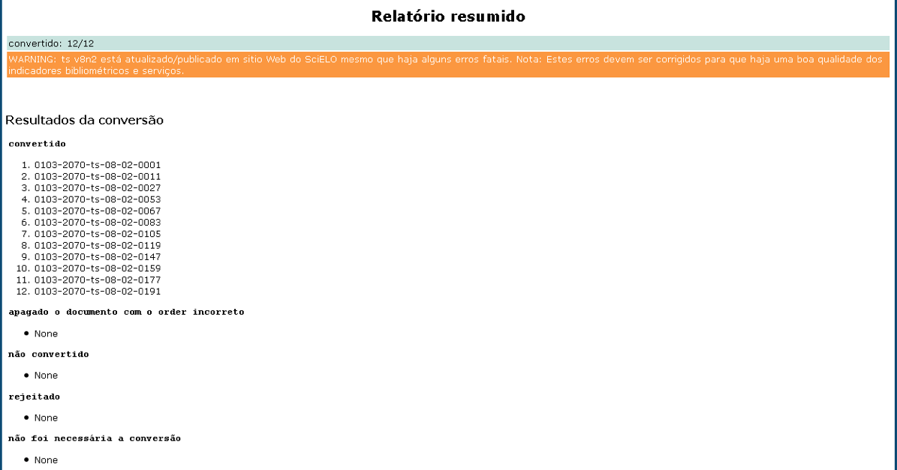
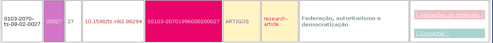
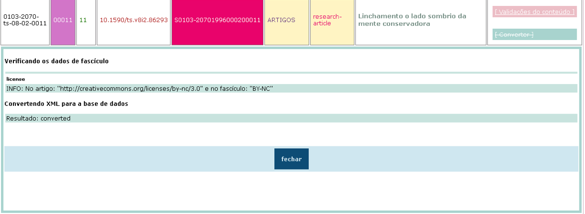
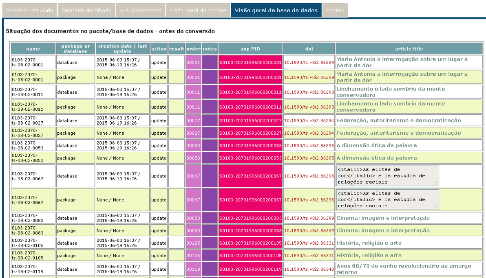
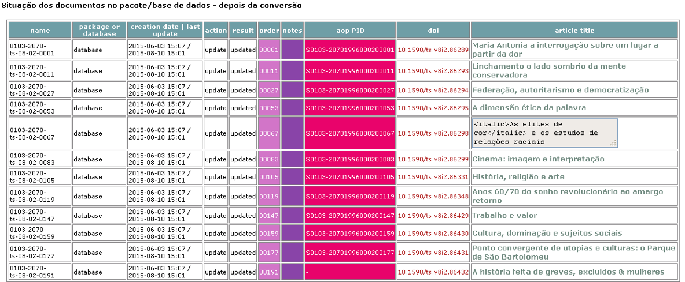

.. toctree::
   :maxdepth: 2

==================
XML Converter (XC)
==================

It is a tool to generate CDS/ISIS databases in the serial folder to generate the Web site.

How to use
----------

Use the Windows menu to open the program.

Select the folder which contains XML package files

Press **XML Converter**.

Unable to identify the issue
----------------------------

If XC was unable to identified the issue, 
the output folder (0103-2070-ts-08-02_xml_converter_result) is generated in the same folder which contains the input folder (0103-2070-ts-08-02) and it contains:

* XML files for SciELO (scielo_package and/or scielo_package_zips folders)
* XML files for PMC (pmc_package folder)
* report files (errors folder)

.. image:: img/xpm_result_folders.png

Package has a valid issue
-------------------------

If XC has identified the issue, the results will be generated in the corresponding folder in the serial folder.

For instance, serial/ts/v8n2.

Results
-------

* base: CDS/ISIS database, used to generate the Web site.
* base_xml/id: files used to generate base contents
* base_xml/base_source: XML package files
* base_xml/base_reports: reports (xml_converter.html)
* windows: (optional) if it does not run in Windows, *windows* is generated in order to export *base* in Windows format. 

If in the computer there is an instance of SciELO Web site, the images, pdf, etc are copied to the corresponding folders in the SciELO Web site.

* htdocs/img/revistas/<acron>/<issue_id>/
* bases/pdf/<acron>/<issue_id>/
* bases/xml/<acron>/<issue_id>/

Reports
-------

After finishing the processing the reports are displayed in a Web browser.

Switch between the tabs.

Some reports are the same generated by XPM. Consult `its documentation <xml_package_maker.html>`_.

Summary report
..............

Conversion status
;;;;;;;;;;;;;;;;;

Presents the files according to the conversion results:

converted
   files for which the database was successfully generated

deleted incorrect order
   files which **order** was incorrect

not converted
   files for which the database was failed to generate

rejected
   files were rejected because they have fatal errors in issue's data.

skipped conversion
   files which were not necessary to convert because they have no changes since last conversion

AOP Status
;;;;;;;;;;

Presents information about AOP.

If the journal has aop documents, presents the **deleted** ex aop and files which continue as aop.

Detail report
.............

Presents the documents in a table.

The columns order, aop pid, toc section, @article-type are hightlighted because contain important data.

The column **reports** contains **buttons** to open/close the detail reports of each document.

Each row has the document's data.

Detail report - Converter
:::::::::::::::::::::::::

XC checks if the data found in XML are the same which were registered in the issue's forms (Title Manager or SciELO Manager).

Presents the results of these validations.

Database overview
.................

Presents the package's data and the status of database before the conversion.

Presents the status of the database after the conversion.

