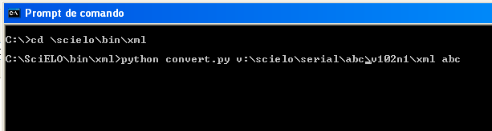
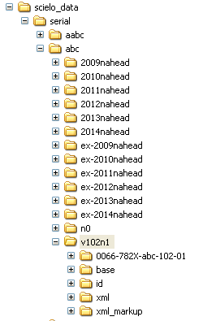

XML Converter
=============

Script to generate the base folder given a XML package.

Usage:

1. Use a DOS session, and go to the script location

.. code::

    cd \scielo\bin\xml

2. Use the command 

.. code::

    python convert.py <parameter_1> <parameter_2>

where

    <parameter_1>: path of the folder where there are the XML files and related files, such as PDF, ePub, etc.
    <parameter_2>: acronym

This command will generate the folder **base** which is in the issue folder and it is the database of articles of an issue.

----------------

Last update of this page: Abril 1, 2014
