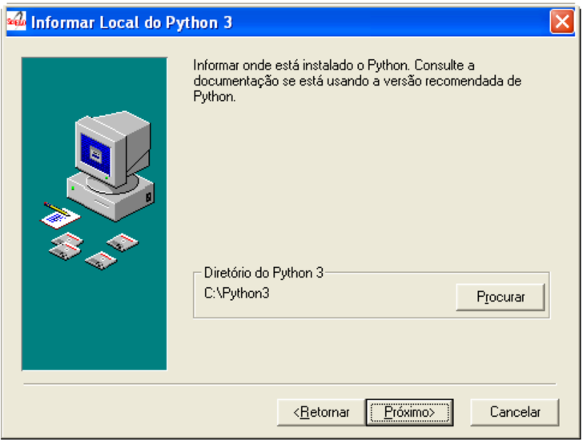
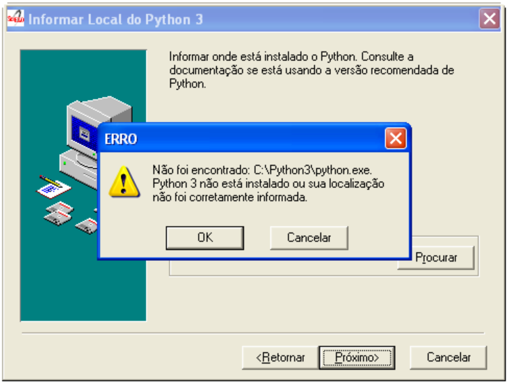
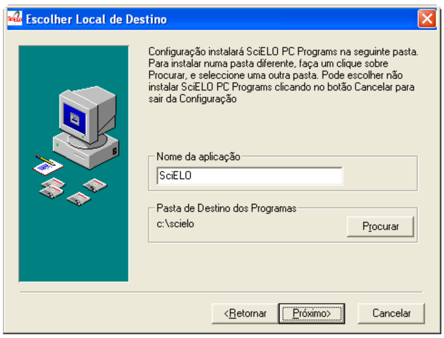
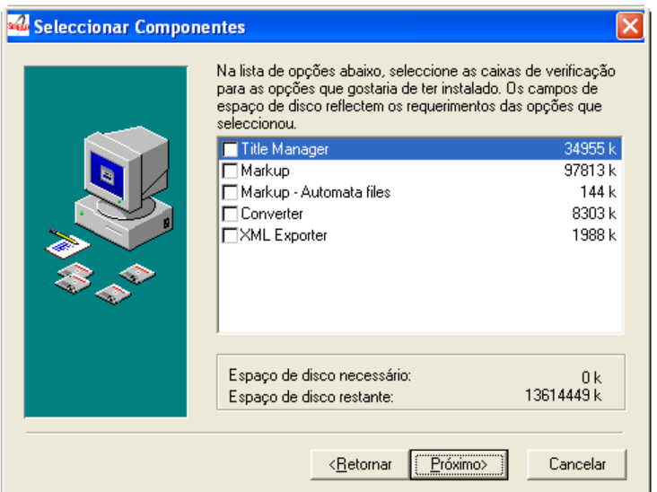
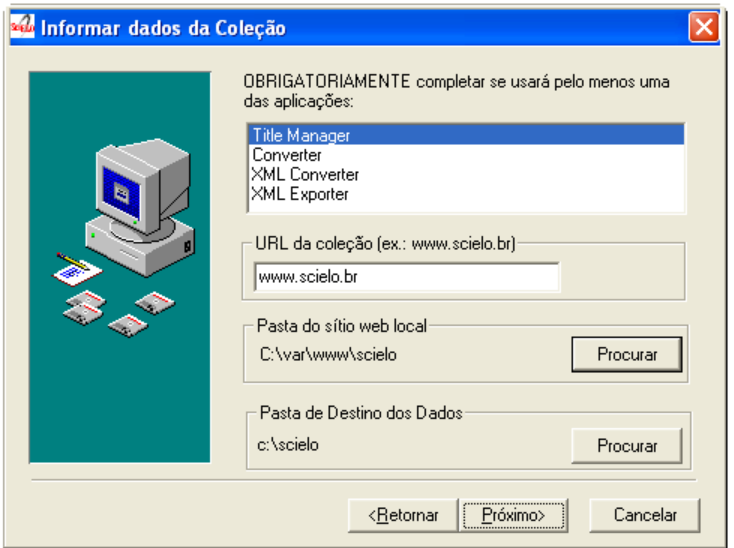
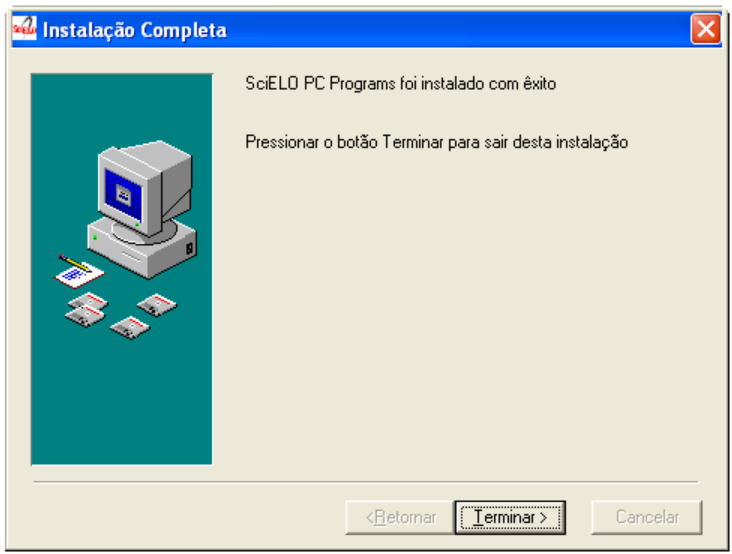

Última atualização Jun, 2020

## Como instalar Markup

Executar o [instalador](download_markup_xml) e completar com as informações solicitadas.

### Informar Localização de Python 3

Python 3 é um pré-requisito. Tem que ser instalado antes de instalar SciELO PC Programs

    

O instalador não permitirá prosseguir sem a indicação da localização (diretório) correta do Python 3

    

### Informar os Dados dos Programas

- **Nome da aplicação:** nome que aparecerá no Menu de Programas. Ex.: SciELO Brasil, SciELO 4.0.097
- **Pasta de Destino dos Programas:** onde os programas serão instalados. Ex.: c:\\scielo, e:\\var\\www\\scielo 

    

### Selecionar as aplicações

Para trabalhar com o Markup XML, será necessário obrigatoriamente:

- **Markup:** programa para identificar elementos de um artigo/texto

    

### Informar Dados da Coleção

**Desnecessário alterar ou preencher os campos**

    

### Terminar a instalação

Clique em "Terminar" para concluir a instalação

    

