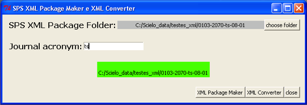

.. toctree::
   :maxdepth: 2

=======================
XML Package Maker (XPM)
=======================

It is a tool to generate XML packages for SciELO and PMC.

How to use
----------

Use the Windows menu to open the program.

.. image:: img/scielo_menu_xpm.png

.. image:: img/xpm_gui.png

Select the folder which contains XML package files

.. image:: img/xpm_gui_selected_folder.png

Inform the journal acronym which will be used to form the files and package names

Press XML Package Maker

It will generate

* XML files for SciELO (scielo_package and/or scielo_package_zips folders)
* XML files for PMC (pmc_package folder)
* report files (errors folder)

in the folder which contains XML package files plus the current time.

.. image:: img/xpm_result_folder.png

Results
-------

After finishing the processing the reports are displayed in a Web browser.

Navigate among the tabs.

Summary report
..............

.. image:: img/xpm_report.png

Detail report
..............

.. image:: img/xpm_report_detail.png

Detail report - Validations
:::::::::::::::::::::::::::

.. image:: img/xpm_report_detail_validations.png

Folders/Files
.............

.. image:: img/xpm_report_folder.png

Overview report
...............

Overview report - languages
:::::::::::::::::::::::::::

.. image:: img/xpm_report_overview_lang.png

Overview report - dates
:::::::::::::::::::::::

.. image:: img/xpm_report_overview_date.png

Overview report - affiliations
::::::::::::::::::::::::::::::

.. image:: img/xpm_report_overview_aff.png

Overview report - references
::::::::::::::::::::::::::::

.. image:: img/xpm_report_overview_ref.png

Sources report
..............

.. image:: img/xpm_report_sources.png

.. image:: img/xpm_report_sources_journals.png

.. image:: img/xpm_report_sources_books.png

.. image:: img/xpm_report_sources_others.png

----------------

Last update of this page: August, 2015
