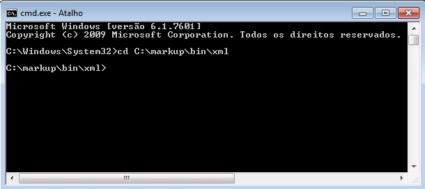
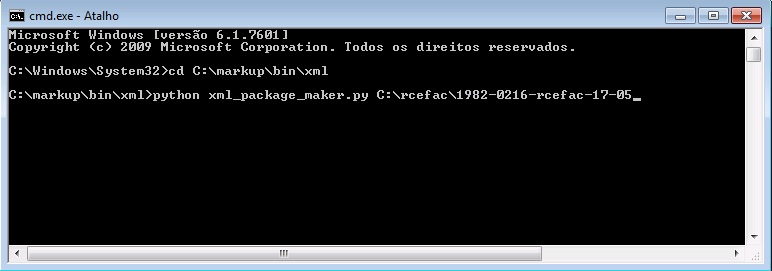

.. toctree::
   :maxdepth: 2

=======================
XML Package Maker (XPM)
=======================

It is a tool to generate XML packages for SciELO and PMC.

How to use
----------

Use the Windows menu to open the program.

.. image:: img/scielo_menu_xpm.png

.. image:: img/xpm_gui.png

Select the folder which contains XML package files

.. image:: img/xpm_gui_selected_folder.png

Press **XML Package Maker**.

.. _viacomando:

Or, to execute Package Maker via command line, open the terminal and go to the folder where the program is installed:

Then type: 

.. code::

    python xml_package_maker.py <xml_package_folder>

Results
-------

* XML files for SciELO (scielo_package and/or scielo_package_zips folders)
* XML files for PMC (pmc_package folder)
* report files (errors folder)

The output folder (0103-2070-ts-08-02_xml_package_maker_result) is generated in the same folder in which contains the input folder (0103-2070-ts-08-02)

.. image:: img/xpm_result_folders.png

Reports
-------

After finishing the processing the reports are displayed in a Web browser.

Switch between the tabs.

Summary report
..............

Validations Statistics
::::::::::::::::::::::

Presents the total of fatal errors, errors, and warnings, found in the whole package.

FATAL ERRORS
   represents errors related to Bibliometrics Indicators.

ERRORS
   represents other types of errors

WARNINGS
   represents something that needs more attention

.. image:: img/xpm_report.png

Detail report
..............

Detail report - package validations
:::::::::::::::::::::::::::::::::::

Fist of all, XPM validates some package's data:

- Some data must have same value in all the XML files, such as:

 * journal-title
 * journal id NLM
 * journal ISSN
 * publisher name
 * issue label
 * issue pub date

- Some data must have unique value in all the XML files, such as:

 * doi
 * elocation-id, if applicable
 * fpage and fpage/@seq
 * order (used to generated article PID)

Example of fatal error because of different values for publisher-name. 

 .. image:: img/xml_reports__toc_fatal_error_required_equal_publisher.jpg

Example of fatal error because of different values for pub-date. 

 .. image:: img/xml_reports_toc_fatal_error_required_equal_date.png

Example of fatal error because unique value is required

 .. image:: img/xml_reports_toc_fatal_error_unique.png.jpg

Detail report - documents' validations
::::::::::::::::::::::::::::::::::::::

Presents the documents in a table.

The columns order, aop pid, toc section, @article-type are hightlighted because contains important data.

The column **reports** contains **buttons** to open/close the detail reports of each document.

Each row has the document's data

.. image:: img/xpm_report_detail.png

Detail report - Validations
:::::::::::::::::::::::::::

Click on **Data Quality Control** to view the problems.
The detail report is displayed below the row

.. image:: img/xpm_report_detail_validations.png

Folders/Files
.............

Displays the files/folders which are inputs and outputs.

.. image:: img/xpm_report_folder.png

Overview report
...............

Overview report - languages
:::::::::::::::::::::::::::

Displays the elements which contains @xml:lang. 

.. image:: img/xpm_report_overview_lang.png

Overview report - dates
:::::::::::::::::::::::

Displays the dates found in the document: publication and history.
Displays the spent time between received and accepted, accepted and published, accepted and the present date.

.. image:: img/xpm_report_overview_date.png

Overview report - affiliations
::::::::::::::::::::::::::::::

.. image:: img/xpm_report_overview_aff.png

Overview report - references
::::::::::::::::::::::::::::

.. image:: img/xpm_report_overview_ref.png

Sources report
..............

.. image:: img/xpm_report_sources.png

.. image:: img/xpm_report_sources_journals.png

.. image:: img/xpm_report_sources_books.png

.. image:: img/xpm_report_sources_others.png

