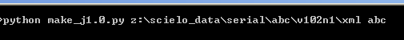
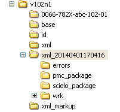

=================
XML Package Maker
=================

Script to generate XML packages for SciELO and PMC.

It is embedded in Markup Program in order to generate XML files.

Usage:

1. Use a DOS session, and go to the script location

.. code::

    cd \scielo\bin\xml

2. Use the command below to generate XML files according to JATS 1.0

.. code::

    python make_j1.0.py <parameter_1> <parameter_2>

where

    <parameter_1>: path of the folder where there are the XML files and related files, such as PDF, ePub, etc.
    <parameter_2>: acronym

This command will generate:

* XML files for SciELO (scielo_package)
* XML files for PMC (pmc_package)
* report files (errors)

in the folder informed as **<parameter 1>** plus the current time.

Reports
=======

Report of files and DTD errors
------------------------------

It reports all the related files and DTD errors.

Report file name: <article filename>.err.txt
Example: article-v48n6p060.err.txt

xml name
  indicates the original file name. Example: article-v48n6p060

new name 
  indicates the normalized name, formed by ISSN-acron-volume-number-page (`File Submission Specifications`_).
  Example: 0100-204X-pab-48-06-00060

total of related files
  total of related files of the article. They are PDF, epub, other formats, versions, of the article.

  They are renamed to new name.

  -  article-v48n6p060.sgm.xml => 0100-204X-pab-48-06-00060.xml
  -  article-v48n6p060.pdf => 0100-204X-pab-48-06-00060.pdf

total of @href
  total of the attribute href found in the XML file and which indicate the files included in the article, such as equations, tables, videos, images, etc.

  .. code-block:: xml

    <graphic xlink:href="abc.jpg"/>

total of @href files
  total of files which are indicated in the href attribute.
  these files are also renamed according to `File Submission Specifications`_

total of @href files found
  total of files which are found in the files system and were referenced in the XML files
  
total of @href files not found
  total of files which are not found in the files system and were referenced in the XML files
  

DTD Errors
----------

This report informe the line and column number where the error occurres.

.. code-block::

   Line number: 68
   Column number: 27
   Message: ...

Messages
........

1. The content of element type "front" must match "(journal-meta,article-meta,notes?)"

   It means, the element front, must have journal-meta, article-meta, and can or not have notes.

   It is possible, some of journal-meta or article-meta is missing or an unexpected element were found inside front.

2. Attribute value "e01" of type ID must be unique within the document.

   The attributes id must not have same value.

3. An element with the identifier "B5" must appear in the document.

   There is at least a rid=B5, but there is not id="B5"

If you can not understand the messages, use our support: `SciELO XML Forum <support.html>`_

Messages to ignore
..................

1. The content of element type "institution" must match "(sub|sup)"

Report of SciELO Style Checker
------------------------------
The document is checked against the `SciELO Tagging Guidelines rules <guidelines_xml.html>`_.

Report file name: <article filename>.rep.html

Example: article-v48n6p060.rep.html

Report of Contents Validations
------------------------------
It is a set of reports: 

<article filename>_href.html
  list the @href and files

<article filename>_id.html
  @id found in the XML

<article filename>.contents.html
  validations of the contents

Report file name: <article filename>

Example: 

  - article-v48n6p060_href.html
  - article-v48n6p060_id.html
  - article-v48n6p060.contents.html

Report of PMC Style Checker
---------------------------

The document is checked against the PMC Tagging Guidelines rules
(http://www.ncbi.nlm.nih.gov/pmc/pmcdoc/tagging-guidelines/article/dobs.html).

----------------

Last update of this page: Abril 1, 2014
