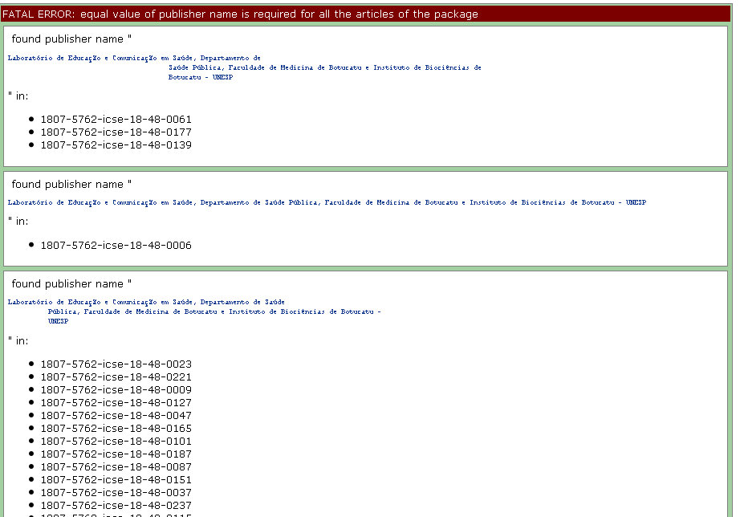
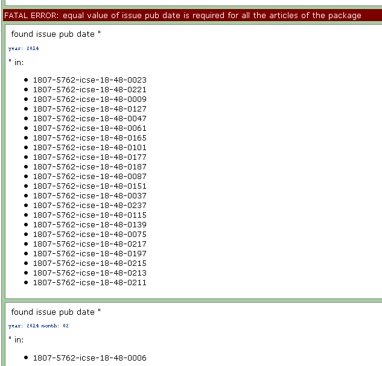

# XML Package Maker (XPM)

É uma ferramenta para gerar pacotes XML para SciELO e PMC.

## Abrir o programa pelo Menu

Use o menu do Windows para abrir o programa.

    
Selecione a pasta que contém os arquivos do pacote XML

Pressione **XML Package Maker**.

## Execução pelo terminal

Ou, para executar o **XML Package Maker** via linha de comando, abra o terminal e vá para a pasta em que o programa está instalado:

    
Então digite:

    python xml_package_maker.py <localização da pasta do pacote>

    
sendo que: `<localização da pasta do pacote>`, é a pasta do pacote

## Resultados

* Arquivos XML para SciELO (pastas **scielo_package** e / ou **scielo_package_zips**)
* Arquivos XML para PMC (pasta **pmc_package**)
* Arquivos de relatório (pasta **errors**)

A pasta de saída (0103-2070-ts-08-02_xpm) é gerada na mesma pasta em que está a pasta do pacote XML (0103-2070-ts-08-02)

## Relatórios

Após o término do processamento, os relatórios são exibidos em um navegador da Web.

Alterne entre as abas.

## Relatório resumido: Números das validações

Apresenta o total de **erros fatais**, **erros** e **avisos** encontrados no pacote.

**ERROS FATAIS:** são erros relacionados aos dados que produzem indicadores bibliométricos e
que se não forem corrigidos podem impactar negativamente para o periódico

**ERROS:** são outros tipos de erros

**AVISOS:** precisa ser verificado para identificar se é erro ou não

   
   

## Relatório detalhado: validações de pacotes

Em primeiro lugar, o XPM valida alguns dados do pacote:

Alguns dados devem ter o mesmo valor em todos os arquivos XML, como:

- título do periódico
- título do periódico registrado na National Library of Medicine (NLM), se aplicável
- ISSN(s) do periódico
- nome do publicador
- dados de volume/número ou similar
- data da publicação

Alguns dados devem ter valor úncio em todos os arquivos XML, como:

- doi
- localização eletrônica, se aplicável
- fpage e `fpage/@seq`
- ordem (article-id[@article-id-type="other"]) (usado para gerar o PID do artigo)

Exemplo de erro fatal devido a valores diferentes para o nome do editor.

     
Exemplo de erro fatal devido a valores diferentes da data de publicação.

Exemplo de erro fatal porque é necessário um valor exclusivo

## Relatório detalhado: Validações de documentos

Apresenta os documentos em uma tabela.

A ordem das colunas, aop pid, seção toc, `@ article-type` é destacada porque contém dados importantes.

A coluna **relatórios** contém **botões** para abrir / fechar os relatórios detalhados de cada documento.

Cada linha apresenta um documento

## Relatório detalhado: Validações

Clique em **Data Quality Control** para visualizar os problemas.

O relatório detalhado é exibido abaixo

## Pastas / Arquivos

Exibe os arquivos / pastas que são entradas e saídas.

## Relatório de visão geral - idiomas

Exibe os elementos que contêm `@xml:lang`

## Relatório de visão geral - datas
    
Exibe as datas encontradas no documento: publicação e histórico.
Exibe o tempo gasto entre recebido e aceito, aceito e publicado, aceito e a data atual.

## Relatório de visão geral - afiliações

    
## Relatório de visão geral - referências

## Relatório de fontes

